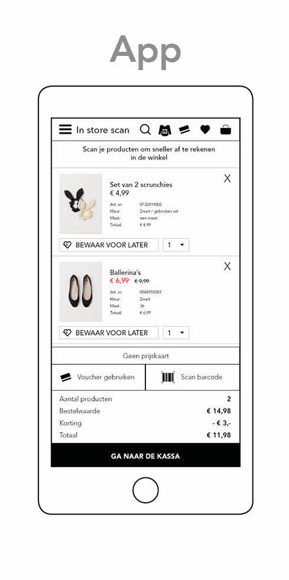
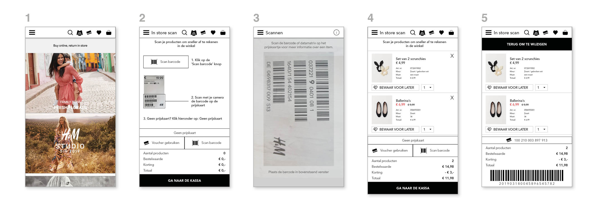
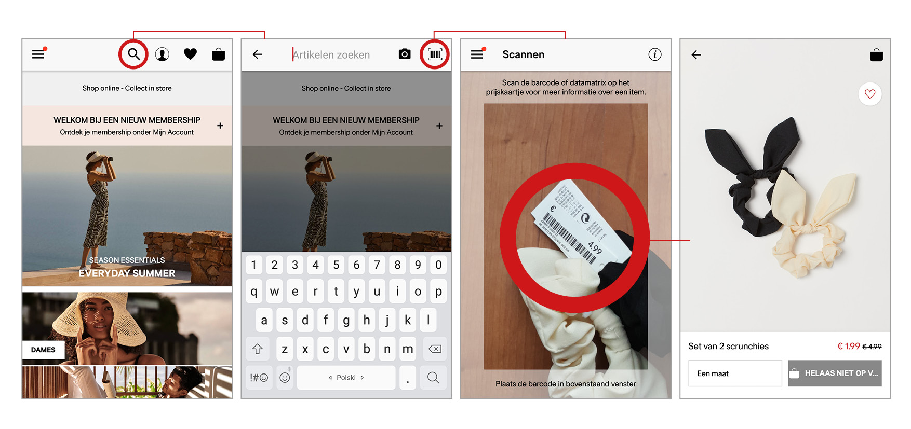

# App 0.1

### De app

### De schermen samengevat



1. Homescherm van de H&M app
2. Introductiescherm van de In Store scan
3. Voorbeeld hoe het scannen eruit ziet via de app
4. Wanneer producten zijn toegevoegd aan de In Store scan
5. Wanneer geklikt is op Ga naar de kassa knop



1. **Homescherm van de H&M app**
   1. Bovenaan in het menu is een shirt met barcodes toegevoegd
   2. Dat is de In Store scan 
2. **Introductiescherm van de In Store scan**
   1. Er wordt uitgelegd dat als je wilt scannen je op de knop: Scan barcode klikt
   2. Met een afbeelding wordt uitgelegd dat je de barcode moet scannen
   3. Knop: Geen prijskaart
      1. Als het product geen prijskaart heeft kan je via de P/N code \(artikelnummer\) het product toevoegen
   4. Voucher gebruiken
      1. Je gebruikt de app en hoeft daarom niet opnieuw je H&M clubkaart te scannen
      2. Vouchers kan je direct in de app toevoegen aan je product
   5. Je ziet onderaan een samenvatting van alle bedragen
      1. Aantal producten
      2. Bestelwaarde: Totale kosten zonder korting
      3. Korting
      4. Totaal: zijn totale kosten met korting
   6. Ga naar de kassa knop
3. **Voorbeeld hoe het scannen eruit ziet via de app**
   1. De camera gaat aan
   2. In het vakje moet de barcode gescand worden
4. **Wanneer producten zijn toegevoegd aan de In Store scan**
   1. Wat je op het scherm ziet na het scannen is:
      1. De afbeelding
      2. De naam van het product
      3. Artikelnummer
      4. Maat
      5. Kleur
      6. Totaal bedrag
      7. Aantal producten
      8. Bewaar voor later: een optie dat in de app is inbegrepen
         1. Voor als je het in de winkel niet wil kopen en online verder wil bekijken
5. **Wanneer geklikt is op Ga naar de kassa knop**
   1. Het overzicht blijft ongeveer hetzelfde
   2. Er is een barcode gekomen
      1. De barcode is voor de caissière
      2. De barcode heeft alle data verzameld van je gescande producten net als een bon die je aan het eind van je aankopen krijgt.



### Het prototype










In de pdf staan alle schermen 



### Hoe werkt de app?

Ongeveer hetzelfde concept idee zoals de scanner maar dan via de app. Er zal een ingebouwde scanner worden toegevoegd aan de H&M applicatie. Via de camera zal de consument in de winkel de kleren kunnen scannen. Het verschil is dat de consument haar eigen telefoon bij zich heeft en niet iets extra’s draagt. De H&M club is ook automatisch toegevoegd. De consument moet nog wel naar de kassa toe om haar producten te controleren en via de app een barcode te laten scannen. 

### Inspiratie

In de H&M app kan je de prijskaarten van de producten scannen. Hiermee kan de consument in de app kijken of het online beschikbaar is. De app laat verder zien welke maten en kleuren beschikbaar zijn. In de app kan de consument zoeken in welke winkel het product verder beschikbaar is. Voor als ze het product gelijk wil passen. 

Door wat al in de H&M app mogelijk is en het idee van de scanner te combineren heb ik de toevoeging aan de app bedacht. De consument kan producten scannen via haar mobiel en toevoegen aan de digitale winkelmand. Met de digitale winkelmand gaat de consument afrekenen in de winkel.

### Test resultaat

Veel van de antwoorden leken op elkaar. Om deze reden heb ik geprobeerd de verschillen per tester te vermelden. 

De testers vonden de app dubbel werk. Ze moeten zelf scannen en alsnog naar de kassa toe gaan. Om deze reden zouden ze de app niet gebruiken.

| Testers | Hoe vond je het om met de app te winkelen? | Moeilijk/minpunten? | Makkelijk/pluspunten? | Zou je het gebruiken? |
| :--- | :--- | :--- | :--- | :--- |
| Hasan | Leek op het scanner concept | Je kan je telefoon bij de kassa vergeten | In store icoon was duidelijk | Ja |
| Beyza | De app werkte fijner dan de scanner! | Zag niet hoe ze voucher kan toevoegen | H&M club is al in de app | Ja |
| Meral | Makkelijker want je telefoon heb je altijd bij je | Ze begreep de barcode niet | Instructies waren duidelijk | Nee, want is weer dubbel werk |
| Elif | Ik zie geen voordeel aan om zelf alles te moeten scannen en nog steeds naar de caissière te moeten gaan | Alweer dubbel werk | Draagt niks extra's zoals de scanner | Nee |
| Esma | Ze dacht dat ze via haar telefoon de producten kon kopen in de winkel | Stappen om te scannen is meer dan met de scanner | Je telefoon heb je al | Nee |
| Harcai | Als ik haast zou hebben zou ik de app gebruiken | Vind het overbodig voor de app | Duidelijk overzicht van de producten | Nee |
| Fikriye | Dacht ook dat ze via de telefoon de producten kon betalen | Bewaar voor later optie is verwarrend | Via de app vind je meer informatie over het product | Misschien |

