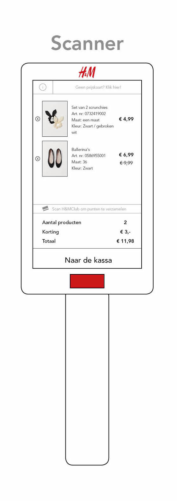
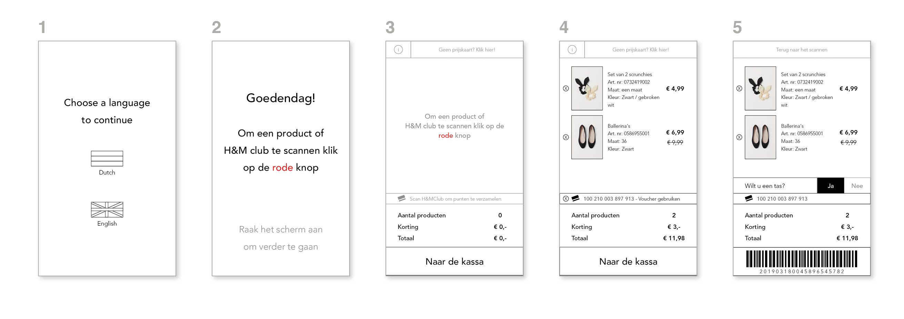

# Scanner 0.1

### De scanner

### De schermen samengevat



1. Introductiescherm met de opties voor taal
2. Instructiescherm hoe je de scanner moet gebruiken
3. Default scherm als je nog niks hebt gescand
4. Wanneer je producten hebt gescand en je H&M club kaart
5. Wanneer je op de knop: Naar de kassa hebt geklikt




1. **Introductiescherm met de opties voor taal**
   1. Keuze Nederlands en Engels
2. **Instructiescherm hoe je de scanner moet gebruiken**
   1. Door op de rode knop te klikken
3. **Default scherm als je nog niks hebt gescand**
   1. De uitleg staat er nog een keer op
   2. Je ziet onderaan staan:
      1. Scan je H&M club kaart
      2. Aantal producten
      3. Korting
      4. Totaal
      5. Knop: Naar de kassa
4. **Wanneer je producten hebt gescand en je H&M club kaart**
   1. Wat je op het scherm ziet na het scannen is:
      1. De afbeelding
      2. De naam van het product
      3. Artikelnummer
      4. Maat
      5. Kleur
      6. Totaal bedrag
   2. Je H&M club code is gelijk ingevuld
5. **Wanneer je op de knop: Naar de kassa hebt geklikt**
   1. Het overzicht blijft ongeveer het zelfde
   2. Er is een barcode gekomen
      1. De barcode is voor de caissière
      2. De barcode heeft alle data verzameld van je gescande producten net als een bon die je aan het eind van je aankopen krijgt



### Het prototype 










In de pdf staan alle schermen 



### Hoe werkt de scanner?

Het werkt zoals de Albert Heijn scanner. Je pakt een scanner dat in de winkel tegen de wand staat. Dit neem je mee tijdens het winkelen of aan het einde van het winkelen. Je scant door op de rode knop te klikken en het licht van de scanner te richten op de barcode. Het product verschijnt op het scherm van de scanner. Je kan ook je H&M club kaart scannen en je tas voorkeur aangeven. Je gaat daarna naar een kassa toe dat voorrang biedt aan mensen met een scanner. De caissière scant een barcode dat is gemaakt in de scanner en controleert de producten. Vervolgens betaald de consument en haalt de caissière het alarm van de producten af. 

### Inspiratie

In de Albert Heijn wordt er gebruik gemaakt van een handscanner. Je kan de handscanner gebruiken door je bonus kaart te scannen. Met de handscanner kan je de boodschappen scannen. Wanneer je klaar bent ga je naar een zelfscan kassa toe. Hier plaatst je de scanner in een vak. Bij de zelfscan kassa scan je de bonus kaart en krijgt je boodschappen te zien. Dit wordt betaald bij de zelfscan kassa en bent daarna klaar met je boodschappen. 

De Albert Heijn maakt geen gebruik van alarm labels zoals de H&M. Daarom is het bij het scanner concept de bedoeling om bij de caissière af te rekenen.

Ik heb dit als inspiratie gekregen door de methode: Competitive analyses. Hier ging ik als een be the user de handscanner van de Albert Heijn gebruiken:



Voor een uitgebreid onderzoek klik op de pagelink hierboven. 

### Test resultaat

Veel van de antwoorden leken op elkaar. Om deze reden heb ik geprobeerd alleen de verschillen per tester te vermelden. 

De testers vonden de scanner een extra gewicht tijdens het winkelen. Om deze reden zouden ze de scanner niet gebruiken.

<table>
  <thead>
    <tr>
      <th style="text-align:left">Testers</th>
      <th style="text-align:left">Hoe vond je het om met de scanner te winkelen?</th>
      <th style="text-align:left">Moeilijk/minpunten?</th>
      <th style="text-align:left">Makkelijk/pluspunten?</th>
      <th style="text-align:left">Zou je het gebruiken?</th>
    </tr>
  </thead>
  <tbody>
    <tr>
      <td style="text-align:left">Hasan</td>
      <td style="text-align:left">Het leek op de Albert Heijn scanner</td>
      <td style="text-align:left">Het was niet handig tijdens het winkelen</td>
      <td style="text-align:left">Was niet lastig te gebruiken</td>
      <td style="text-align:left">Nee</td>
    </tr>
    <tr>
      <td style="text-align:left">Beyza</td>
      <td style="text-align:left">Als ik winkel wil ik niet te veel spullen dragen</td>
      <td style="text-align:left">Ik zou het niet gebruiken omdat ik iets extra&apos;s moet dragen</td>
      <td
      style="text-align:left">Fijn dat je van te voren kan scannen en gelijk betaald</td>
        <td style="text-align:left">Misschien</td>
    </tr>
    <tr>
      <td style="text-align:left">Meral</td>
      <td style="text-align:left">Na het scannen wil ik naar een zelfscan kassa om zelf af te rekenen</td>
      <td
      style="text-align:left">
        
Dat ik naar een caissi&#xE8;re moet gaan

        
Caissi&#xE8;re moet alsnog de spullen controleren

        </td>
        <td style="text-align:left">Niet echt</td>
        <td style="text-align:left">Nee</td>
    </tr>
    <tr>
      <td style="text-align:left">Elif</td>
      <td style="text-align:left">Dubbel werk, ik scan en moet nog steeds naar een kassa toe</td>
      <td style="text-align:left">H&amp;M club scannen was niet duidelijk</td>
      <td style="text-align:left">Makkelijk te gebruiken</td>
      <td style="text-align:left">Nee</td>
    </tr>
    <tr>
      <td style="text-align:left">Esma</td>
      <td style="text-align:left">Handig dat ik alvast scan dan hoeft de caissi&#xE8;re dit niet weer te
        doen</td>
      <td style="text-align:left">
        
Mis de tas voorkeur vraag

        
Dan is dat nog een stap minder voor de caissi&#xE8;re

      </td>
      <td style="text-align:left">De stappen waren duidelijk en herkenbaar
         van de Albert Heijn scanner</td>
      <td style="text-align:left">Misschien</td>
    </tr>
    <tr>
      <td style="text-align:left">Harcai</td>
      <td style="text-align:left">Ik begrijp het concept maar zou het niet gebruiken</td>
      <td style="text-align:left">Ik wil niet wat extra&apos;s dragen tijdens het winkelen</td>
      <td style="text-align:left">Het was duidelijk</td>
      <td style="text-align:left">Nee</td>
    </tr>
    <tr>
      <td style="text-align:left">Fikriye</td>
      <td style="text-align:left">Ze dacht dat ze de scanner bij de wand moest gebruiken en niet meenemen</td>
      <td
      style="text-align:left">Als H&amp;M club belangrijk is moet dit niet wegvallen</td>
        <td style="text-align:left">Handig dat je zelf de prijs kan controleren</td>
        <td style="text-align:left">Nee</td>
    </tr>
  </tbody>
</table>