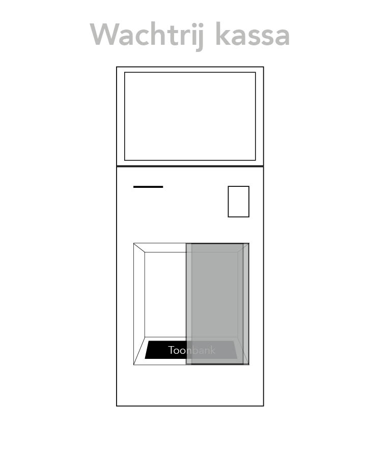
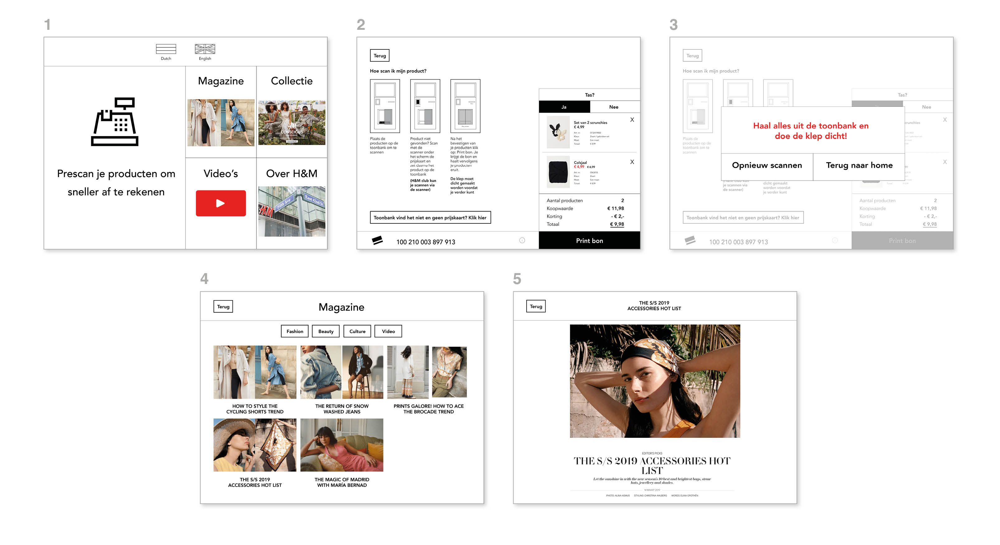

# Wachtrij kassa 0.1

### De wachtrij kassa

### De schermen samengevat



1. Introductiescherm van de wachtrij kassa
2. Instructiescherm + gescande product
3. Melding dat je producten van de toonbank moet pakken
4. Hoe magazine, collectie, video's en over H&M overzicht eruitziet
5. Wanneer je een optie hebt gekozen zie je een volledige artikel



1. **Introductiescherm van de wachtrij kassa**
   1. Je kan een taal kiezen tussen Nederlands en Engels
   2. In het menu heb je de opties:
      1. Prescannen - om van te voren al je producten te scannen
      2. Magazine - om magazines te lezen
      3. Collectie - om de collecties van H&M te bekijken
      4. Video's - om de video's van H&M te bekijken
      5. Over H&M - om over de geschiedenis van H&M te leren
2. **Instructiescherm + gescande product**
   1. 1. Uitleg hoe je de wachtrij kassa moet gebruiken
         1. Afbeeldingen als voorbeeld
         2. Instructie bij de afbeeldingen
      2. Knop: Geen prijskaart?
         1. Voor als het product geen prijskaart heeft is er nog een oplossing
      3. H&M club kaart is al gescand
      4. Het product zit in het overzicht
         1. Afbeelding van het product
         2. Product naam
         3. Prijs
         4. Kleur
      5. Overzicht van het totaal bedrag
         1. Aantal producten
         2. Korting
         3. Bestelwaarde
         4. Totaal
3. **Melding dat je producten van de toonbank moet pakken**
   1. Na het klikken op Print bon verschijnt deze melding
   2. Producten moeten uit de toonbank gehaald worden
   3. Je kan terug gaan naar het startscherm of opnieuw scannen
4. **Hoe magazine, collectie, video's en over H&M overzicht eruitziet**
   1. Menu bovenaan om te categoriseren
   2. Afbeeldingen met titel over onderwerp  
5. **Wanneer je een optie hebt gekozen zie je een volledige artikel**
   1. Foto's
   2. Tekst 
   3. Producten



### Het prototype










In de pdf staan alle schermen



### Hoe werkt de wachtrij kassa?

Uit mijn ideation groep met de consumenten kwam ik erachter dat ze het wachten in de rij ook vervelend vinden. Daarom bedacht ik een wachtrij kassa waar de consument net als bij de zelfscan kassa alvast haar producten kan scannen. Het verschil is dat je een bon mee krijgt om bij de caissière te betalen en niet bij de wachtrij kassa. Ze kunnen bij de wachtrij kassa ook de H&M magazine, video’s, collecties en geschiedenis bekijken. Deze combinatie heb ik gedaan zodat ze al gescande producten hebben en sneller kunnen betalen bij de kassa. Behalve het sneller betalen wilde ik ze ook iets aanbieden om wat te doen tijdens het wachten. 

### Inspiratie

De pretparken van Disney Land zitten vol entertainment. Dit passen ze overal toe en ook aan de wachtrijen. Ze zorgen ervoor dat de consumenten een leuke tijd hebben terwijl ze staan te wachten. Dit doen ze door Disney karakters bij de rij te laten lopen, met de mensen laten praten en foto's maken. Er kan een kleine show gegeven worden in de buurt van de rijen. Hierdoor kijken de mensen naar iets leuks terwijl ze wachten. Disney heeft veel meer methodes om ervoor te zorgen dat de mensen niet door hebben dat ze lang staan te wachten. Ze maken een ervaring mee terwijl ze in de rij staan. 

Door de rij bij de H&M leuker te maken werd er een entertainment sectie toegevoegd. H&M heeft een eigen magazine, video’s en collecties die bekeken kunnen worden. Om de entertainment sectie ook handig te maken werd de zelfscan kassa hier toegevoegd. Op deze manier was het een handige en leuke toevoeging aan de wachtrij van de H&M.





### Test resultaat

Veel van de antwoorden leken op elkaar. Om deze reden heb ik geprobeerd de verschillen per tester te vermelden. 

De testers vonden de wachtrij kassa overbodig. Ze zouden het niet gebruiken om hun producten te scannen. Ze zouden het entertainment onderdeel ook niet gebruiken omdat ze hun mobiel hebben.

<table>
  <thead>
    <tr>
      <th style="text-align:left">Testers</th>
      <th style="text-align:left">Hoe vond je het om met de wachtrij kassa te winkelen?</th>
      <th style="text-align:left">Moeilijk/minpunten?</th>
      <th style="text-align:left">Makkelijk/pluspunten?</th>
      <th style="text-align:left">Zou je het gebruiken?</th>
    </tr>
  </thead>
  <tbody>
    <tr>
      <td style="text-align:left">Hasan</td>
      <td style="text-align:left">Was leuk om entertainment te gebruiken maar niet voor scannen</td>
      <td
      style="text-align:left">Veel gebuk bij producten scannen</td>
        <td style="text-align:left">Zou alleen entertainment deel gebruiken</td>
        <td style="text-align:left">Nee</td>
    </tr>
    <tr>
      <td style="text-align:left">Beyza</td>
      <td style="text-align:left">Lijkt een beetje op de zelfscan kassa</td>
      <td style="text-align:left">Dacht dat ze bij de wachtrij kassa al had afgerekend</td>
      <td style="text-align:left">Entertainment sectie was wel leuk</td>
      <td style="text-align:left">Nee</td>
    </tr>
    <tr>
      <td style="text-align:left">Meral</td>
      <td style="text-align:left">Vind het concept omslachtig omdat je twee problemen in 1 concept verwerkt</td>
      <td
      style="text-align:left">
        
Niet duidelijk of ze op de mensen voor haar moet wachten

        
die bezig zijn met de kassa

        </td>
        <td style="text-align:left">Niet</td>
        <td style="text-align:left">Nee</td>
    </tr>
    <tr>
      <td style="text-align:left">Elif</td>
      <td style="text-align:left">Vind het onnodig, ik sta al in de rij waarom zou ik nog scannen</td>
      <td
      style="text-align:left">Niet duidelijk wanneer je door moet lopen als je bezig
         bent met de wachtrij kassa</td>
        <td style="text-align:left">Niks</td>
        <td style="text-align:left">Nee</td>
    </tr>
    <tr>
      <td style="text-align:left">Esma</td>
      <td style="text-align:left">Ik zou allebei de functies niet gebruiken</td>
      <td style="text-align:left">Niet handig om met producten in de hand het
         entertainment sectie te gebruiken</td>
      <td style="text-align:left">Niet echt</td>
      <td style="text-align:left">Nee</td>
    </tr>
    <tr>
      <td style="text-align:left">Harcai</td>
      <td style="text-align:left">Ik sta in de rij zou het niet gebruiken</td>
      <td style="text-align:left">Wist niet zeker of mensen mogen voordringen
         als ze zit te pre scannen</td>
      <td style="text-align:left">Was makkelijk te gebruiken</td>
      <td style="text-align:left">Nee</td>
    </tr>
    <tr>
      <td style="text-align:left">Fikriye</td>
      <td style="text-align:left">Denk zal het te veel ruimte innemen en overbodig zijn</td>
      <td style="text-align:left">Denk dat mensen achter mij gaan pushen van ga
         door lopen terwijl ik nog bezig ben</td>
      <td style="text-align:left">Fijn dat het alle producten heeft gevonden</td>
      <td style="text-align:left">Nee</td>
    </tr>
  </tbody>
</table>

