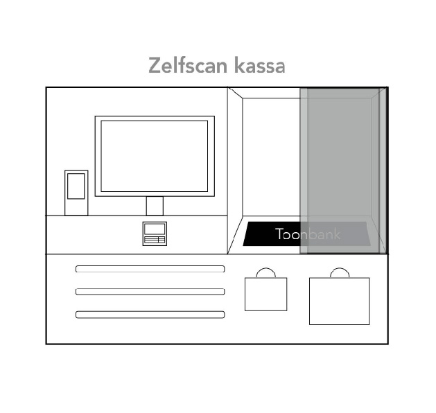
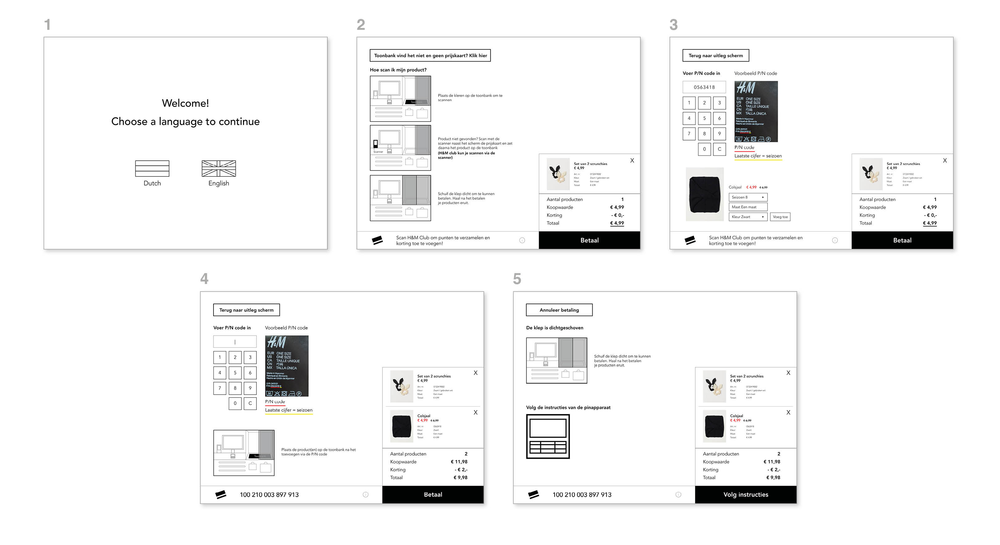

# Zelfscan kassa 0.1

### De zelfscan kassa

### De schermen samengevat



1. Introductiescherm van de zelfscan kassa
2. Instructiescherm + gescande product
3. Product toevoegen door P/N code in te voeren
4. Wanneer product is toegevoegd via P/N code
5. Het betalingsscherm 



1. **Introductiescherm van de zelfscan kassa**
   1. Verwelkomt de gebruiker
   2. Je kiest een taal tussen Nederlands en Engels
2. **Instructiescherm + gescande product**
   1. Uitleg hoe je de zelfscan kassa moet gebruiken
      1. Afbeeldingen als voorbeeld
      2. Instructie bij de afbeeldingen
   2. Knop: Geen prijskaart?
      1. Voor als het product geen prijskaart heeft is er nog een oplossing
      2. Bij punt 3 wordt dit verder uitgelegd
   3. H&M club kaart moet nog worden gescand
3. **Product toevoegen door P/N code in te voeren**
   1. Toetsknoppen om de cijfers in te voeren
   2. Afbeelding voorbeeld waar P/N code zit
   3. Afbeelding van het product wanneer het gevonden is
      1. Er wordt gevraagd wat het seizoensnummer is
      2. Wat de kleur is
      3. Wat de maat is
4. **Wanneer product is toegevoegd via P/N code**
   1. Het product is aan de rechterkant toegevoegd
   2. Een afbeelding verteld na het toevoegen dat het product weer op de toonbank moet zitten
5. **Het betalingsscherm**
   1. Een afbeelding vertelt dat de deuren dicht gemaakt moeten worden om de betalen
   2. Een afbeelding vertelt dat je via de pinapparaat verder kan betalen



### Het prototype










In de pdf staan alle schermen 



### Hoe werkt de zelfscan kassa?

De zelfscan kassa wordt aan het einde van het winkelen gebruikt. Hier is geen caissière bij nodig. De consument gaat zelf de producten op de toonbank zetten waar het wordt gescand met een RFID scanner. De producten verschijnen op het scherm en worden gecontroleerd door de consument. Als alles klopt word nog gevraagd of ze H&M club member zijn. De schuifdeur van de toonbank moet sluiten om te kunnen betalen. Dit word gedaan omdat na het betalen een kill code wordt gestuurd naar de producten, omdat ze zijn betaald. Als de deur dicht is kan de consument namelijk geen ander product stiekem toevoegen. Na het betalen kan de consument haar producten pakken en gratis een papieren tas meenemen.

### Inspiratie

De Zara en Albert Heijn hebben een zelfscan kassa. Uniqlo maakt gebruik van RFID tags. 

De zelfscan kassa van de Zara maakt gebruik van RFID tags en 2D scanner. Je legt je producten op de toonbank en de zelfscan kassa vindt dit. Na het betalen haal je zelf de alarm labels van het product eraf en bent klaar met de zelfscan kassa. Helaas was de uitleg van Zara niet duidelijk en het alarm afhalen was lastig. 



Voor een uitgebreid onderzoek klik op de pagelink hierboven. 

De Albert Heijn heeft geen alarm labels waardoor dat een stap minder was. Na het scannen van je producten bij de zelfscan kassa was de laatste taak het betalen. De schermen van de Albert Heijn waren simpel en duidelijk. 



Voor een uitgebreid onderzoek klik op de pagelink hierboven. Het tweede deel gaat over Albert Heijn To Go.

Uniqlo maakt nog wel gebruik van caissières, maar het scannen en verwijderen van producten gaat in 1 keer door de RFID tags. Waardoor het het kopen van producten veel sneller ging. 



Voor een uitgebreid onderzoek klik op de pagelink hierboven. 

Door deze drie inspiratie bronnen te combineren heb ik de zelfscan kassa ontworpen. Het verschil is dat de toonbank gesloten word en het alarm net als bij Uniqlo tegelijk bij wordt verwijderd. 

### Test resultaat

Veel van de antwoorden leken op elkaar. Om deze reden heb ik geprobeerd de verschillen per tester te vermelden. 

De testers vonden de zelfscan kassa goed, maar er moet veel verbeterd worden. De instructies waren niet duidelijk wat het moeilijk maakte.

<table>
  <thead>
    <tr>
      <th style="text-align:left">Testers</th>
      <th style="text-align:left">Hoe vond je het om met de zelfscan kassa te winkelen?</th>
      <th style="text-align:left">Moeilijk/minpunten?</th>
      <th style="text-align:left">Makkelijk/pluspunten?</th>
      <th style="text-align:left">Zou je het gebruiken?</th>
    </tr>
  </thead>
  <tbody>
    <tr>
      <td style="text-align:left">Hasan</td>
      <td style="text-align:left">Niet erg dat ik zelf moet scannen</td>
      <td style="text-align:left">
        
Er kan gelogen worden bij het zelf toevoegen

        
van een product

      </td>
      <td style="text-align:left">Fijn dat ik kan controleren</td>
      <td style="text-align:left">Ja</td>
    </tr>
    <tr>
      <td style="text-align:left">Beyza</td>
      <td style="text-align:left">Fijn dat ik zelf kan afrekenen</td>
      <td style="text-align:left">Uitleg was niet duidelijk</td>
      <td style="text-align:left">Het duurt even maar het lukt makkelijk zelf</td>
      <td style="text-align:left">Ja</td>
    </tr>
    <tr>
      <td style="text-align:left">Meral</td>
      <td style="text-align:left">Als de stappen beter worden verteld dan is dit mijn favoriet</td>
      <td style="text-align:left">Waar de toonbank is was niet duidelijk</td>
      <td style="text-align:left">Overzicht producten was duidelijk</td>
      <td style="text-align:left">Ja</td>
    </tr>
    <tr>
      <td style="text-align:left">Elif</td>
      <td style="text-align:left">Veel beter! Als ik zelf al moet scannen dan liever dat ik gelijk kan afrekenen</td>
      <td
      style="text-align:left">Volgordes instructies aanpassen</td>
        <td style="text-align:left">Je kan makkelijk zelf scannen</td>
        <td style="text-align:left">Ja</td>
    </tr>
    <tr>
      <td style="text-align:left">Esma</td>
      <td style="text-align:left">De zelfscan kassa kan makkelijk zijn als de schermen voorbeelden geven</td>
      <td
      style="text-align:left">Het was niet duidelijk of je voor de tas moest betalen of niet</td>
        <td
        style="text-align:left">H&amp;M club scannen was makkelijk</td>
          <td style="text-align:left">Ja</td>
    </tr>
    <tr>
      <td style="text-align:left">Harcai</td>
      <td style="text-align:left">De instructies zijn veel maar te volgen</td>
      <td style="text-align:left">Seizoensnummer was niet duidelijk</td>
      <td style="text-align:left">Afbeeldingen hielpen als voorbeeld</td>
      <td style="text-align:left">Ja</td>
    </tr>
    <tr>
      <td style="text-align:left">Fikriye</td>
      <td style="text-align:left">Handig hoef dan niet naar een caissi&#xE8;re te gaan</td>
      <td style="text-align:left">H&amp;M club was niet opvallend</td>
      <td style="text-align:left">Zelfstandig afrekenen</td>
      <td style="text-align:left">Ja</td>
    </tr>
  </tbody>
</table>

