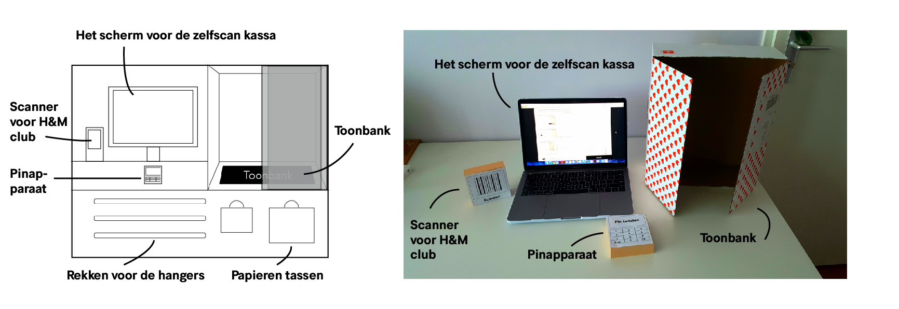

# Concepten test resultaten

### Deelvragen:

**Hoe kan een product helpen om het betalingsproces te verbeteren?** 

* Welke technologie zou het beste werken voor de verbetering van het betalingsproces? 
* Hoe zouden de consumenten het interactief product ervaren?

### Gebruikte methodes

* Wizard of oz
* Scenario schetsen
* Usability testing

### Invision concept prototypes:

| Concept | Link |
| :--- | :--- |
| Scanner | [https://invis.io/FKQX6GO2QDT](https://invis.io/FKQX6GO2QDT) |
| App | [https://invis.io/X7S0AA3YBKP](https://invis.io/X7S0AA3YBKP) |
| Zelfscan kassa | [https://invis.io/75R6LAEU829](https://invis.io/75R6LAEU829) |
| Wachtrij kassa | [https://invis.io/Q7RN68PNW2R](https://invis.io/Q7RN68PNW2R) |

### In het kort hun mening over de concepten



### Gekozen concept: Zelfscan kassa

Uit de testresultaten bleek de zelfscan kassa de favoriet. Ze vonden het concept idee handig, snel en fijn werken. De instructies konden wel beter uitgewerkt worden en het prototype gaf geen goed beeld hoe het eruit zou komen te zien \(zie afbeelding beneden\). De meeste vinden het niet erg om zelf te scannen en de producten te vouwen. Maar ze gaven wel aan dat ze niet met veel producten de zelfscan kassa gaan gebruiken. Voor 2-3 producten en niet zo groot  zouden ze er gebruik van maken. 

### Verbeteringen/tips/vragen voor de zelfscan kassa

* Duidelijk zetten wat de toonbank is 
* Stap voor stap de uitleg tonen 
* Alleen de uitleg tonen die op dat moment van belang is 
* Betere zinnen gebruiken 
* Jip en janneke taal 
* Beleefd zijn, geen uitroeptekens gebruiken 
* De zelfscan kassa gebruiken voor weinig producten \(1-3\)
* Hoe zit het met het formaat? 
* Hoeveel zelfscan kassa's zullen er zijn?
* Hoe past een hele jas er bijvoorbeeld op? 
* Help knop toevoegen! 
* Afbeelding, kleuren en teksten groter maken! 
* Zelfscan kassa vooral gebruiken bij weinig artikelen
* Gebruik afbeeldingen / tekeningen als voorbeelden 

| De gestelde vragen |
| :--- |
| Hoe vond je het om te winkelen met een \(concept\)? |
| Wat vond je zelf van \(het concept\)? \(het model, interface, hoe het eruit ziet\) |
| Hoe vond je de uitleg van \(het concept\)? |
| Waarom zou jij \(het concept\) wel/niet gebruiken? |
| Welke vragen kreeg jij over \(het concept\)? |
| Wat viel mij op tijdens de test? |

### Samengevat testers ervaring en opmerkingen



De resultaten leken vaak op elkaar en daarom besloot ik het samen te vatten. Hierdoor heb ik een uitgebreide overzicht over waar ze het overeen zijn en wat er op viel per tester.

