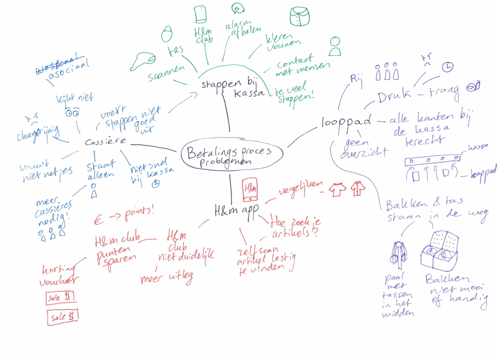

# Brainstormen

## Gebruikte methodes:

* **Sketching -** zoveel mogelijk schetsen ****
* **Reframing a problem -** Het probleem via een ander perspectief bekijken
  * De rij duurt lang bij de kassa
    * De caissière moet sneller kunnen werken
    * De taken van de caissière moeten minder
    * Het wachten moet leuker worden
* **Provocatie techniek** - Aparte ideeën toepassen aan concept
  * Zoals karaoke, Photo Booth, dansen, serie kijken etc tijdens het wachten.
* **Ideation sessie - Brainstormen met de doelgroep en ze bij betrekken**
  * De doelgroep gaf zelf ook een aantal ideeën waar ik ook deels aan dacht
  * Heb die ideeën uitgewerkt voor een testsessie

### Zelf scan concept ideeën

De concepten over het zelf scannen heb ik al ver uitgewerkt voor een testsessie. Ik had ook andere ideeën maar die schetsen zijn niet duidelijk. 

**Scanner -** Lijkt op de Albert Heijn scanner maar dan voor H&M  
**App -** Werkt als de scanner maar is een toevoeging aan de app  
**Zelfscan kassa -** Hier scant en betaald de klant zelf hun producten \(aan de hand van RFID\)

Tijdens de ideation had ik mijn concepten hierboven al voorgesteld. Ze waren over alledrie enthousiast maar hadden wel een voorkeur voor de app. Dit komt omdat ze de applicatie van H&M al hebben, je H&M club is al toegevoegd, zelf heb je alles al gescand, je mobiel blijft bij jouw en mensen zullen eerder geneigd zijn om H&M club member te worden.

Ik ben van plan om deze drie concepten nog te laten testen.

### Mindmap

Vanuit de mindmap gingen we samen op zoek naar de irritaties bij het betalingsproces. Dit brachten we in kaart en zag best snel wat ze irritant vonden. Met deze informatie heb ik mijn concepten geprobeerd mee te maken.

### Looppad concept ideeën

Ik heb veel verschillende ideeën voor de looppad. Ik neig er zelf naar om het handig te maken door zelf al de consument te laten scannen. Tegelijk wil ik het een leuke, interessante ervaring maken waardoor het wachten minder erg wordt.

Bij mijn onderzoek **Wachten in de rij - Psychologie** ben ik erachter gekomen dat mensen houden van eerlijkheid. De _first come first serve_ methode werkt voor veel mensen daarom het beste. Ze vinden het eerlijk en stressen minder tijdens het wachten in de rij. Ze konden namelijk de andere rij kiezen dat veel sneller gaat waardoor ze zenuwachtig worden.

De multiserver, single-line single-phase \(de derde van de afbeelding\) zou bij H&M het beste werken

De vorm van de looppad wil ik daarom ook aanpassen naar één rij zoals de afbeelding beneden:



