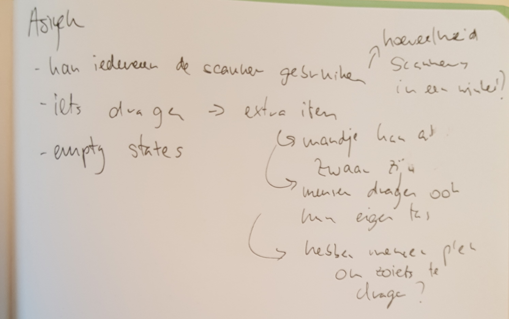
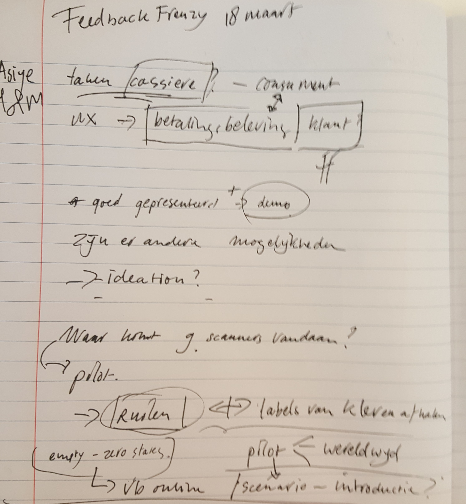

# Feedback frenzy 1.0

### Presentatie pdf



### [https://invis.io/FKQX6GO2QDT](https://invis.io/FKQX6GO2QDT)     -  Prototype scanner versie 1.0

### Feedback ontvangen

09:30 Asiye Koca - Feedback van Christiaan van Dokkum

* De taken van de caissière verminderen H&M.

  Andere titel lijkt

  me beter, wellicht betalingsproces wel noemen en dan specifiek benoemen wat je hiermee bedoeld.

Young Kapital

Wat bedoel je met oranje? Wat is dit precies? Welke vragen krijgen ze dan? 30 seconden en 3-5 minuten?

* Retourneren van kleren?

Waarom niet met je mobiel? Wat is het vervolg van het onderzoek?

Waarom is het voor de H&M club belangrijk? Waar blijven de vragen?

* Heb je nagedacht

  over de beleving van de klant?

### Hoe ging de presentatie en hoe ga ik verder?

De presentatie ging op zich wel goed. De belangrijkste punten heb ik vermeld en ze vonden de presentatie netjes uitgelegd. Op sommige punten hadden ze wel vragen en de meeste van de vragen had ik wel kunnen beantwoorden. 

Ik had 1 concept idee over de H&M scanner laten testen bij mijn presentatie. Dit kon ik wat beter aanpakken maar het gaf wel een beter beeld over mijn concept. Het is 1 van mijn ideeën en ik wilde hier graag feedback op. Dit betekent niet dat de scanner mijn uiteindelijke oplossing zal zijn. 

Met de feedback kan ik goed verder mee werken. Dat ik mijzelf niet te streng moet houden aan wat er in de winkel nu is en ideeën die ik bedenk gewoon kan toepassen. Een handige tip die ik kreeg was dat je met visuele voorbeelden de gebruiker beter op weg kan helpen dan met tekst. Dit zal ik verbeteren in de prototype.

De vragen en opmerkingen die ze hebben gesteld wil ik meenemen en proberen te beantwoorden in mijn proces. Zoals is een scanner wel de oplossing? Er zijn meer manieren om te kunnen betalen bij een kassa? Hoe zou het voor de klant als beleving zijn? Hou er rekening mee met het retouren want dat hoort ook bij de kassa ervaring/ betalingsproces.

