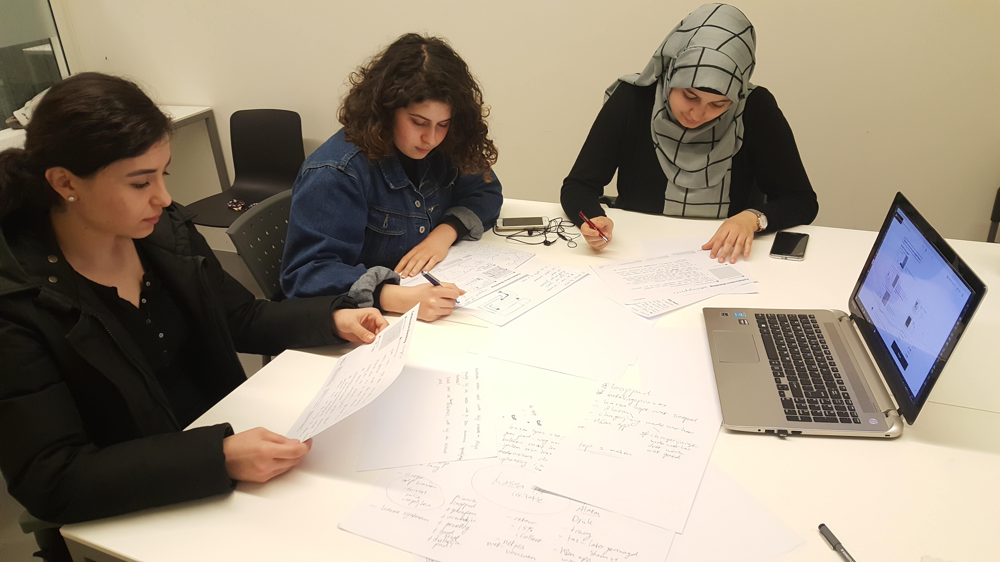

# Ideation consumenten

### Deelvraag

**Waarom is de consument niet tevreden over het betalingsproces?** 

* Wat kan er beter aan het huidige betalingsproces? 
* Hoe ervaart de consument de huidige betalingsproces? 

### Gebruikte methodes

* Ideation - Samen werken om het probleem te kaderen
* Collaborative sketching - Individueel oplossingen bedenken
* Round Robin - Elkaars ideeën aanpassen

### Inzichten ideation

* Ze vinden de looppad naar de kassa onduidelijk
* Ze vinden dat het betalingsproces verbeterd moet worden 
  * Minder taken of dat de taken beter worden uitgevoerd
* Ze vinden dat de medewerkers niet klantvriendelijk zijn
* Ze vinden dat er meer medewerkers moeten zijn om kassa bij te draaien
* Ze vinden dat de medewerkers hun taken op de juiste volgorde moeten doen
  * Zoals dat ze voor het betalen al moeten vragen wil je een tas of niet
  * Als het erna wordt gevraagd werd er 5 cent nog om gevraagd en kwam er een aparte bon
* Ze vinden de look en feel bij de kassa pad niet mooi of goed ingedeeld
* Ze begrijpen de H&M \(club\) applicatie niet
* Dat de medewerkers het alarm vergeten vinden ze irritant
* Het duurt allemaal te lang bij de kassa om je producten te kopen

### Inzichten oplossingen

* De oplossingen waren vooral service gericht
* Dat het beter voor de medewerkers wordt geregeld
  * Dat er per kassa 2 medewerkers zijn 
    * De een scant de producten
    * De ander haalt het alarm eraf en vouwt de kleren
  * Dat er meer medewerkers zijn bij de kassa
  * Dat ze niet te lange uren maken
  * Dat ze de klanten vriendelijker moeten aanspreken
  * Dat ze de klanten goed moeten helpen met de H&M club
* De look en feel werd ook besproken 
  * Primark was voor hun de beste voorbeeld
  * Ook al staan ze lang te wachten ze vinden het minder erg
  * Door de leuke gevulde bakken bij de looppad
  * Dat je wordt geroepen wanneer je aan de beurt bent
  * Meer kassa's bij primark dan H&M
  * Grootste plus is dat ze vriendelijker zijn dan bij H&M

### Samengevat ideation

De ideation zou eigenlijk met 4 personen worden uitgevoerd. Maar dit ging niet door en deden we het met 3 personen. Ik gaf ze een korte presentatie over de kassa en gaf voorbeelden hoe de winkel eruit ziet. Hierna liet ik hun 5 minuten opschrijven wat zij irritant vinden bij de kassa. 

De problemen die zij ervaren had ik helemaal niet verwacht! Ze hadden het vooral over dat de looppad helemaal niet fijn werkt, dat medewerkers onbeleefd zijn en dat het betalingsproces niet goed wordt uitgevoerd. Dat laatste wist ik wel maar de andere twee waren nieuw voor mij. We maakten hierdoor een top drie en ieder kreeg 1 probleem om op te lossen. Dit heb ik gedaan door een [Collaborative sketching](https://www.boardofinnovation.com/staff-picks/favorite-ideation-tools/) template te geven. 

Het probleem gingen zij vooral oplossen door de service te verbeteren. Ze begrijpen dat het werk zwaar kan zijn en lang kan duren voor de medewerkers. Daarom bedachten zij oplossingen om de sfeer voor de medewerkers te verbeteren. Ook de service werd wat aangepast door er bijvoorbeeld twee medewerkers te plaatsen. De een scant alle producten en de ander vouwt de kleren netjes op. De looppad werd meer aangepast zoals het bij de primark wordt gedaan.

Ik liet ze doormiddel van [Round Robin](https://www.boardofinnovation.com/staff-picks/favorite-ideation-tools/) elkaars ideeën horen maar ook wat eraan toevoegen. Meestal waren ze al eens met het idee en vonden dat een goede oplossing. 

Ik heb veel gehad aan deze ideation en nieuwe pijnpunten ontdekt bij de kassa.

