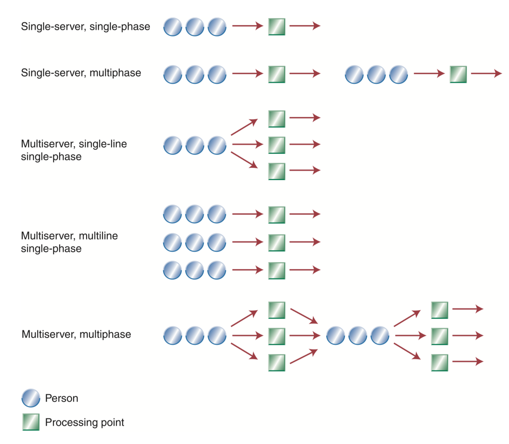

# Wachten in de rij

[https://www.csus.edu/indiv/b/blakeh/mgmt/documents/opm101supplc.pdf](https://www.csus.edu/indiv/b/blakeh/mgmt/documents/opm101supplc.pdf)

A **waiting line system** \(or **queuing system**\) is defined by two elements: the population source of its customers and the process or service system itself  \(“Waiting Line Model”, z.d., pp. 1–3\)

When potential new customers for the waiting line system are affected by the number of customers al- ready in the system, the customer population is **finite** 

**Finite** = beperkt aantal wachten in de rij

**Infinite** = geen beperkt aantal wachten in de rij

Wat er kan gebeuren als er een rij is:

1. **Balking** - when a customer chooses not to enter the waiting line.
2. **Reneging** - when a customer enters the line, but leaves.
3. **Jockeying** - when a customer changes from one line to another.

The advantage of using a **single** **line** when multiple servers are avail- able is the customer’s perception of **fairness** in terms of equitable waits. 

De multiserver, single-line single-phase \(de derde van de afbeelding\) zou bij H&M het beste werken

Dit is een korte samenvatting over de belangrijkste bevindingen die ik vond.

-------------



## Disney and the Art of Queuing

Disney maakt slim gebruik van de personages in het pretpark. Ze zorgen ervoor dat het wachten in de rij ook een entertainment wordt. Hierdoor maken de bezoekers een extra ervaring mee. \(Tšernov, 2017\)

* **Waiting is boring**
* **Businesses need to understand this.** They might lose a potential returning customer because the queue ruined the experience for them — and [returning customers are always cheaper than attracting new ones](https://hbr.org/2014/10/the-value-of-keeping-the-right-customers).

* **An Entertaining Queue**
* In short, **visitors are there to be entertained**. But more clearly, to be entertained throughout every part of the Disney World experience.

  As patrons wait in line for Space Mountain or any other ride, Disney characters parade the line, shaking hands, and snapping pictures with those in queue. These are interactive queue lines.

* So that, **waiting in line becomes an experience of its own**. Disney knows to take visitors’ minds off the queue and put it on to something else.

* **Look, What’s Over There: Queue and the Art of Distraction**
* **The Disney queuing system is centered on keeping patrons entertained** — to turn waiting in line into its own kind of amusement. Whether that be a dance, or show on the side, or other attractions to steal people’s eyes.

