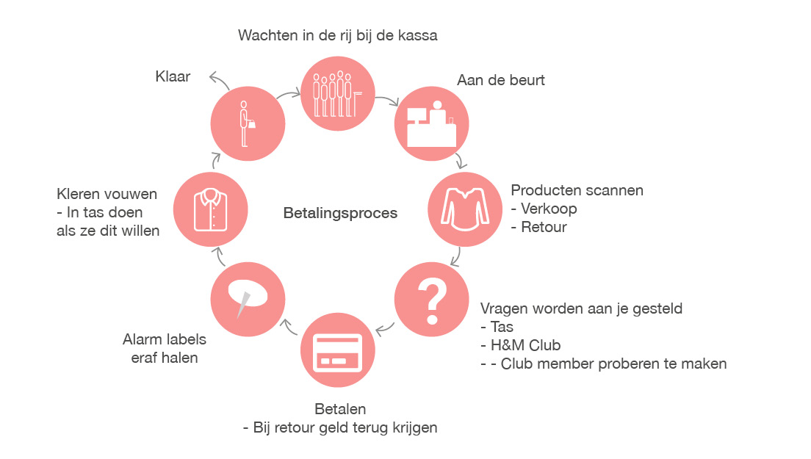

# Betalingsproces visual

Van de interviews en de functies van de kassa heb ik een visual gemaakt. Met dit visual voorbeeld kan ik laten zien wat ik bedoel met het betalingsproces. Hierbij zit ook het retour bij omdat dit een belangrijk onderdeel is van het betalingsproces. 

**Mijn focus blijft wel bij het aankoop proces van de producten bij de kassa**

**In het kort:**

Het betalingsproces begint vanaf het moment dat de consument naar de kassa gaat. Wanneer de consument heeft betaald en weggaat is het betalingsproces beëindigt. 

