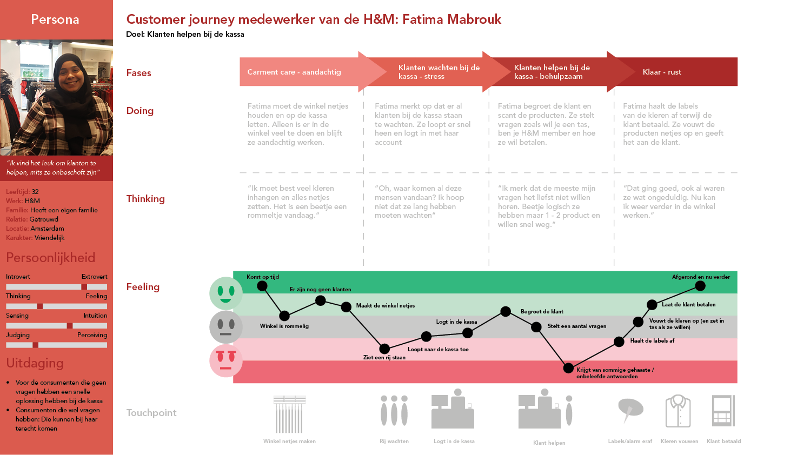

# Customer Journey

### Deelvragen: 

**Waarom is de consument niet tevreden over het betalingsproces?** 

* Wat kan er beter aan het huidige betalingsproces? 
* Hoe ervaart de consument de huidige betalingsproces? 

**Hoe ervaren de caissières het betalingsproces?** 

* Wat zijn de taken van de caissière? 
* Hoe vinden zij het om bij de kassa te werken? 

### Waarom een customer journey?

Ik wilde een overzicht over de stappen van de consument en medewerker. Hier heb ik de customer journey voor gebruikt, omdat het duidelijk de stappen laat zien van de doelgroep. Net als de persona heb ik mijn onderzoek hier in verwerkt. Dit zorgt ervoor dat de customer journey een samenvatting is van het betalingsproces.



Deze customer journeys zijn gemaakt **met** de ideationsessie met de doelgroepen.




Deze custmer journeys zijn gemaakt zonder de ideationsessie met de doelgroepen. Na de ideationsessie heb ik de customer jouerneys geüpdated.




De customer journeys zijn gebaseerd op mijn onderzoek. De gegevens komen van desk research, het boek Decoding the New Consumer Mind van Kit Yarrow, fly on the wall, interviews, enquêtes, en ideationsessies.

