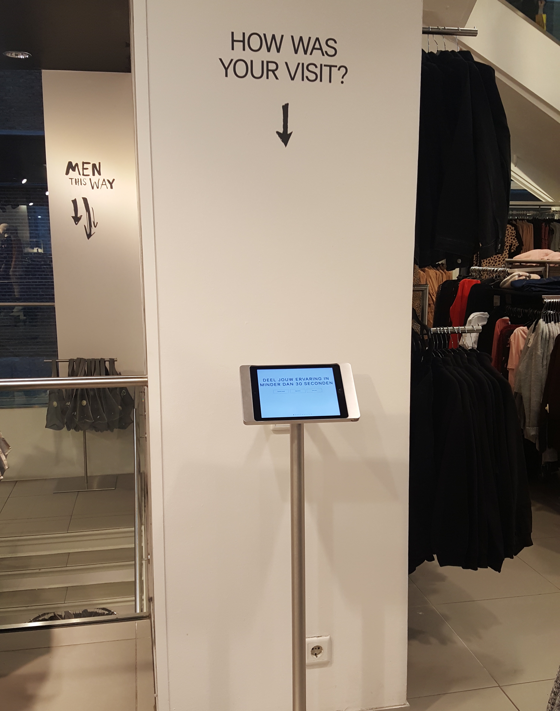

# Desk research

### Waarom desk research?

Na mijn design brief ben ik begonnen met desk research. Door desk research te doen heb ik veel informatie verzameld over de huidige toestand van winkels.

Als eerst heb ik onderzoek gedaan naar de winkel. Vervolgens heb ik onderzoek gedaan naar H&M en de situatie waar H&M zich in bevind. Ik zocht inspiratie op van boeken en hoe andere winkels het doen met innovatie.

### Informatie van H&M Kalverstraat 125

In bijna alle H&M's zit er een tablet waar je feedback kan geven over de winkel. Dit wordt iedere week ongeveer 300 keer ingevuld \(het ligt eraan waar de winkel is en hoe druk die wordt bezocht\). Met deze data kunnen de store managers zien hoe de winkel nu draait en wat er verbeterd kan worden. 

Op dit moment kan het filiaal van Kalverstraat 125 beter. **De cash desk staat op dit moment oranje, wat onder het gemiddelde is in vergelijking met de andere winkels in de buurt.** Ik mag de gegevens niet fotograferen of alle data zelf uitwerken. Ik mag de gegevens wel inzien en vragen stellen om het met de store manager te bespreken. De store manager vind dat het bij de kassa ook beter kan en wil dat ik dit uitzoek. 

