# Decoding the New Consumer Mind van Kit Yarrow

## Deelvragen: 

**Waarom is de consument niet tevreden over het betalingsproces?** 

* Wat kan er beter aan het huidige betalingsproces? 
* Hoe ervaart de consument de huidige betalingsproces? 

### Volgens Kit Yarrow de reden waarom consumenten zijn veranderd

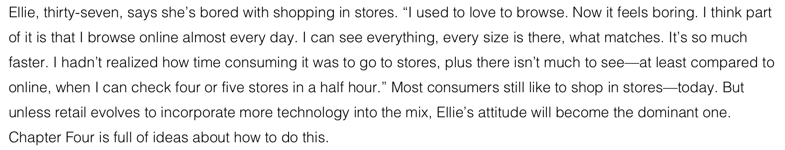

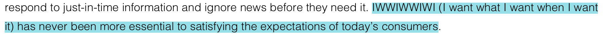

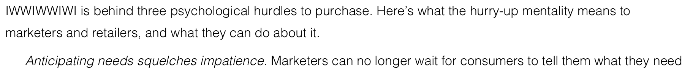

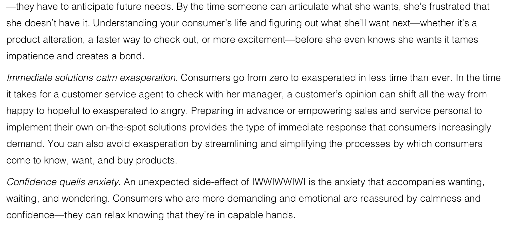

### De verschillen van online shopping en naar de winkel gaan

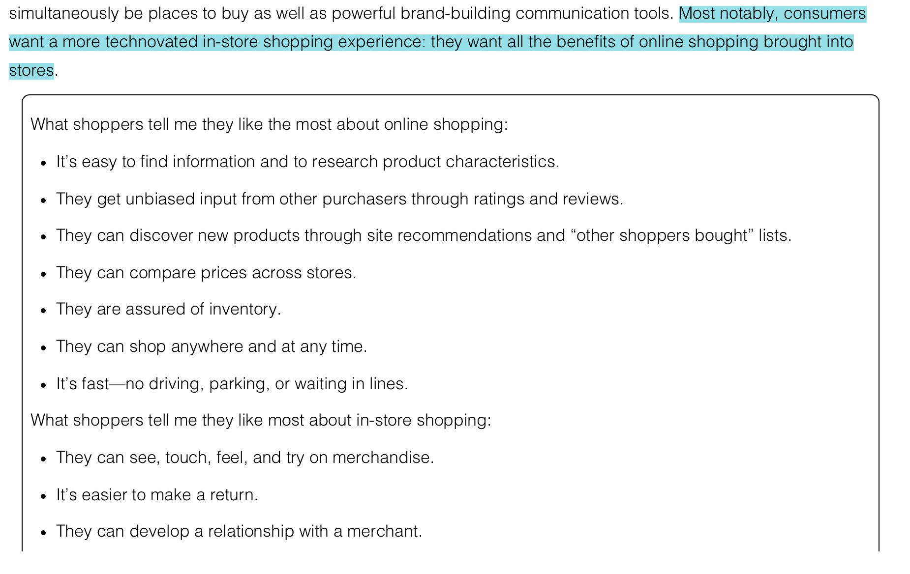

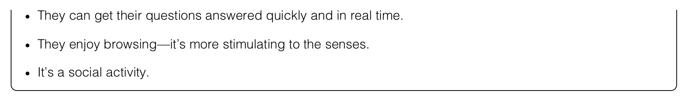

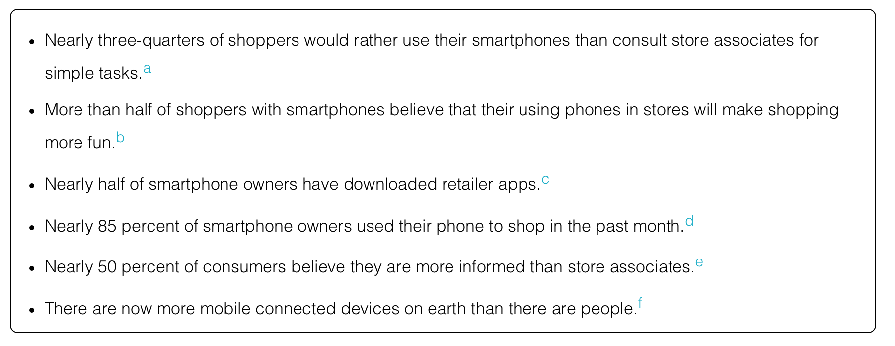

### Wat verwachten consumenten volgens Kit Yarrow?

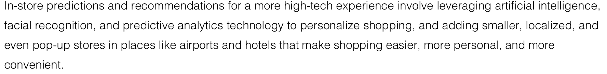

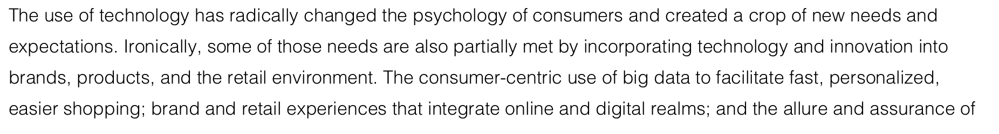

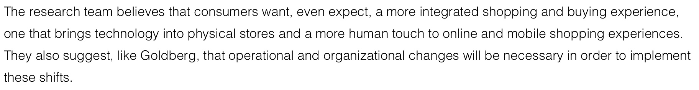

### 5 Psychologische shifts

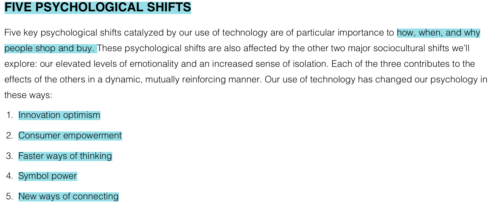

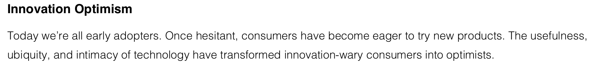

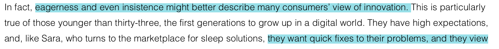

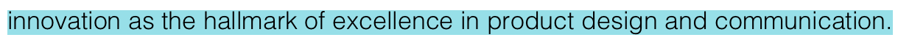

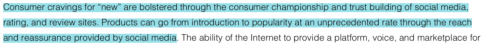

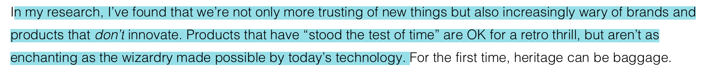

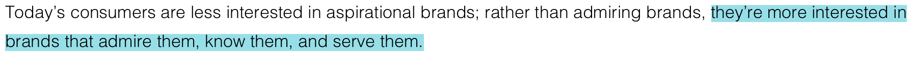

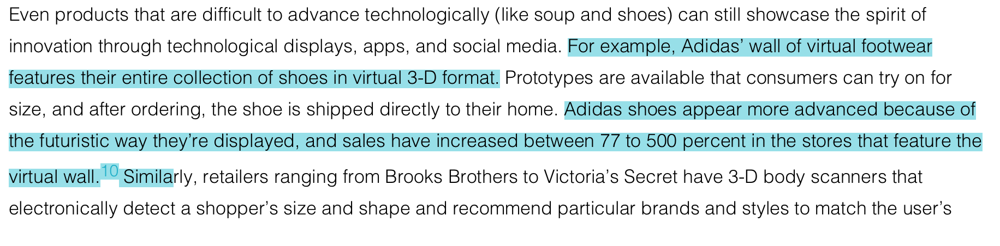

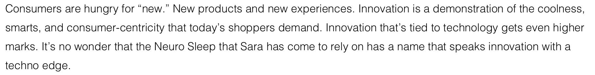

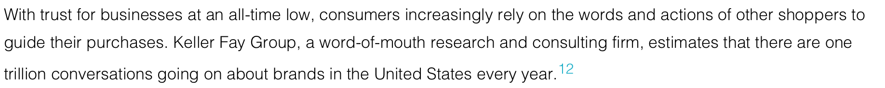

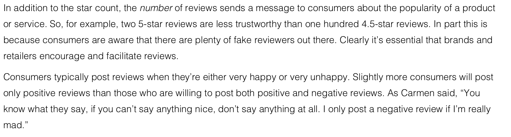

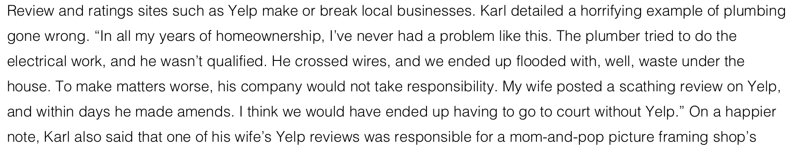

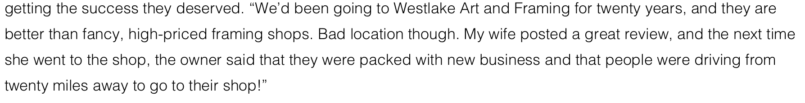

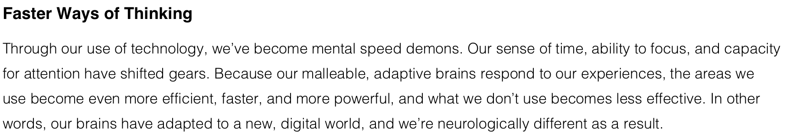

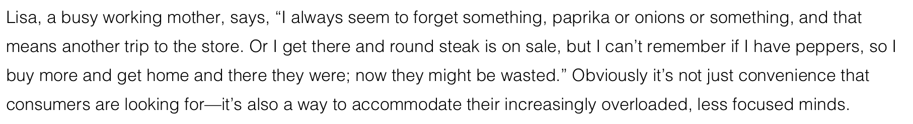

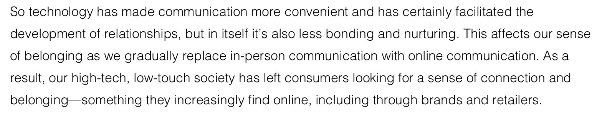

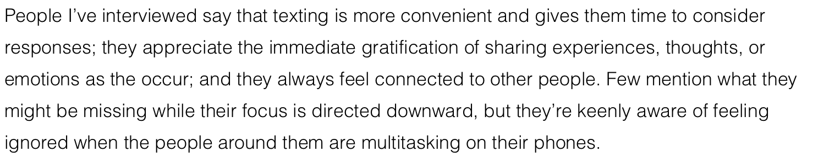

