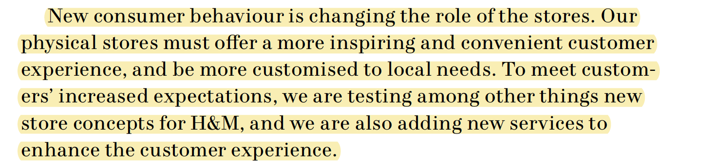
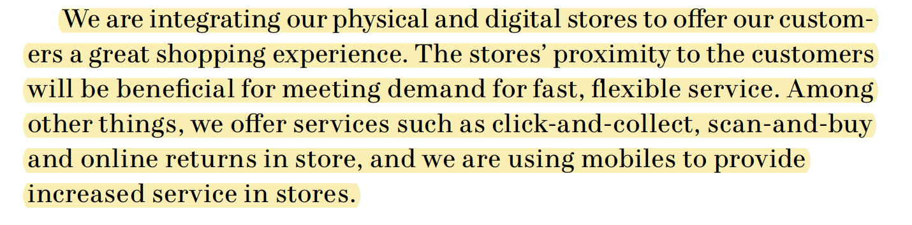
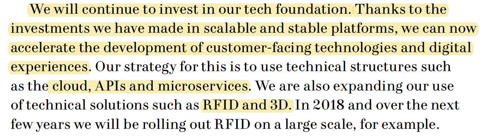
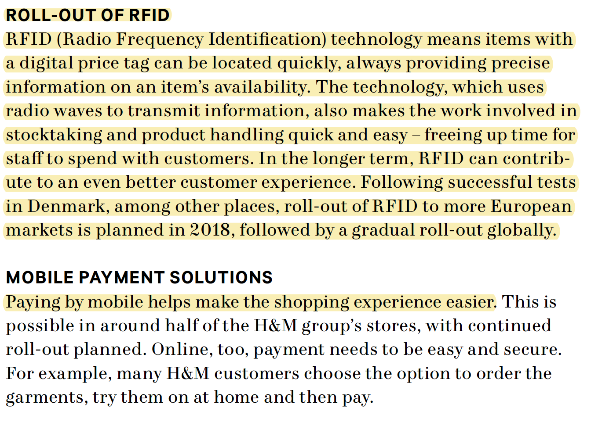
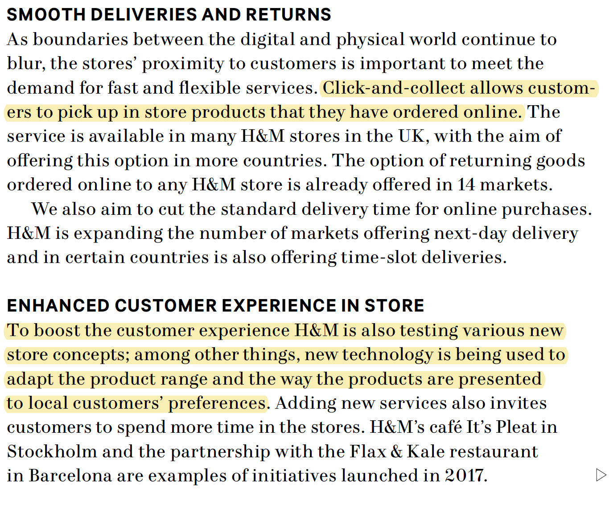
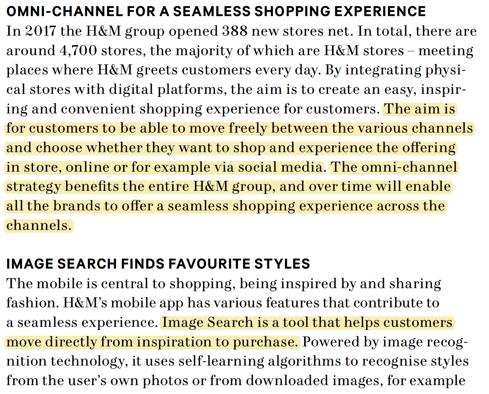
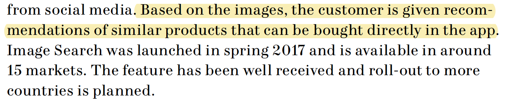

# H&M wil innovatie toepassen in de winkels

## Deelvragen:

**Hoe komt het dat de winkels van H&M minder goed presteren dan voorgaande jaren?** 

* Wat is hiervoor de reden? 
* Wat komt H&M tekort in vergelijking met hun concurrent?

