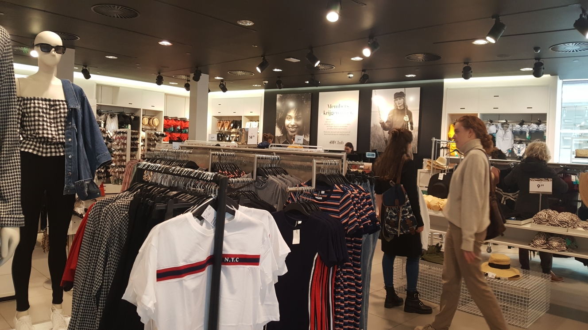

# Kalverstraat 125

### Wat wil ik weten over Kalverstraat 125?

Ik wilde meer informatie hebben over hoe de winkel werkt. Hoe komen de producten naar de winkel toe? Hoe werken de medewerkers? Hoe word de inventaris bijgehouden? Hoe word de winkel onderhouden? Van deze vragen krijg ik een beter beeld over de winkel en weet ik met wat ik kan werken. Zelf heb ik ook geobserveerd in de winkel om te zien wat er wordt verkocht. 

### Interview



**Naam:** Tess Jansen  
**Functie:** Sales advisor + alles en nog wat functie  
**Datum interview:** 7 februari 2019  
**Locatie:** Kalverstraat 125  
****Werkt 11 jaar bij de H&M  
Spreekt Nederlands en Engels

[De interview opnames zijn via deze link te vinden. Interview algemeen winkel: gaat over de winkel. ](https://drive.google.com/open?id=1voqQJow55nzKWkp7Z_x9aaltMxK8Ls59)



* Het filiaal bepaald zelf niet welke producten ze verkopen
* Dit wordt allemaal bepaald door het hoofdkantoor in Rotterdam en het magazijn in Tiel
* De kassa houdt bij wat er wordt verkocht en stuurt de data naar het hoofdkantoor
* Alle winkels moeten herkenbaar zijn als een H&M winkel
* Er is een commercial boek die de stijl van de winkel bepaald
  * Hier houdt de Visual Merchandiser zich aan
* Carment care: De winkel netjes houden 
* Medewerkers doen bijna alle taken in de winkel
  * Carment care
  * Producten inhangen
  * Consumenten helpen
  * Producten verkopen
* Andere problemen behalve de kassa
  * Te weinig maten
  * Meer ruimte nodig
  * Meer personeel nodig



1. Hoe komt het assortiment binnen in de winkel?
   1. Wat doen jullie als het assortiment in de winkel komt?
   2. Bepalen jullie welk assortiment in de winkel komt?
      1. Tussenvraag voor 1.2: Wat gebeurd er als jullie een item goed verkopen maar niet genoeg vracht binnen krijgen hiervoor?
   3. Hoe wordt het bijgehouden welk assortiment in de winkel wordt verkocht?
2. Wie kleed de poppen in de winkel?
   1. Bedenken zij de stijlen voor de poppen?
3. Wat doen de medewerkers in de winkel?
   1. Welke medewerkers zijn er in de winkel? \( Kassa, stylist, beveiliging etc\)
4. Komen mensen hier vragen voor een fashion stylist?
   1. Is er een fashion stylist?
   2. Wat doet een fashion stylist?
   3. Hoeveel kost een fashion stylist?
5. Wat doen jullie met de kleren die worden geretourneerd?
6. Wat voor andere problemen vind je in de winkel?



Het assortiment komt iedere ochtend via het vracht naar het filiaal. Het filiaal bepaald niet wat ze willen. Dit wordt bepaald door het hoofdkantoor in Rotterdam. Het vracht wordt gecontroleerd en wordt door de medewerkers uitgepakt. De medewerkers kijken naar welke collecties binnen zijn gekomen en hangen ze per collectie in de winkel op. Wanneer een product goed wordt verkocht wordt dit bijgehouden door de kassa. De kassa stuurt de gegevens door naar het magazijn in Tiel en hoofdkantoor in Rotterdam. Zij bepalen dan of er meer van het product wordt gestuurd of andere kleuren bij worden toegevoegd.

Alle winkels van de H&M moeten gelijk herkenbaar zijn. Je moet dezelfde winkelervaring hebben in elke filiaal. De Visual Merchandiser houdt de winkel aan de regels van het commercial boek. In het commercial boek staat wat de poppen aan moeten trekken en hoe de winkel eruit ziet.

De medewerkers moeten de winkel netjes houden dat carment care wordt genoemd. Producten aanvullen en consumenten helpen als ze vragen hebben. De meeste medewerkers kunnen achter de kassa werken en verkopen de producten van H&M.

De H&M geeft de consument de mogelijkheid om gratis met een fashion stylist een afspraak te maken. Na het maken van een afspraak wordt in het gekozen filiaal kledingsets klaar gemaakt. De consument kan dit aantrekken en samen met de fashion stylist bespreken wat ze goed vinden en wat niet. 

Wanneer kleren worden geretourneerd hangen we dit op in de winkel. Als het product niet wordt verkocht in ons filiaal geven we dit mee aan de vracht de volgende dag. Dit geven we aan bij het hoofdkantoor en zij bepalen waar de producten naar toe gaan. 

Wat het filiaal verder als probleem ervaart zijn de tekort aan producten. Ze hebben te weinig maten en willen meer ruimte hebben in de winkel. Er is ook te weinig personeel waardoor het lastig is de winkel te onderhouden. De paskamers worden rommelig en het kan lang duren bij de kassa.  



### Wat is er in de winkel?

Dit zijn de resultaten van mijn observatie en de vragen die ik in de winkel heb gesteld:

De winkel verkoopt voor vrouwen Basic, Divided en Everyday collecties. Dit neemt 3 van de vier diepingen in beslag. Voor de mannen is er Divided en Basic mannen collectie voor 1 verdieping. Ze verkopen behalve kleren ook accessoires, make-up artikelen en schoenen.

* De winkel heeft op drie verdiepingen paskamers waar consumenten de producten kunnen proberen. 
* Er zijn op drie verdiepingen kassa's maar de kassa's op de begane grond wordt vooral gebruikt. De andere twee niet zo vaak.
* De winkel heeft liften
* Er is een verdieping voor het magazijn, kantoor en kantine.
* In de winkel komen vooral toeristen en Nederlanders naar de winkel. De meeste Nederlanders die in deze winkel komen zijn Amsterdammers.

