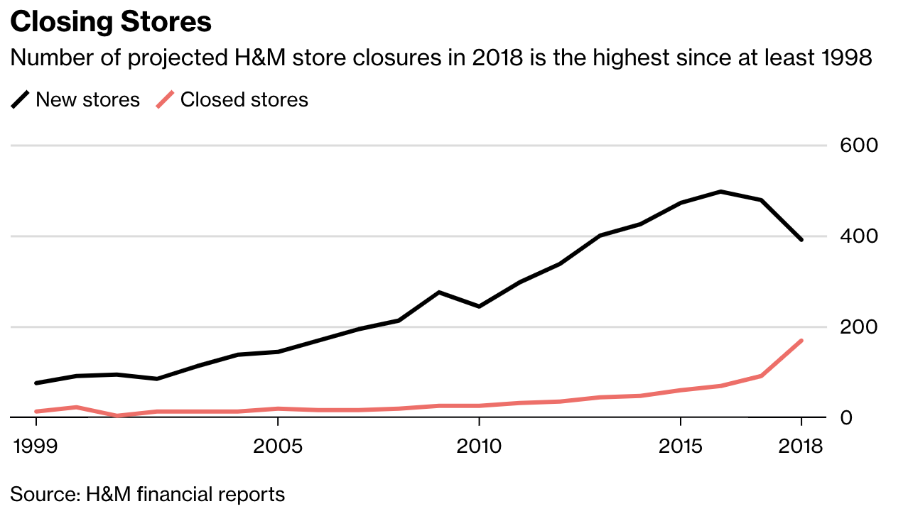
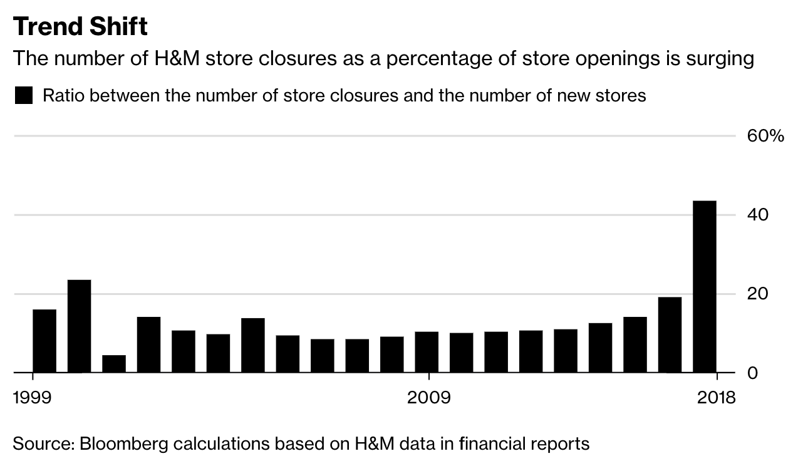
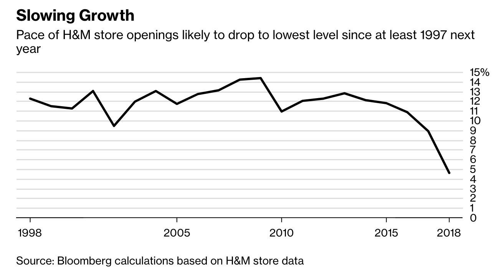

# Nieuwsberichten over H&M

## Deelvragen: 

**Hoe komt het dat de winkels van H&M minder goed presteren dan voorgaande jaren?** 

* Wat is hiervoor de reden? 
* Wat komt H&M tekort in vergelijking met hun concurrent?

## [H&M Is Closing the Most Stores in Two Decades](https://www.bloomberg.com/news/articles/2018-01-31/h-m-s-store-closures-to-surge-as-fashion-giant-shifts-strategy) 

By [Niklas Magnusson](https://www.bloomberg.com/authors/AOakIxrMFiE/niklas-magnusson) 31 januari 2018 16:01 CET Updated on 1 februari 2018 00:00 CET

The number of store closures by [Hennes & Mauritz AB](https://www.bloomberg.com/quote/HMB:SS) will surge to the highest level in at least two decades this year as the Swedish fashion giant tries to adapt to a new digital world where customers abandon physical stores and increasingly shop online.

In 2018, the clothing retailer expects to close 170 shops and open a total of 390 new ones, the biggest number of store closures since at least 1998. \(Magnusson, 2018\)

## [H&M, a Fashion Giant, Has a Problem: $4.3 Billion in Unsold Clothes](https://www.nytimes.com/2018/03/27/business/hm-clothes-stock-sales.html) 

By [Elizabeth Paton](https://www.nytimes.com/by/elizabeth-paton) March 27, 2018

Foot traffic in the past year fell as customers eschewed crowded shop floors in favor of online shopping, or lower-cost offerings elsewhere, a challenge hitting a wide array of “fast fashion” retailers. On Tuesday, the company said the pile of unsold stock had grown 7 percent in the past year and was now worth nearly 35 billion Swedish kronor.

The scale of the problem illustrates H&M’s vast size — as one of the world’s largest clothing manufacturers, it produces hundreds of millions of items each year. There are so many that a power plant in Vasteras, the town where H&M founded its first store, relies partly on [burning defective products](https://www.bloomberg.com/news/articles/2017-11-24/burning-h-m-rags-is-new-black-as-swedish-plant-ditches-coal) the retailer [cannot sell](https://about.hm.com/en/media/news/general-2017/h-m-does-not-burn-functioning-clothes.html) to create energy.  
  
Analysts have been pressing Karl-Johan Persson, the company’s chief executive, over the issue. Inventory levels were up, Mr. Persson said, because H&M was opening 220 new stores and expanding its e-commerce operations, and so needed to fill the racks.

Critics, however, blamed poor inventory management and underwhelming product offerings, prompting once-loyal shoppers to take their wallets elsewhere.

The company said operating profit fell 62 percent in the three months through February, sending its shares to their lowest closing price since 2005 on the Stockholm stock exchange.\(Paton, 2018\)

## [Betaalbare eenheidsworst van H&M is nu het probleem van de Zweedse kledingwinkel geworden](https://www.volkskrant.nl/economie/betaalbare-eenheidsworst-van-h-m-is-nu-het-probleem-van-de-zweedse-kledingwinkel-geworden~b1c66986/)

 [Jochem van Staalduine](https://www.volkskrant.nl/auteur/Jochem%20van%20Staalduine)31 januari 2018, 22:12

Lucy van der Wal wist de reden achter het succes van haar werkgever H&M in 2000 haarfijn uit te leggen: betaalbare eenheidsworst, dat was het geheim. De manager Nederland vergeleek de Zweedse keten in Het Parool met McDonald's. Die keten werd groot door lokale smaakverschillen te negeren en overal dezelfde burgers te serveren. H&M doet niet anders, analyseerde Van der Wal. 'Als jij morgen in Frankrijk een H&M-winkel binnenstapt, vind je daar dezelfde kleding als in Amsterdam. Dat is dus vertrouwd.'

Tijden veranderen. H&M's sterke punten zijn zwakke punten geworden, bleek woensdag uit de jaarcijfers van de Zweedse kledingketen. De nettowinst daalde in 2017 met 13 procent. De omzet groeide 3 procent, maar H&M kijkt naar omzetgroei zoals een scholier naar zijn cijfers: een drie is een dikke onvoldoende. Het aandeel H&M verloor woensdag 10 procent van zijn waarde, nadat H&M vorig jaar al ruim 30 procent van de beurswaarde zag verdampen. Topman Karl-Johan Persson deed in zijn toelichting niet geheimzinnig over zijn gevoelens. Het moet anders, volgens Persson. 'Het is duidelijk beneden onze verwachtingen.' En: 'We hebben fouten gemaakt die ons opgehouden hebben.'

#### Achterhaald

De gouden formule bleef al die tijd ongewijzigd: H&M verkoopt kleding uit Azië voor weinig geld. Lang werkte dat, maar de strategie is achterhaald, volgens Cor Molenaar, buitengewoon hoogleraar marketing aan de Erasmus Universiteit. 'Mensen willen tegenwoordig ergens bij horen. Dat is overal in de samenleving te zien. Facebook is te algemeen, jongeren gebruiken liever Snapchat.' Wie weinig specifieke voorkeuren heeft, kan zijn kleren op internet kopen. Naar de winkel gaan is voor veel consumenten een bewuste keuze geworden, volgens Molenaar. 'Mensen willen binding voelen, het moet 'hun' winkel zijn.'  
  
De concurrentie van H&M speelt daar op in door een doelgroep te kiezen en die aan zich te binden. Inditex, bekend van Zara, gaat voor de modieuze types. Het Spaanse bedrijf, als enige keten groter dan H&M, produceert dichter bij huis en kan daardoor sneller inspelen op veranderende voorkeuren en schuiven met collecties. Het Ierse Primark verslaat H&M op het gebied van goedkope kleding. \(van Staalduine, 2018\)

