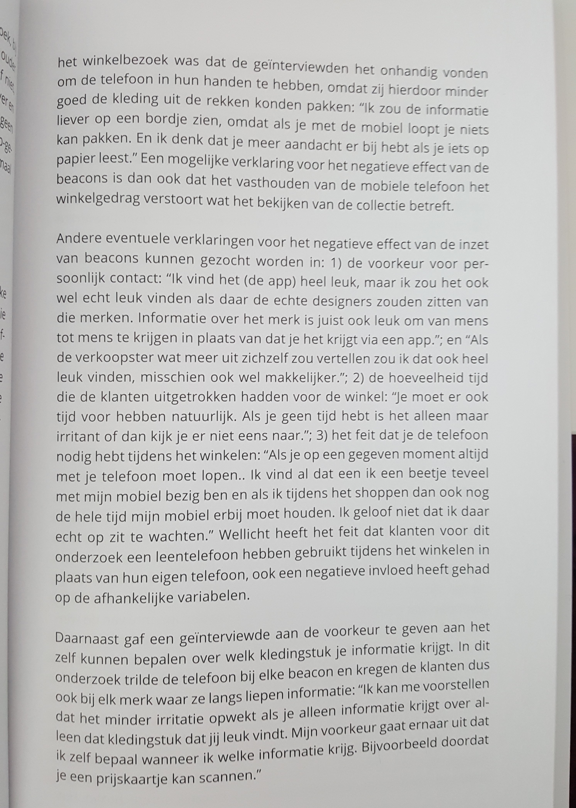
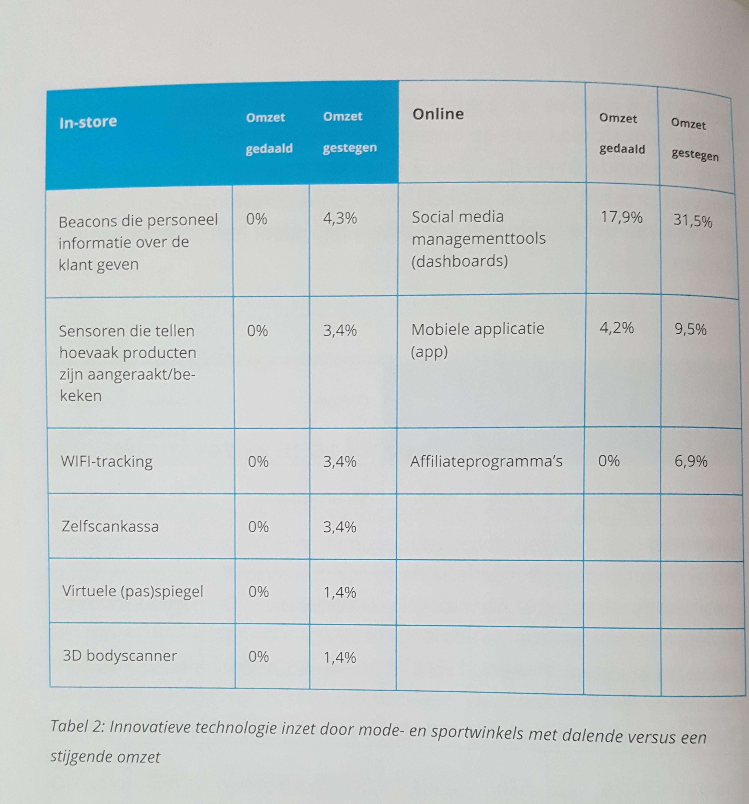
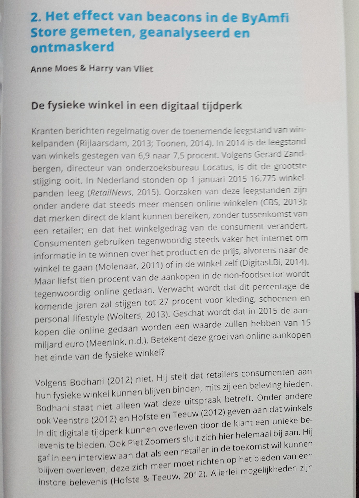

# Technologie redt de winkel?! van de Hogeschool van Amsterdam

### Deelvraag:  ****

* Wat kan er beter aan het huidige betalingsproces? 

Bij de kassa kan de consument het misschien minder erg vinden om de telefoon te gebruiken.  In het voorbeeld hierboven gebruikten ze de telefoon in combinatie met beacons. Wanneer je in de buurt kwam met je telefoon bij een beacon kreeg je informatie over een kledingstuk. Dit werkte irritant voor de gebruiker omdat ze dan meer aandacht besteedden aan hun telefoon dan aan de kleren voor zich. 

Ze vertellen niet welke winkels, maar de winkels die technologie toepassen scoren meer met omzet gestegen dan als ze geen technologie toepassen.

