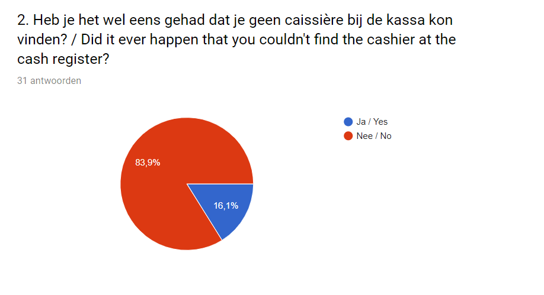

# Enquête

### Deelvragen

**Waarom is de consument niet tevreden over het betalingsproces?** 

* Wat kan er beter aan het huidige betalingsproces? 
* Hoe ervaart de consument de huidige betalingsproces? 

### Waarom een enquête?

De consumenten in de winkel willen meestal geen interview houden. Ik wilde ze namelijk interviewen nadat ze klaar zijn bij de kassa. Het is begrijpelijk dat ze dit allemaal afslaan omdat ze na het betalen weg willen gaan. Om deze reden heb ik een korte enquête gemaakt met Google formulieren. 

**Informatie:**

* In totaal hebben 31 consumenten het formulier ingevuld. 
* Ik stond op 20 en 21 februari in de winkel

### Belangrijkste bevindingen

* Meer dan de helft komt niet zo vaak naar H&M Kalverstraat 125
* Meer dan de helft wacht ongeveer 3 minuten
* Bij de kassa worden ze snel geholpen
* Meer dan de helft koopt meestal 1-2 producten 
* Meer dan de helft is H&M club member
* Ongeveer de helft kent de zelfscan kassa van Albert Heijn
  * Ze vinden dat goed werken behalve 5 mensen - 22 %
* De meeste zijn vrouwen tussen den 15-25 jaar.

### Resultaten van de enquête

