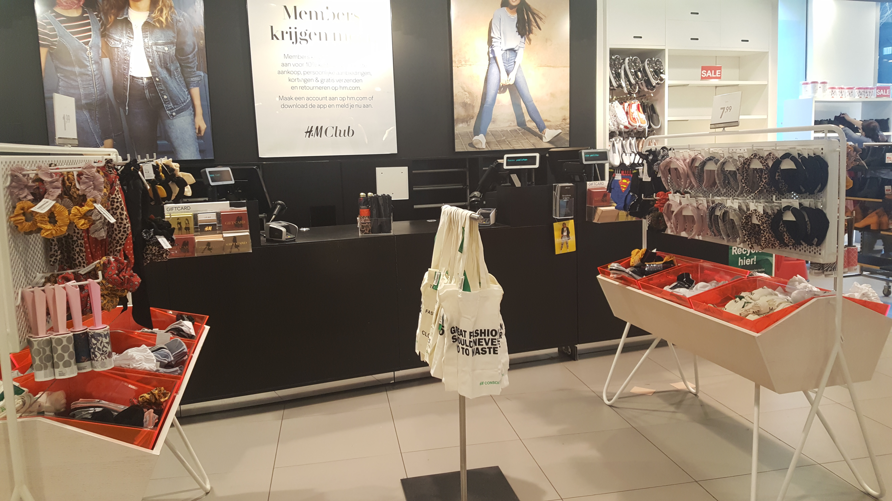

# Fly on the Wall

### Deelvragen: 

**Waarom is de consument niet tevreden over het betalingsproces?** 

* Wat kan er beter aan het huidige betalingsproces? 
* Hoe ervaart de consument de huidige betalingsproces? 



Datum: 15 februari 2019  
Locatie: H&M Kalverstraat 125  
Tijd: 13:55 tot 14:30  
Verdieping: Begane grond bij de kassa geobserveerd

**Ik ben zo vaak in de winkel geweest. Hier heb ik iedere keer weer opgelet bij de kassa. De bevindingen die ik op 15 februari schreef komen overeen met de andere keren dat ik ging observeren.**



* Vaak staat er niemand bij de kassa en staat de consument te wachten voor ongeveer 30 seconden
* De vraag over de H&M club member wordt niet altijd gevraagd
* De consumenten hebben meestal 1 - 2 producten bij zich
* De consumenten raken geïrriteerd wanneer het lang duurt bij de kassa
* De werknemers moeten soms elkaar spreken bij de kassa over het werk, waardoor ze de klant niet sneller kunnen helpen
* Gemiddeld doet de medewerker er ongeveer 1 minuut over om 1 product te verkopen
* 90% van de consument zijn vrouwen
* 70% betaalde met pinpas
* Om de kwartier kwam er een lange rij bij de kassa staan \(ongeveer 4 consumenten\)
* Over de lange rij werd er door 1 medewerker ongeveer 10 minuten over gedaan voor 2 medewerker 3 - 5 minuten
* De consument die het langst werd geholpen duurde ongeveer 5 minuten



### **Mijn observatie samengevat:**

Op vrijdag 15 februari stond ik voor een lange periode bij de kassa. Ik had namelijk niet door hoe snel de tijd ging terwijl ik ging observeren. Wat mij erg opviel was dat de medewerkers meerdere taken hebben in de winkel. Ze moeten de winkel netjes houden, nieuwe rekken zetten en kleding inhangen. Dit moeten ze allemaal doen en tegelijk op de kassa letten. Dat ging niet altijd even snel. De consument stond namelijk vaak te wachten bij de kassa. Het duurt ongeveer 30 seconden voordat een medewerker het merkte en naar de kassa liep.

De medewerker werkt wel erg snel. Per product doet ze er maximaal 1 minuut over en pakt snel in. Wanneer de consument naar de kassa gaat heeft ze haar kleren om haar arm, haar eigen jas en tas om haar arm en haar pinpas in haar hand. Ze leggen de producten op de toonbank en sommige kijken de medewerkers geen eens aan. Ze zijn stil en volgen wat de medewerker doet. Ze checken het scherm of de prijs klopt en geven aan wanneer ze er vragen over hebben. Sommige consumenten geven hun aandacht aan hun telefoon, vrienden of aan de producten die bij de kassa in de buurt hangen.

Er gebeuren ook menselijke fouten die iedereen kan overkomen. Zoals het missen van een label waardoor het alarm afgaat bij de poorten. De consument raakte toen geïrriteerd en liep terug naar de kassa. Wanneer iets niet kon worden opgelost werd er gebeld naar de manager en zij kwam toen langs om de consument te helpen. Als een consument vragen had werd de volgende consument verveeld. Door de vragen duurde het namelijk langer voordat de volgende consument aan de beurt kwam. Wat er nog mis kan gaan bij de kassa is de pinautomaat. Die wilt niet altijd een goede connectie maken met de pinpas van de klant.

In het kort ging bijna iedere verkoop bij de kassa op deze manier: De consument komt en wacht tot de medewerker er is. Ze zet haar spullen op de toonbank en wacht tot de medewerker klaar is. De medewerker begroette haar en de consument groette terug. Na het scannen vertelt de medewerker hoeveel het kost en vraagt of ze een tasje wilt. Voor de plastic tas komt er 10 cent bij en de papieren tas is gratis. Als laatste wordt er gevraagd of de consument een H&M clubmember is. De consument betaald en de medewerker pakt alles in. Ze wensen elkaar een fijne dag en de consument gaat de winkel uit.

