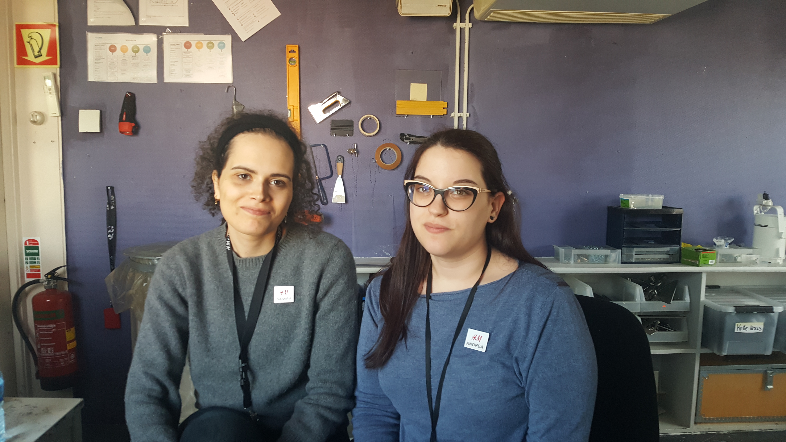

# Interview Andrea en Samira

### **Deelnemer\(s\)**

**Naam:** Andrea Soler  
**Functie:** Sales advisor  
****Werkt sinds oktober 2018 bij H&M Kalverstraat 125  
Spreekt alleen Engels en begrijpt Nederlands

**Naam:** Samira Ismail  
**Functie:** Sales advisor  
****Werkt sinds november 2018 bij H&M Kalverstraat 125 - Heeft hiervoor in de zomer van 2018 via Young Capital gewerkt bij meerdere H&M’s  
Spreekt Nederlands en Engels

[De geluidsopname van het interview is hier te vinden](https://drive.google.com/open?id=16M8e72h65giSWdhUXLamIYUwXltchMPo)  
De opnames werden tussen door verstoord. Hierdoor moest ik het trimmen.

### **Belangrijkste bevindingen**

* Samira vind het leuk aan de kassa: Als de klant beleefd is en dankbaar is
  * Niet zo leuk: Achter de kassa staan. Ze houdt niet van de face to face contact.
  * Niet zo leuk: Geld zetten op een cadeaukaart wat voor 1 minuut duurt. En dan sta je zo onnodig te wachten 
* Andrea leuk aan de kassa: Aardige klant en als je ze hebt geholpen naar het zoeken van een kledingstuk en ze vinden het, dat geeft voldoening
  * Niet zo leuk: Systeem van register kan door te veel mensen overlaad raken. Het zal dan langzamer werken 
* Andrea langste tijd achter de kassa zonder onderbreking: 1.5 uur
  * Gemiddeld op een dag 2 uur
* Samira langste tijd achter de kassa zonder onderbreking: half uur
  * Gemiddeld op een dag 1 uur. 
* Andrea en Samira maken met retouren wel eens fouten
  * Je moet heel goed letten op wat sale is en wat is betaald met tegoedkaarten

### Gestelde vragen

1. In het kort: Hoe help je een consument als die naar de kassa komt?
2. Uit je eigen ervaring: Zijn de meeste consumenten introvert of extrovert?
3. Uit je eigen ervaring: Wat vind je er leuk / minder leuk aan om bij de kassa te staan?
4. Uit je eigen ervaring: Wat was de langste tijd dat je achter de kassa hebt moeten staan?
5. Op een drukke dag, hoe lang sta je gemiddeld achter een kassa?
6. Wat gaat er soms niet soepel bij de kassa?
7. Iedereen is een mens en menselijke fouten komt bij iedereen voor. Wat gaat er soms mis bij de kassa?
8. Wat zijn je andere taken in de winkel?
9. Hoe weten jullie dat er iemand bij de kassa staat als er niemand achter de kassa balie is?
10. Wat wordt er gedaan als de rij bij de kassa lang is geworden?
11. Wat wordt er gedaan als er geen extra caissière bij kan komen wanneer het druk is?

### **Samengevat interview**

Samen met Andrea en Samira heb ik een interview gehouden. Hun ervaring leek best veel op elkaar maar hadden soms weer andere meningen. Ze zijn het met elkaar eens dat wanneer een klant beleefd is en aardig terug doet bij de kassa ze het erg fijn vinden. Wat Samira niet fijn vind om bij de kassa te werken is het face to face contact. Ze is zelf een introvert en wilt liever de klant helpen in de winkel of carment care doen. Wanneer ze geld moet zetten op een tegoedkaart of cadeaukaart doet de kassa er altijd een minuut of twee over. Beiden medewerkers vinden dit erg irritant, want het duurt alleen maar langer. Andrea vind het systeem van de kassa erg langzaam. Dit wilt ze liever sneller hebben zodat ze de klanten beter kan helpen.

Andrea vertelde mij dat de klanten van deze H&M erg introvert zijn. Ze zijn erg punctueel en willen snel iets kopen. Met punctueel bedoeld zij meer van: Het regent buiten en zij willen nu een paraplu gebruiken. De klanten willen dan niet al die vragen beantwoorden van wilt u een tas of bent u een H&M club member. Volgens Samira is het juist andersom. Ze vind de klanten meer extrovert en socialer dan haar. Ze gaf wel toe dat het eraan kan zitten dat ze zelf introvert is.

Wat er verder niet goed gaat bij de kassa volgens de dames is de fashion check. Als de klant niet weet hoeveel er op de fashion check staat dan duurt het erg lang. Want de kassa moet weten hoeveel er precies op de fashion check staat om het te accepteren. Wanneer er een retour binnenkomt moeten ze er erg goed op letten. Het komt wel eens voor dat je de verkeerde item retourneert die niet in de sale was. De klant krijgt dan een bedrag terug dat niet klopt. Waar ze nog meer bij retour moeten opletten is dat het geld terug gaat op de juiste manier. Als er met een tegoedkaart is betaald dan moet het terug op de tegoedkaart. Wanneer de rij bij de kassa erg lang is kijken ze of de klanten retour of veel producten hebben. Ze bellen de manager of via de bel onder de toonbank voor hulp. Als niemand kan komen dan vertelt Andrea de situatie aan de klanten en werkt zo snel mogelijk. De eerste twee klanten hebben meer begrip dan de klanten er achter.

Er is ook geen melding wanneer een klant bij de kassa staat. De medewerkers moeten dan zelf hele tijd kijken. Andrea vertelde dat ze het zelf heeft aangeleerd om op bepaalde momenten van de dag dicht bij de kassa te staan. Samira vind zelf dat ze geluk heeft dat de klanten naar haar toe komen. Ze geeft zelf wel toe dat het vervelend kan zijn voor de klanten om te moeten zoeken naar een medewerker.

