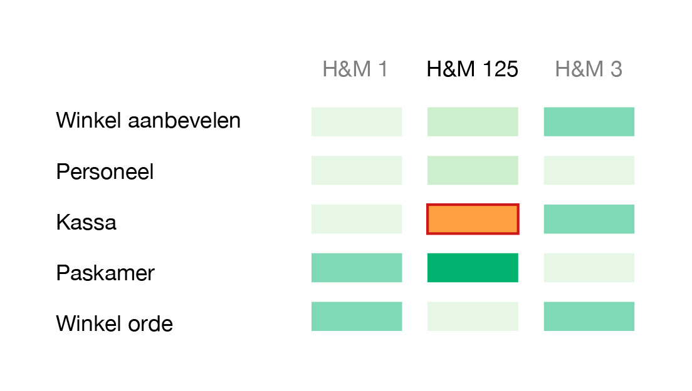
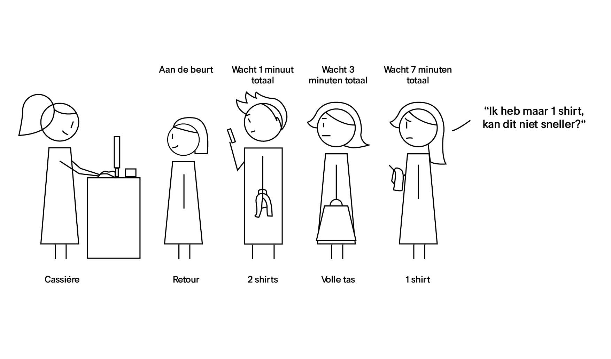
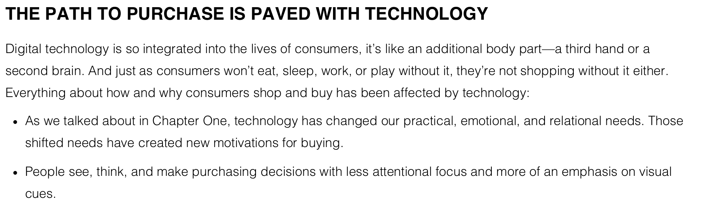
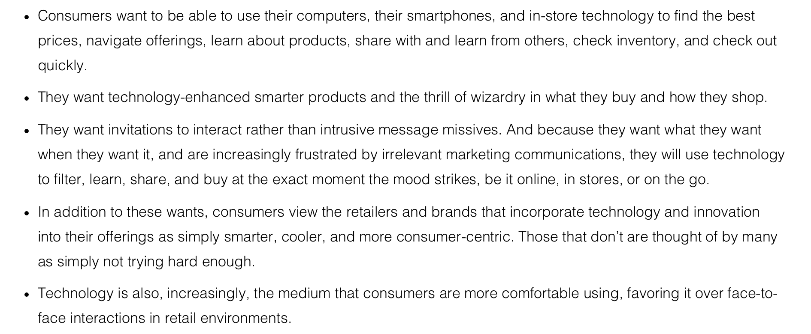
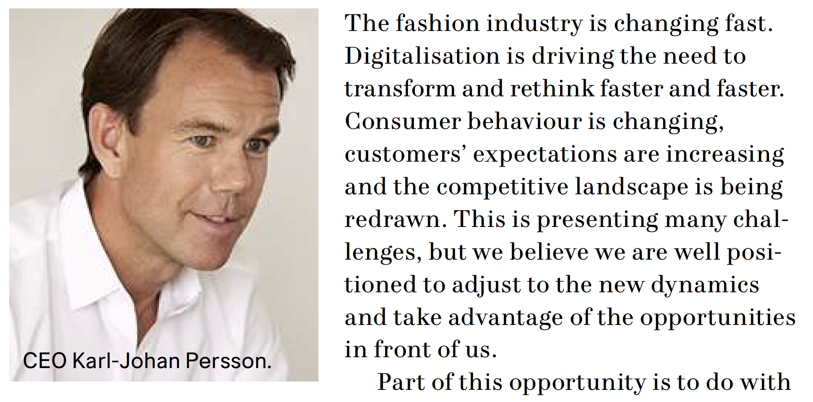

# Introductie onderwerp

In de zomer van 2018 heb ik via Young Capital gewerkt bij H&M. Hierdoor werkte ik bij verschillende filialen als ze me nodig hadden. Bij H&M Kalverstraat 125 heb ik het meest gewerkt. De winkel heeft een tablet waar consumenten hun mening over de winkel kunnen geven . Dit doen ze door een korte enquête in te vullen. Ze kunnen er niks bij opschrijven en alleen door middel van smileys aangeven hoe tevreden ze zijn. Van de data**\*** konden we zien dat de kassa ervaring niet goed genoeg is. Het staat momenteel in oranje \(Niet tevreden tot neutraal\) wat groen \(tevreden\) moet zijn. Dit is niet goed voor de winkel, caissières en de consument. Ze weten niet waarom dit zo is en willen dit graag verbeteren. 

_\* Het bestand van de data van de tablet mag ik helaas niet overnemen of fotograferen. Deze data is alleen bedoeld voor H&M en mag niet gepubliceerd worden. Ik mag er zelf wel naar toe kijken wanneer ik wil en vragen stellen als iets mij niet duidelijk is._ 

Om deze reden wil ik één pijnpunt van het betalingsproces verbeteren. Ik zal eerst uitzoeken waar de pijnpunten zijn en welke ik het beste kan verbeteren. In de tekening hieronder laat ik zien wat ik bedoel met het betalingsproces. In het kort is het betalingsproces het moment dat de consument naar de kassa toe gaat tot na het betalen van haar product\(en\) en weggaat. 

**Over H&M** 

H&M heeft 4.968 fysieke winkels in meer dan 71 landen \(H&M, z.d.\). In Nederland zijn er 145 fysieke winkels \(H&M, 2018\). De kleren die H&M verkoopt zijn er voor mannen en vrouwen van alle leeftijden. Ze worden kwalitatief gemaakt en voor een scherpe prijs verkocht. H&M wil winkels blijven openen in landen waar ze nog niet in staan. Dat zal lastig gaan, omdat de winkels niet goed presteren. Dat heeft de CEO Karl-Johan Persson toegegeven in de annual rapport van 2017 \(H&M, 2018\). H&M heeft sinds het begin in de jaren 50 het winkelproces hetzelfde aangehouden \(Van Staalduine, 2018\). Maar tijden veranderen en de consument is niet meer hetzelfde. Ze verwachten innovatie en een betere winkel ervaring zoals het online shoppen. Dat heeft H&M zelf onderzocht en uit het boek van Kit Yarrow: Decoding the New Consumer Mind staat al geschreven dat retail met technologie de fysieke winkels kan redden \(Yarrow, 2014\). 

\_\_

Het liefst wil ik de complete winkelervaring verbeteren, maar met 20 weken heb ik niet genoeg tijd om dat te kunnen doen. Om deze reden ga ik de komende 20 weken focussen op het verbeteren van het betalingsproces. Dit project ga ik doen bij de H&M in Kalverstraat 125 Amsterdam. Ik zal onderzoeken hoe het proces nu gaat, wat er verbeterd aan kan worden en op welke manier dit het beste is te doen.

