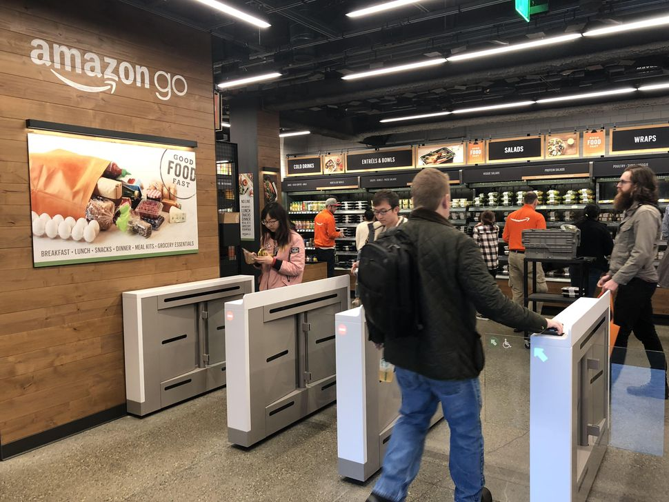
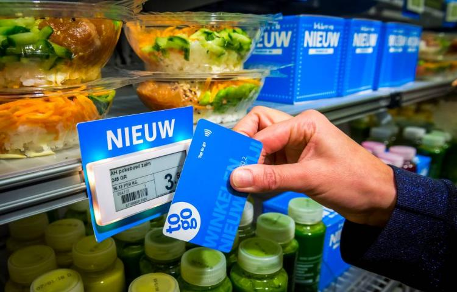
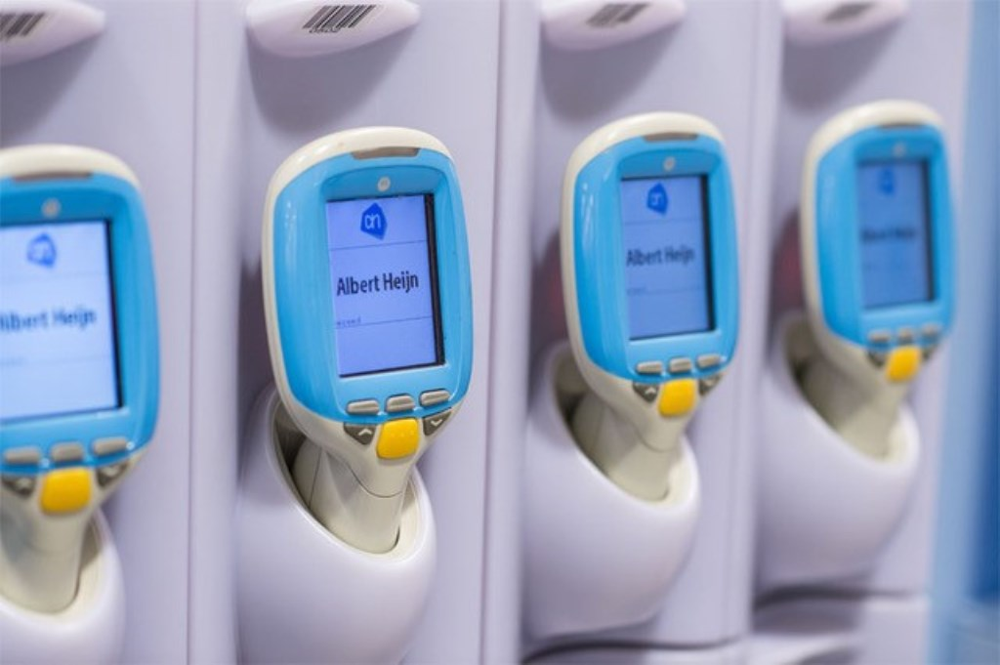
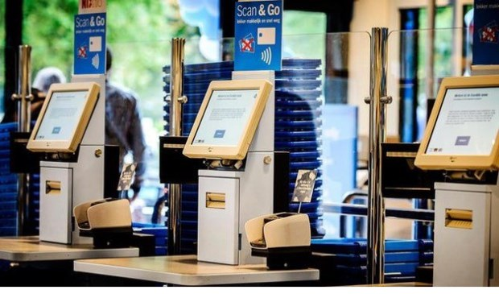

# Product visie

### Amazon Go \(Jansen, 2018\) 

Winkelen en betalen zonder kassa. Je loopt naar binnen, scant je telefoon bij de poorten, pakt wat je nodig hebt en gaat weer naar buiten. Alles wordt betaald via de telefoon.

* Snel - toekomstvisie - geen gedoe
* Diefstal - hoe accuraat is het? - dure technologie

### Albert Heijn Kassaloos betalen \(De Ondernemer, 2018\)

Ook de Albert Heijn is van plan om kassaloos te werken. Je scant met je telefoon of een Go-kaart de barcodes bij de producten. De klant pakt de producten en verlaat de winkel. Daarna wordt het automatisch van je rekening afgeschreven.

* Toekomstvisie - snel - geen rij.
* Kans op diefstal - niet iedereen wilt kassaloos - moeite om alles zelf nog te scannen.

### Albert Heijn zelf scan kassa \(Ramon Oolthuis, 2018\) 

Nog een voorbeeld is dat je bij Albert Heijn een scanner kan meenemen met je Albert Heijn pas. Met de scanner scan je de producten en gaat naar een zelf scan kassa toe. Je zet de scanner terug in een kast en scant met je pas bij een zelf scan kassa. Daar betaal je je producten en krijgt een bon om de winkel te verlaten.

* Werkt goed voor vele - geen lange rij - acties en kortingen automatisch toegevoegd
* Kans op diefstal - moeite om alles zelf nog te scannen - systeem kan niet werken - verplicht AH pas

### Albert Heijn to go Scan & Go \(Albert Heijn, 2017\) 

De Albert Heijn past technologie goed toe aan hun winkels. In Albert Heijn to go kan je zelf je producten pakken en scannen. Medewerkers kunnen soms langs komen om het even te controleren en vervolgens betaal je het product.

* Makkelijk te gebruiken - snel en simpel - geen lange rijen
* De moeite nemen om zelf alles te scannen - het systeem kan niet werken

