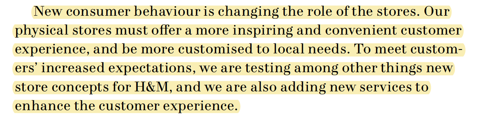

# Stakeholders

**De meeste zijn aannames over de stakeholders die ik wil onderzoeken** ‌

### **H&M corporate:**  

**Problemen**‌

* Maakt met de fysieke winkels niet zoveel winst \(H&M, 2018\) 
* Ze lopen achter met innovatieve en technische ontwikkelingen \(H&M, 2018\) 
* Ze hebben voor het eerst sinds 2017 de grootste daling in het openen van nieuwe winkels en een toename van het sluiten van winkels \(H&M, 2018\) 

**Behoefte**‌

* Ze willen meer winst maken met hun winkels 
* Ze willen winkels overal blijven openen 
* Ze willen minder winkels sluiten \(H&M, 2018\) 

### **H&M Kalverstraat 125:** 

**Problemen**‌

* Op dit moment krijgt de winkel oranje \(onder het gemiddelde\) als feedback voor de kassa ervaring 
* De consumenten worden niet zo snel geholpen 
* Er zijn niet zo veel werknemers op de vloer om de consumenten te helpen

**Behoefte**‌

* Wil dat de kassa ervaring word verbeterd 
* Wil dat de consument beter word geholpen 
* Wil de consument sneller helpen 

### **H&M Caissière** 

**Problemen**‌

* Heeft het druk in de winkel 
* Niet altijd snel genoeg bij de kassa 
* Lastige klanten 

**Behoefte**‌

* Wil de winkel netjes houden
* Wil klanten zo goed mogelijk helpen
* Wil bij de kassa zo soepel en snel mogelijk de consument helpen

### **H&M Consument** Vrouwen - 15-30 jaar \(Delirium, z.d.\) 

**Problemen**‌

* Wil niet te lang in de rij staan 
* Wil snel afrekenen. 
* Wil niet terug lopen om het alarm van de kleren af te doen 

**Behoefte**‌

* Wil snel afrekenen 
* Wil niet te lang in de rij wachten 
* Wil technische oplossingen hebben \(H&M, 2018\) + Aanname 

