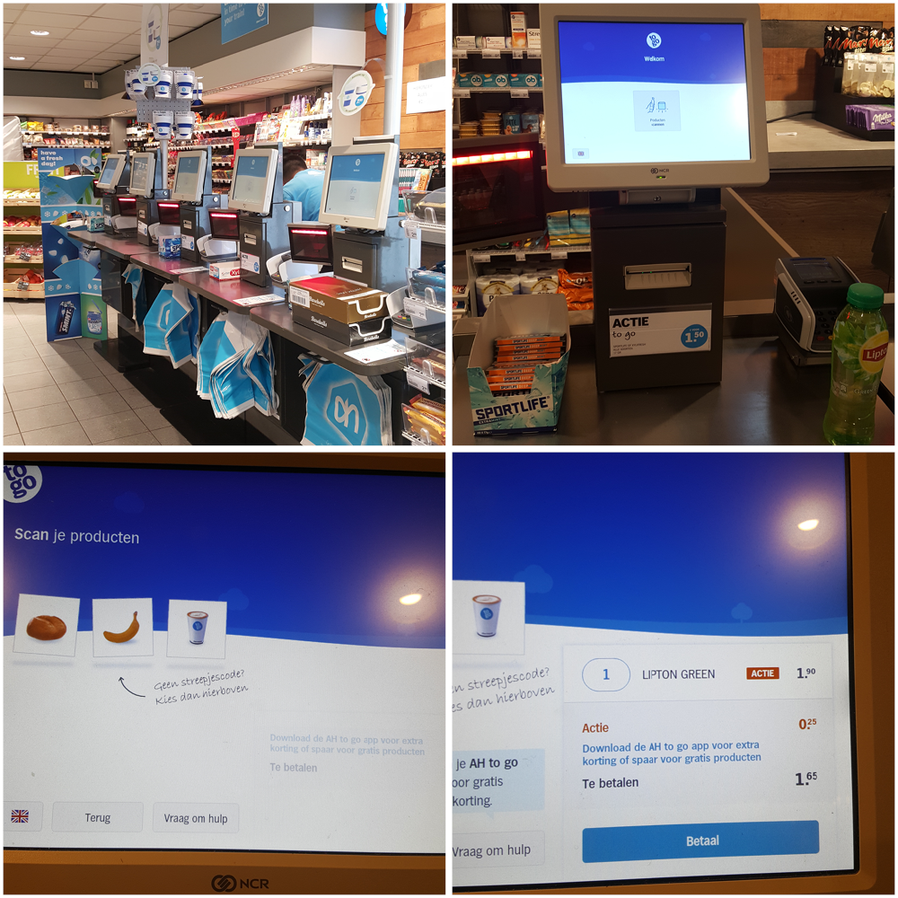
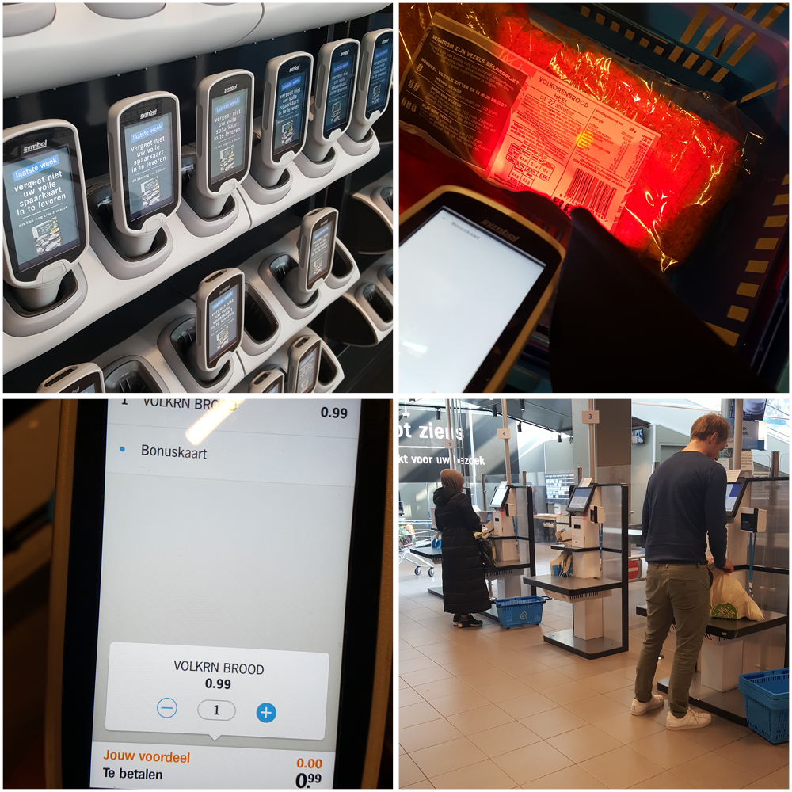
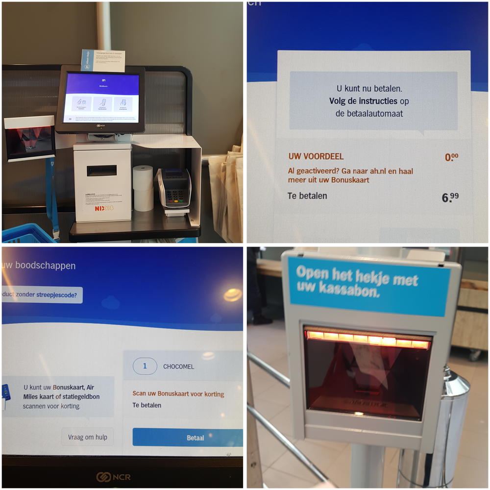

# Albert Heijn

### Deelvragen

* Wat komt H&M tekort in vergelijking met hun concurrent? \(Van deelvraag: **Hoe komt het dat de winkels van H&M minder goed presteren dan voorgaande jaren?**\)

**Hoe kan een product helpen om het betalingsproces te verbeteren?** 

* Hoe doen andere vergelijkbare retailers dit? 

## **Albert Heijn to go Lelylaan 28-2-2019**

### **Belangrijkste bevindingen To Go**

* Er zijn geen hekjes om in de winkel te komen of eruit te gaan
* Geen rij
* Iets van 8 zelfscan kassa’s in de winkel
* De zelfscan kassa werkt makkelijk
* Je scant snel je product
* Als je een bonuskaart hebt kan je die ook snel scannen
* Betaald met je pinpas
* Tassen en extra’s zoals kauwgom zitten bij de zelfscan kassa in de buurt
* Duidelijke interface
* Kortom een hele fijne ervaring

### **Samengevat ervaring To Go**

Bij station Lelylaan is er een Albert Heijn to go. Je kan alleen naar binnen als je je incheckt voor het station. Een Albert Heijn to go is anders dan de gewone supermarkt van Albert Heijn. Je kan namelijk naar binnen zonder langs poortjes te gaan. In de winkel heb ik gekozen om een ice tea te kopen.

Er was geen rij bij de zelfscan kassa, omdat er maar 2 klanten \(inclusief ik\) en 2 medewerkers waren. Aangekomen was het gelijk duidelijk wat ik moest doen bij de kassa. Er stond op het scherm: Producten scannen. Dit deed ik nog niet want ik vroeg mij af wat er gebeurd als ik op de knop klikte. Er verscheen een vervolg pagina waarop stond: Scan je producten. In het midden zag ik brood, banaan en koffie staan. Dit waren goede voorbeelden van producten zonder streepjescode. Als ik er op zou klikken zou ik de opties krijgen van producten zonder barcode en die aanklikken. Ik scande mijn ice tea en zag gelijk resultaat met de actie korting. Ik had mijn bonuskaart van Albert Heijn bij mij en scande die ook voor punten. Dit kwam ook gelijk op het scherm terecht. Vervolgens klikte ik op betaal en de pinapparaat werd geactiveerd. Contactloos betalen ging soepel en kreeg als laatst een vraag of ik een bon wilde. Deze optie ging voor mijn gevoel iets te snel en kon toen geen bon ontvangen.

Van een andere ervaring heb ik wel eens een controle meegemaakt. De kassa’s kiezen random uit dat er af en toe gecontroleerd moet worden. Dit vind ik zelf wel fijn zodat er niet wordt gesjoemeld.

Over deze ervaring ben ik best tevreden, behalve over de bon. Het is alles wat ik van een zelfscan kassa kan verwachten. Ik vraag mij af hoe ik deze snelle proces kan toepassen aan de H&M.

## **Albert Heijn XL Osdorp 28-2-2019**

### **Belangrijkste bevindingen XL**

* De scanners zitten buiten en binnen in de winkel
* Je moet het wel hele tijd vasthouden of in de tas zetten
* Scant makkelijk de barcode
* Je ziet direct hoeveel het totaal kost en hoeveel korting je hebt verzameld
* Ik mis alleen wel een overzicht van al mijn producten bij de zelfscan kassa na het gebruiken van de scanner
* 12 zelfscan kassa’s
* Geen rij
* Makkelijkste en meest heldere interface
* Was binnen 1 minuut klaar voor 4 producten
* Meerdere opties bij de zelfscan kassa
* Er zijn nog steeds standaard kassa’s
* Er zijn bij de zelfscan kassa’s medewerkers die controleren

### **Samengevat ervaring XL**

Voordat ik de supermarkt binnen liep keek ik rond waar de scanners zaten. Ze waren gelijk naast de poortjes in de kast en ook als je langs de poortjes bent kan je een scanner pakken. Dit is handig voor als je was vergeten een scanner mee te nemen. Ik keek naar de het scherm bij de kast van de scanners en het vertelde mij dat ik alleen mijn bonuskaart hoef te scannen. Ik volgde de instructies en kreeg te zien dat ik naar een verlichte scanner moet zoeken. Die viel gelijk op door een opengemaakte geluid en licht. De scanner pakte ik op en ging met een winkelmandje de winkel in.

Van mijn moeder had ik een boodschappenlijst gekregen wat ik moest halen. Dit zocht ik op in de winkel. Bij ieder product moest ik met de scanner de barcode scannen. Ik zag daarna gelijk op het scherm van de scanner hoeveel het kost, hoeveel stuks ik heb en of ik korting heb gekregen. Meer hoefde ik ook niet te weten en het was erg duidelijk ontworpen. Het enige wat ik merkte was dat het niet zo goed werkt op de bordjes bij de producten in het schap.

Nadat ik alles had verzameld ging ik naar de kassa toe. De standaard kassa’s nemen de meeste ruimte in en de zelfscan kassa’s zitten ernaast. Bij de standaard kassa’s waren er lange rijen en was het er erg druk. Wat mij opviel was dat het niet zo druk was bij het zelfscannen. Er was geen rij en de klanten waren hier heel snel klaar. In het midden zag ik scanners weer terug in de kasten gezet worden. Je kon bij iedere zelfscan kassa een tas bij kopen en je mandje terug zetten. Ik koos een zelfscan kassa en volgde de instructies.

Als eerste kreeg ik 3 opties. De eerste was of ik zelf de producten nu wil scannen. De tweede was of ik al mijn producten had gescand met een scanner. Als laatst was de optie om mijn aankopen te betalen via de Albert Heijn applicatie. De eerste twee opties heb ik kunnen proberen maar niet de applicatie, want die had ik niet.

Ik koos voor de scanner en er werd uitgelegd dat ik eerst mijn scanner terug moet zetten in de kast. Dit had ik gedaan en moest vervolgens mijn bonus kaart scannen. Gelijk kreeg ik mijn kosten te zien en de korting als ik die had verzameld. Alles klopte en kon gelijk betalen. Het enige wat ik miste was om nog één keer een overzicht te kunnen zien van mijn producten. De betaling ging vlekkeloos en ik kreeg mijn bon.

Heel even testte ik hoe het scannen van producten bij de kassa zou zijn. Net zoals bij Albert Heijn to go was het makkelijk te scannen en te gebruiken. Ik kon bepalen hoeveel producten ik had gekocht en gelijk betalen.

Toen ik uit de winkel wilde stappen moest ik mijn bon scannen. Ik pakte mijn bon en scande het via de scanner. De poorten gingen open en ik ging weer uit de winkel.

De betalingsproces begint eigenlijk al wanneer je de scanner pakt. Daarom heb ik er ook bij opgelet hoe het in de winkel is met de scanner. Ene kant is het erg handig om het zelf al te doen. Andere kant is het wel een beetje vervelend om zo iets groots vast te moeten houden.

Bij de zelfscan kassa’s waren er 2 medewerkers. Een bij de poorten en een ander die in het midden zat. Hij hielp de klanten als ze vragen hadden en de ander controleert de aankopen als het nodig was. Bij mij was het niet het geval en vind het eigenlijk wel een goed idee dat medewerkers hier op letten. Ik geloof wel zeker in dat mensen hier sjoemelen met hun aankopen. Mijn hele ervaring bij de Albert Heijn XL was uitstekend en ik zou zelf wel vaker zo boodschappen doen.

