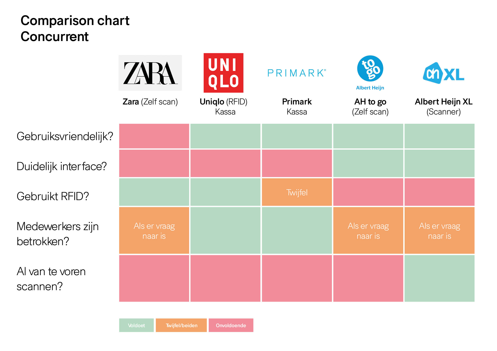

# Competitive Analysis

### Deelvraag:

* Hoe doen andere vergelijkbare retailers dit? \(Van de deelvraag: **Hoe kan een product helpen om het betalingsproces te verbeteren?** \)

### Waarom Competitive Analysis?

Met de methode competitive Analysis wilde ik onderzoeken hoe het bij de concurrent werkt. Hoe werken zij met het betalingsproces? Wat doen zij anders dan H&M? Hoe is de beleving van hun betalingsproces? 

### Belangrijkste bevindingen

* Zara's zelfs scan kassa werkte niet makkelijk
  * De ervaring was ook lastig
  * Gebruikt wel RFID
  * Medewerkers horen eigenlijk niet betrokken te zijn maar zag ze vaak terug komen
* Uniqlo gebruikt in de hele winkel RFID
  * Geen interface omdat ze voor de rest een kassa gebruiken
  * Zal niet voor Uniqlo's methode kiezen omdat het alleen RFID is. 
    * Maar vind de RFID enorm handig dat gebruikt kan worden bij H&M 
* Primark gebruikt een standaard kassa
  * Ze hebben niet echt een alarm systeem of ik kon de RFID maar niet vinden
  * Las ook nergens online iets over RFID
  * Er is maar 1 rij om naar de kassa te gaan
  * First come first serve methode gebruiken ze
* Albert Heijn to go zelf scannen
  * Voor kleine boodschappen bedoeld
  * Heel makkelijk en fijn in gebruik
* Albert Heijn XL heeft ook een zelfscan kassa maar ook een scanner
  * Beiden methodes werken erg fijn
  * Je hebt al van te voren gescand en hoeft daarna alleen af te rekenen +
  * Medewerkers zijn alleen betrokken om af en toe te controleren of om vragen te beantwoorden

### Welke kwam het beste uit?

Albert Heijn XL kwam uit mijn onderzoek het beste uit. Dit kwam vooral door hun duidelijke interface in de scanner en bij de zelfscan kassa. Het was ook niet lastig te gebruiken. Je scant en je hebt je product toegevoegd. Bij de zelfscan kassa kan je ook zonder de scanner je producten scannen. Het waren hele simpele stappen om uit te voeren en ik was snel klaar. Zonder hulp van medewerkers kon ik makkelijk mijn weg vinden en stond ik niet eens in de rij. 

H&M is geen supermarkt maar het concept kan volgens mij wel verwerkt worden in een kledingwinkel. Misschien kan dit in samenwerking met de RFID die Uniqlo gebruikt. Om deze reden wil ik RFID eerst verder onderzoeken. Dan weet ik wat een RFID allemaal kan. 

Uniqlo en Primark maken nog wel gebruik van een 'standaard kassa'. Met dit bedoel ik dat de klant naar de kassa toe gaat en door de medewerker laat scannen. 

