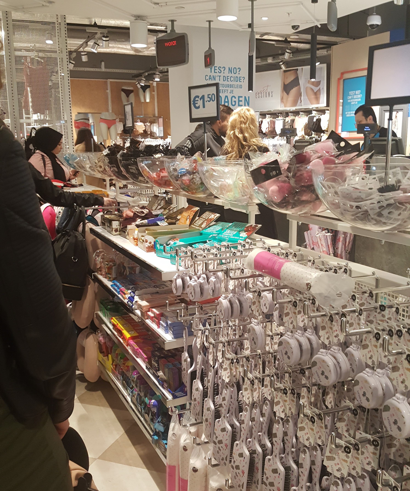

# Primark

### Deelvragen

* Wat komt H&M tekort in vergelijking met hun concurrent? \(Van deelvraag: **Hoe komt het dat de winkels van H&M minder goed presteren dan voorgaande jaren?**\)

**Hoe kan een product helpen om het betalingsproces te verbeteren?** 

* Hoe doen andere vergelijkbare retailers dit? 

### **Belangrijkste bevindingen:**

* Lange rij
* Consumenten kopen in een keer veel spullen
* Bij de kassa zijn er allemaal spullen die je kan kopen terwijl je wacht
* Winkel is er erg druk
* Weinig caissières op de dag toen ik ging
* Bij de kassa wel snel geholpen
* Contactloos betalen deed het niet

### **Samengevat ervaring:**

Bij de Primark is de kassa ervaring net een beetje anders. Ik kocht er wandplanken en ging in de rij wachten. Het duurde iets van 10 minuten voordat ik aan de beurt kwam. Er was namelijk een erg lange rij en er waren maar 2 caissières.

Wanneer je wacht in de rij staat iedereen op hun beurt te wachten. Via het bordje boven het einde van de kassa rij staat naar welke kassa je heen moet. Ik vind dit zelf een eerlijke methode. Het gebeurd wel eens dat je de keuze hebt uit twee kassa’s. Je kiest de eerste kassa en staat langer te wachten dan de mensen bij de tweede kassa. Terwijl jij er eerder stond en later klaar bent.

Toen ik aan de beurt kwam werd ik begroet en gaf ik mijn wandplanken. Hij scande de barcode en vroeg of ik een tasje wilde. Hierop zei ik ja en vroeg of hij niet het alarm af moet halen. Net als bij Uniqlo wees hij naar de barcode van wandplanken. Ik keek na de betaling naar de barcode. Hier zag ik nergens RFID staan en kon niet de RFID lijnen achter de label zien. Ik wil de barcode niet afhalen want ik wil de wandplanken terug brengen.

In de winkel zocht ik op kleren en andere producten naar een label. Misschien zag ik het verkeerd en hebben sommige items wel een label. Net als de wandplanken hebben de andere producten geen label en wel een barcode. Ik vraag me af of Primark dan ook werkt met RFID en ben van plan dit te onderzoeken.

