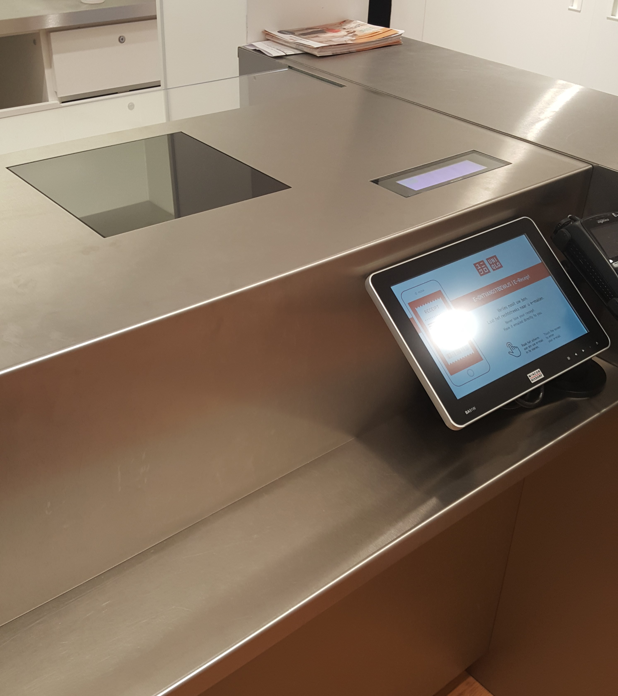
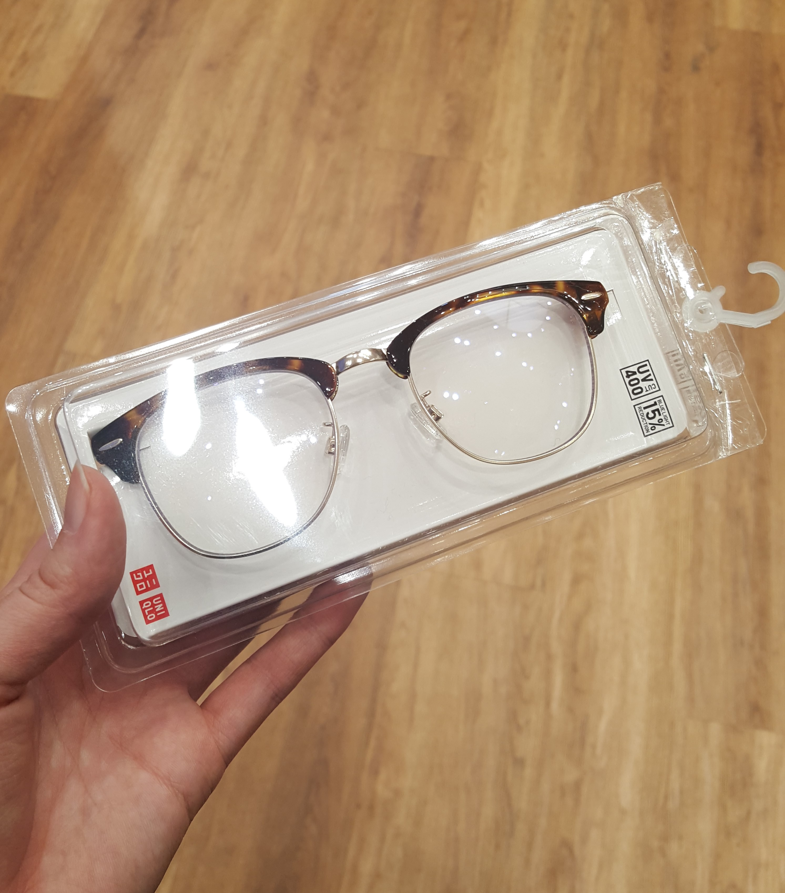
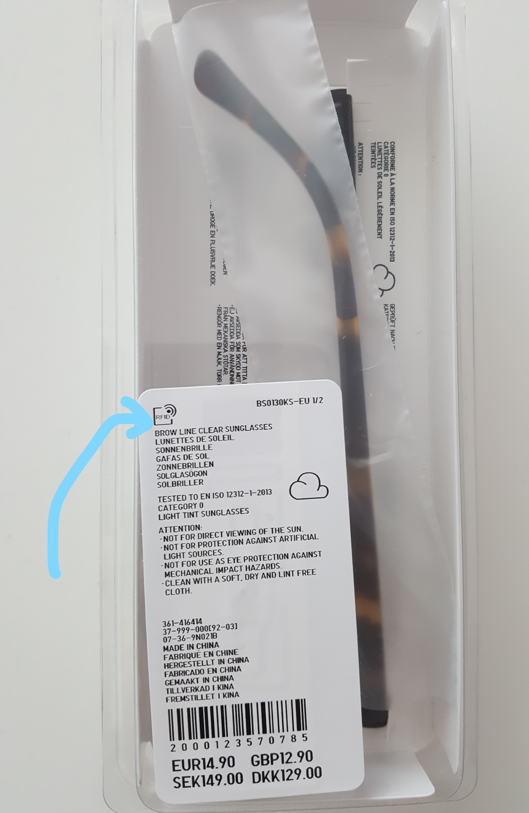

# Uniqlo

### Deelvragen

* Wat komt H&M tekort in vergelijking met hun concurrent? \(Van deelvraag: **Hoe komt het dat de winkels van H&M minder goed presteren dan voorgaande jaren?**\)

**Hoe kan een product helpen om het betalingsproces te verbeteren?** 

* Hoe doen andere vergelijkbare retailers dit? 

### **Belangrijkste bevindingen:**

* Geen rij!
* Was binnen 30 seconden al klaar
* Snelle en fijne service
* De tablet bij de kassa is om je bon digitaal te sturen naar je e-mail
* Kassa is niet te zien alleen een toonbank
* Via de toonbank producten scannen en alarm afdoen
* In Uniqlo zijn er veel beveiligers
* Alle producten hebben een RFID zender

### **Samengevat ervaring:**

Toen ik de winkel binnenliep verwachtte ik dat Uniqlo dezelfde kassa systeem heeft als alle andere. Als eerste liep ik gelijk door naar de kassa en zag vier tablets staan zonder een duidelijke kassa op de toonbank. Ik raakte hierdoor benieuwd hoe het werkte en besloot om een glazen zonnebril te kopen.

Ik liep naar de kassa toe en klikte op de tablet. Het ging erover dat je je e-mail kan invoeren en de bon digitaal kan meenemen. Dit is handig als je op vakantie bent en in eigen land wilt retouren of niet zo goed bonnen kan bewaren. Een caissière kwam naar mij toe en vroeg waar die mij mee kon helpen. Ik vertelde dat ik via de tablet wilde betalen en hij legde uit dat het alleen voor een bon is maar via de kassa moet betalen.

Ik gaf de glazen zonnebril aan hem en hij zette het op een glazen plaat op de toonbank. En klaar was hij met scannen en de alarm afhalen! Hij vroeg of ik een tas nodig had en ik zei nee. Zelf vroeg ik aan hem of hij niet nog iets anders moet doen. Hij vertelde dat Uniqlo niet meer werkt met scanners en dat deze plaat aan de hand van de barcode de prijs checkt. Het alarm is ook uitgeschakeld maar dat wist hij niet precies hoe. Ik betaalde mijn aankopen via pin en kreeg mijn bon mee.

Dit vond ik zelf een hele snelle en fijne proces van Uniqlo! Ik raakte enthousiast over het idee dat het zo makkelijk en snel kan gaan. Ik keek goed naar de barcode en wat er nog meer op de sticker stond. Links bovenin staat RFID. Deze term kwam ik eerder tegen maar begreep toen nog niet zo goed wat ermee gedaan kan worden. Ik keek verder goed naar de barcode en zag heel licht een paar zwarte lijnen achter. Via mijn telefoon zocht ik op wat RFID inhoudt en kwam erachter dat het een mini zender heeft.

Ik ben van plan om meer onderzoek te doen naar RFID om de volgende vragen te beantwoorden: Hoe werkt RFID? Zou RFID kunnen werken in H&M?

