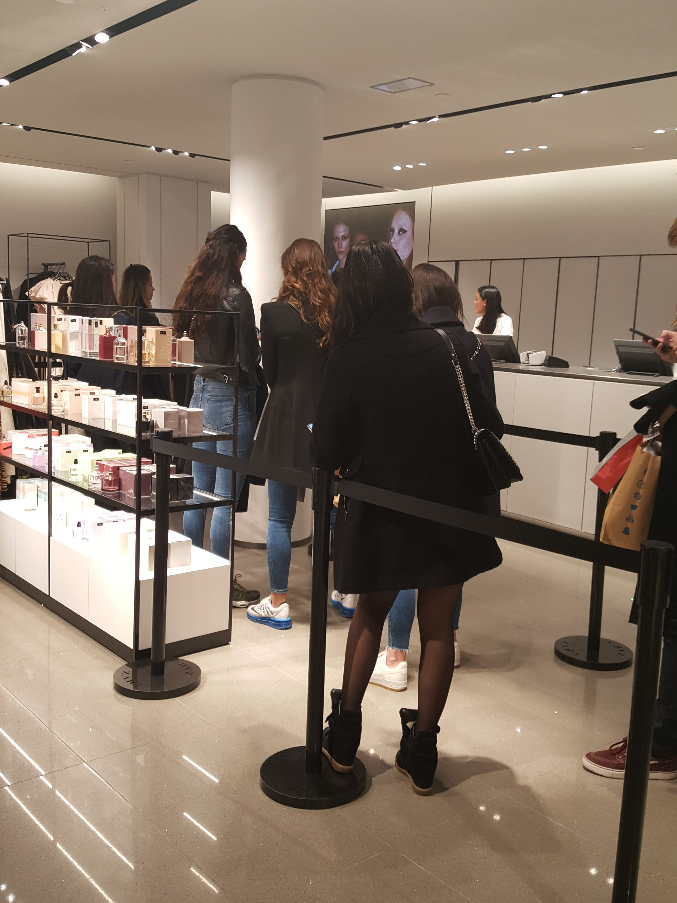
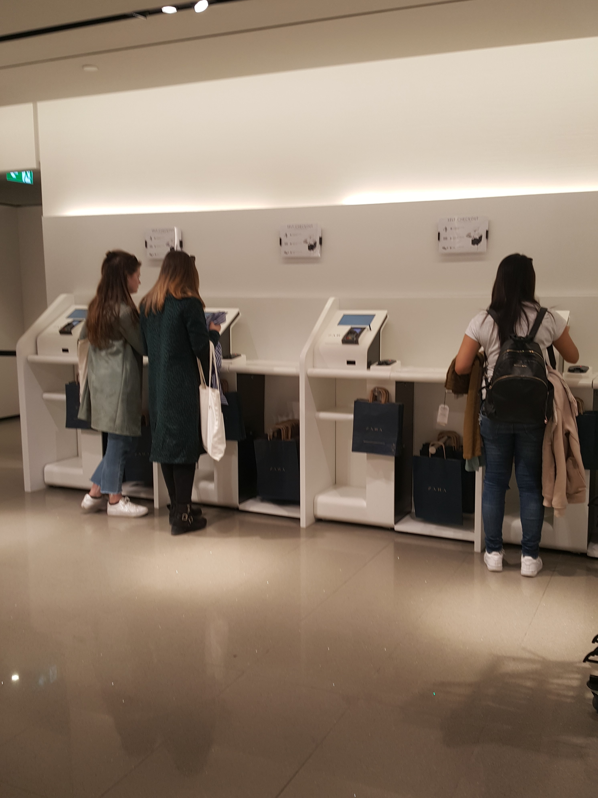
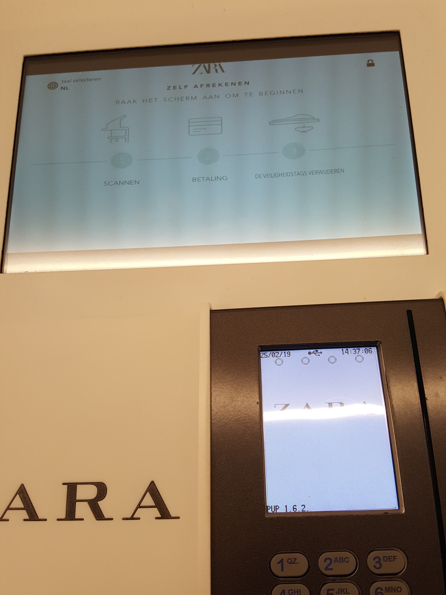
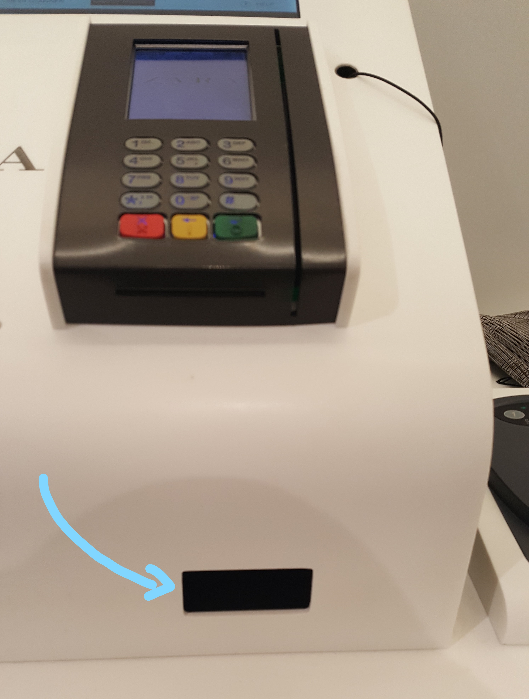
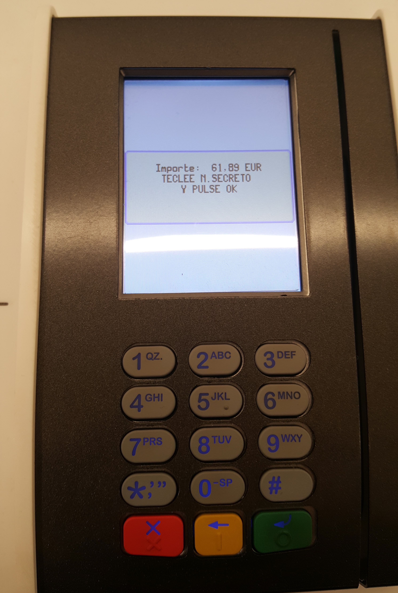
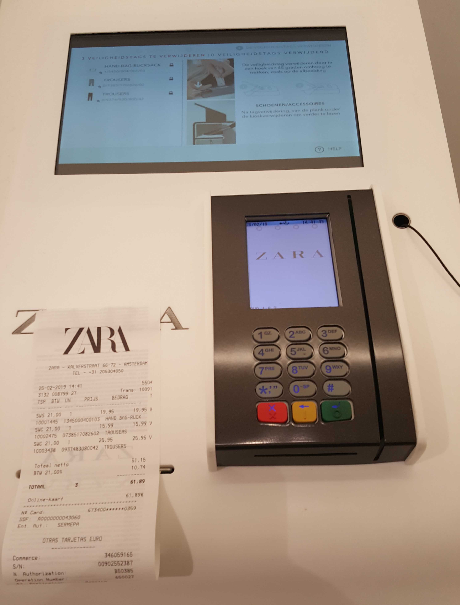
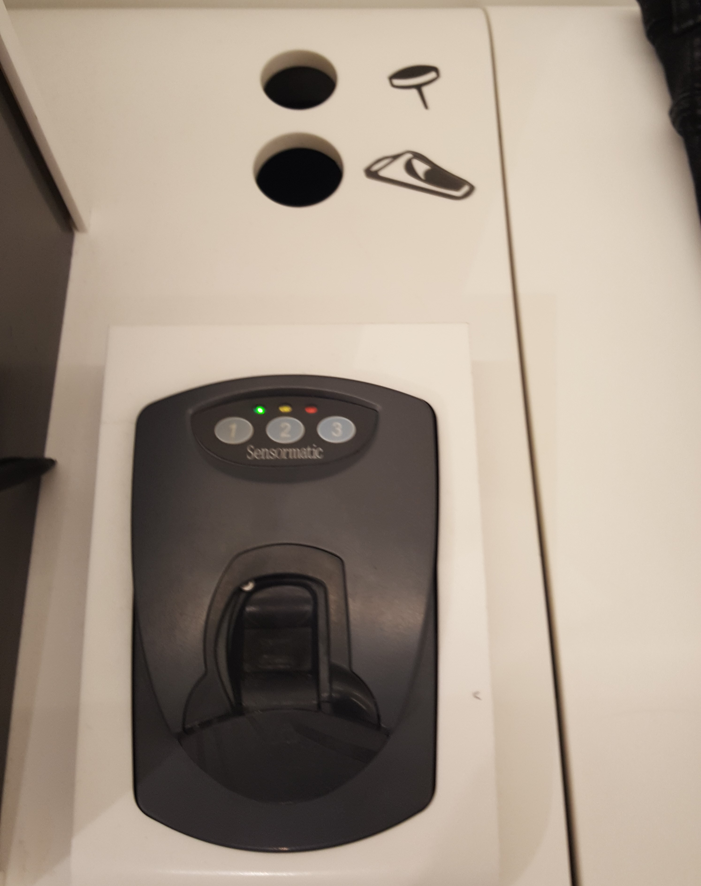

# Zara

### Deelvragen

* Wat komt H&M tekort in vergelijking met hun concurrent? \(Van deelvraag: **Hoe komt het dat de winkels van H&M minder goed presteren dan voorgaande jaren?**\)

**Hoe kan een product helpen om het betalingsproces te verbeteren?** 

* Hoe doen andere vergelijkbare retailers dit? 

### **Belangrijkste bevindingen**

* Voor als je de eerste keer de zelfscan kassa gebruikt is het niet een snelle of makkelijke manier
* Ik zag alsnog een lange rij staan bij de kassa ondanks dat er 4 zelfscan kassa’s zijn
* Bij de zelfscan kassa waren er geen producten of iets anders dat je afgeleid kon worden zoals bij de kassa's meestal
* Mensen vroegen elkaar om hulp bij de zelfscan kassa
* Medewerkers werden erbij gehaald
* Labels konden van sommige klanten er niet af en gingen vervolgens weer naar de kassa toe
* Het scherm is niet heel duidelijk opgemaakt. Denk hebben ze meer op het uiterlijk gelet dan op de stappen die de klant moet nemen
* Het proces duurde voor mijn gevoel meer dan 7 minuten voor 3 items
* Ik voelde wel een bepaalde stress van de klanten die achter mij zaten te wachten
* De toonbank vond niet alle items die ik wilde kopen
* Het contactloos betalen ging niet soepel
* De labels eruit halen duurde ook een lange tijd
* Ik geloof wel dat als ik het nog een keer zou gebruiken het proces wel sneller zou gaan

### **Samengevat ervaring:**

Van mijn collega’s van H&M kreeg ik te horen dat Zara een zelfscan kassa heeft. Dit wilde ik uitproberen en ging op zoek naar de kassa. De kassa’s zijn op de eerste verdieping en ze hebben vier zelfscan kassa’s. Ik had twee broeken en één tas bij mij en ging wachten totdat ik aan de beurt kwam. Er was geen lange rij en een zelfscan kassa was beschikbaar, maar het scherm bleef vast.

Terwijl ik stond te wachten observeerde ik de klanten. Één klant had een medewerker erbij gehaald, een ander wist een beetje hoe het werkte en deed er toen ik aan de beurt kwam nog steeds een tijdje over en de laatste persoon lukte het wel maar ze had iets van 6 kledingstukken bij haar. Ik had verwacht dat het proces wel sneller zou gaan maar het duurde wel iets van 5-7 minuten voordat ze klaar waren.

Na een tijdje was de kassa beschikbaar en was het mijn beurt. Ik klikte op het scherm en ging lezen wat ik moest doen. De eerste taak was om mijn kleren gewoon op de toonbank te zetten. De toonbank zou zelf de items scannen. Ik deed wat mij gevraagd werd en kreeg na een seconde mijn items te zien op het scherm. Alleen 2 van de 3 waren te zien. Mijn broek die niet was gescand ging ik telkens opnieuw op de toonbank zetten op verschillende manieren. Ik besloot om opnieuw te beginnen, maar nog steeds was mijn derde broek niet te vinden. Heel klein zag ik een knop voor meer scannen. Ik klikte daar op en kon toen lezen dat er een eigen scanner beschikbaar is. Via de voorkant kon ik de label scannen en toen was mijn derde broek toegevoegd.

Vervolgens wilde ik betalen. Ik kon hier alleen pinnen en besloot om contactloos te betalen. Wanneer ik mijn pinpas van het betalingsscherm had afgehaald werd de tekst ineens Spaans. Het duurde een tijdje voordat ik opnieuw kon betalen. Zelf controleer ik altijd of ik niet dubbel heb betaald voordat ik weer ga betalen. Ik klikte overal op maar kwam maar niet terug op het betalingsscherm. Toen ik weer kon betalen zette ik mijn pinpas in het apparaat en toetse mijn code in. De betaling was gelukt en ik kreeg mijn bon.

Op het scherm kwam toen het bericht dat ik 3 labels moet verwijderen. Het viel alleen niet erg op voor mijn gevoel. Ik zag naast de zelfscan kassa een label verwijder apparaat. Ik zette een label op het apparaat en verwachtte dat het los kwam van elkaar. Dat was niet zo en ik probeerde op verschillende manieren de label af te krijgen. Toen ik weer naar het scherm keek zag ik een knop verschijnen van labels eraf halen. Ik klikte hier op en de label verwijder apparaat lichtte op. Ik plaatste mijn label erin en dit werd vastgehouden door het apparaat. De pin haalde ik eraf en kon toen de complete label in twee gaten in de toonbank gooien. De tweede en derde keer lukte het sneller. Ik weet zelf niet zo zeker hoe veilig dit kan zijn, omdat de labels naalden hebben. Mensen kunnen zich prikken als ze niet weten hoe de label werkt.

Vervolgens vouwde ik mijn kleren op, plaatste de hangers aan een rek en pakte onder de zelfscan kassa een papieren tas. Het hele proces duurde voor mijn gevoel wel iets meer dan 7 minuten. Als ik de rij van de kassa weg zou kunnen halen dan denk ik dat de caissière mij veel sneller had geholpen.

