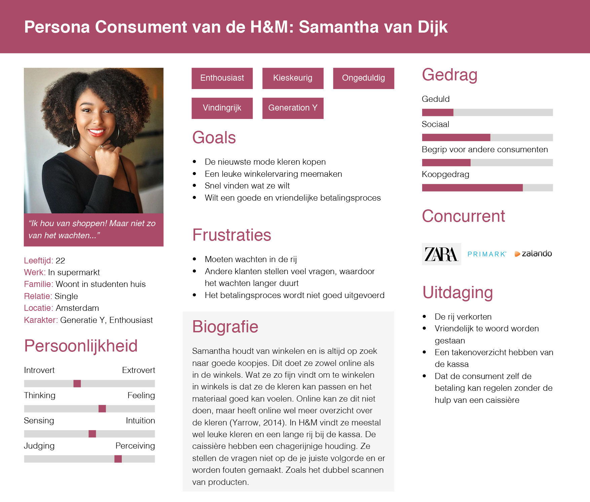
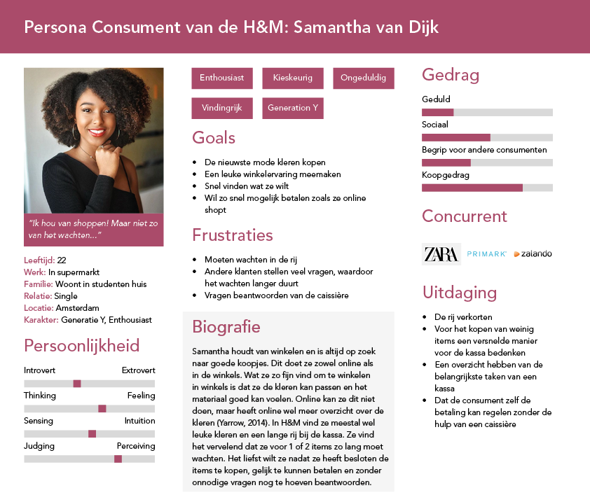
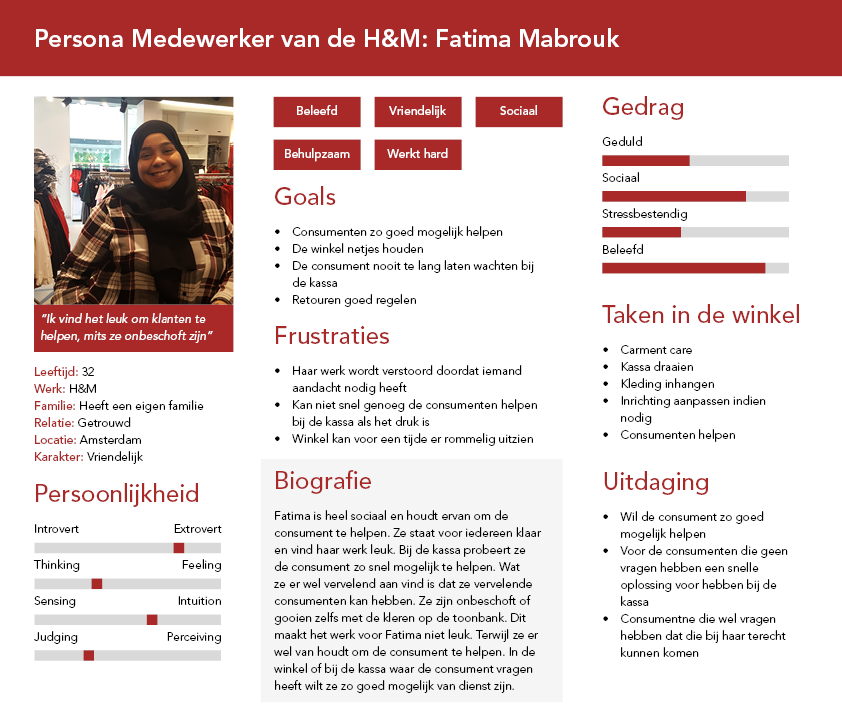

# Persona

### Deelvragen: 

**Waarom is de consument niet tevreden over het betalingsproces?** 

* Wat kan er beter aan het huidige betalingsproces? 
* Hoe ervaart de consument de huidige betalingsproces? 

**Hoe ervaren de caissières het betalingsproces?** 

* Wat zijn de taken van de caissière? 
* Hoe vinden zij het om bij de kassa te werken? 

### Waarom een persona?

Ik wil een duidelijk beeld hebben voor wie ik een oplossing bedenk. Daarom heb ik gekozen om een persona te maken van de consument en medewerker. De persona's zijn opgemaakt van alle onderzoek die ik hiervoor heb uitgevoerd. Dit zorgt ervoor dat mijn persona's een samenvatting zijn van mijn bevindingen.



Deze persona's zijn gemaakt **met** het interview en ideationsessie met de doelgroepen.




Deze persona's zijn gemaakt zonder de ideationsessie met de doelgroepen. Na de ideationsessie heb ik de persona's geüpdated.

De persona's zijn gebaseerd op mijn onderzoek. De gegevens komen van desk research, het boek Decoding the New Consumer Mind van Kit Yarrow, fly on the wall, interviews, enquêtes en participant observation.



De persona's zijn gebaseerd op mijn onderzoek. De gegevens komen van desk research, het boek Decoding the New Consumer Mind van Kit Yarrow, fly on the wall, interviews, enquêtes, en ideationsessies.

