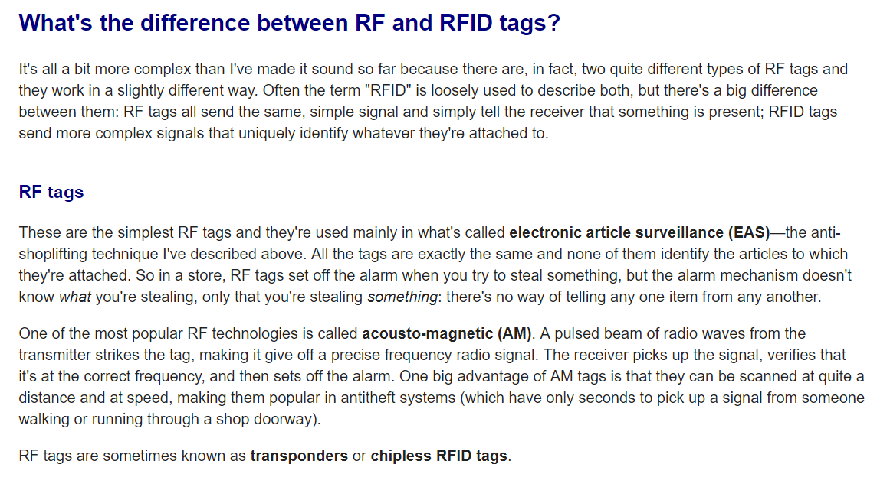
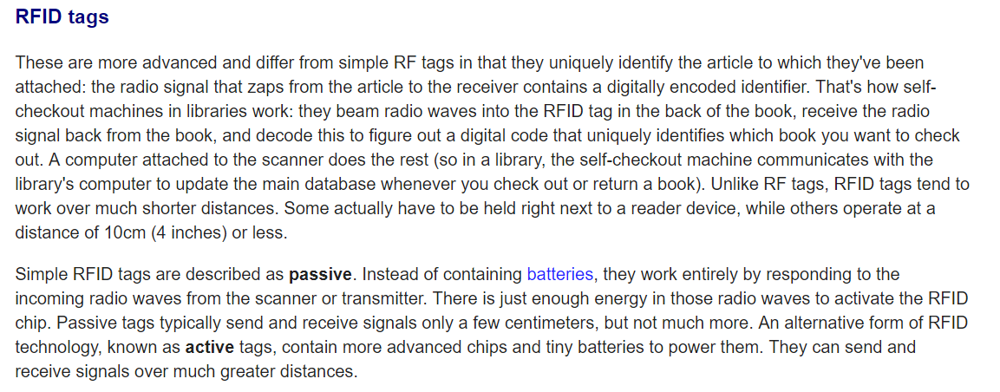
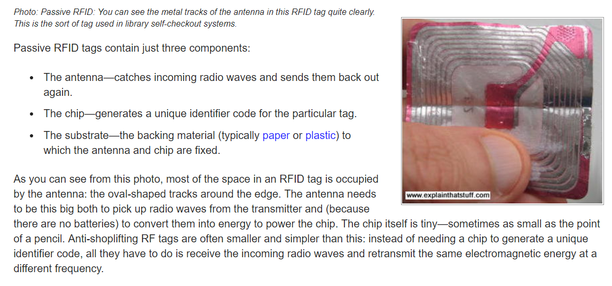
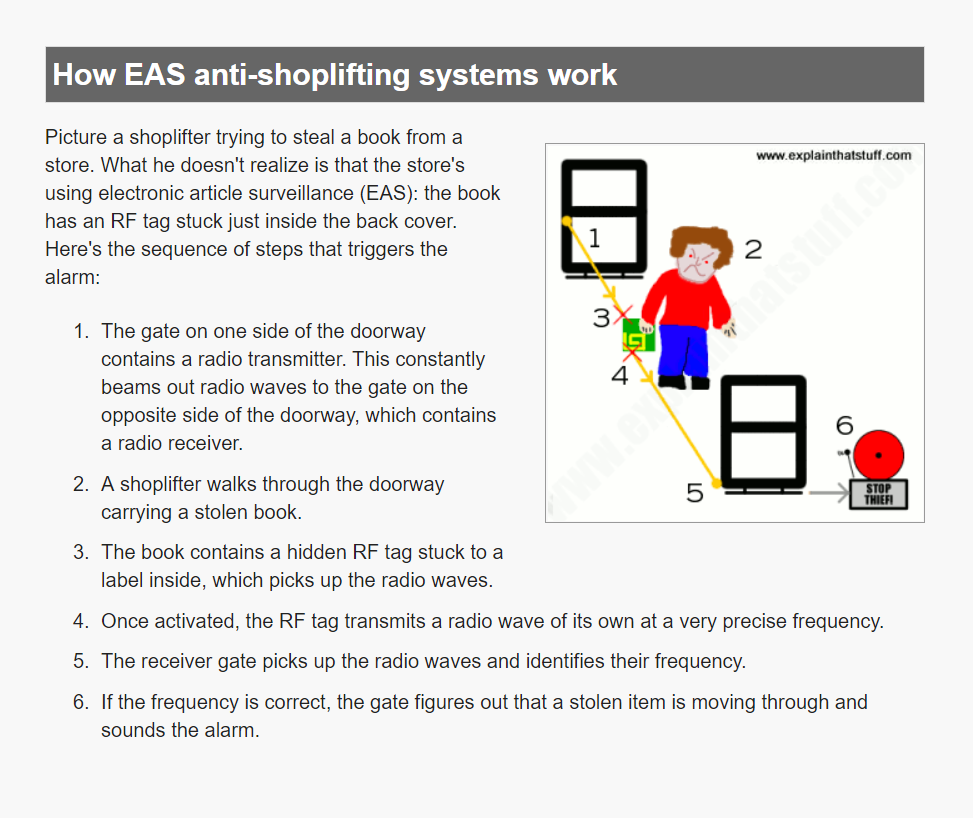

# RFID

### Deelvraag:

* Hoe doen andere vergelijkbare retailers dit? \(Van de deelvraag: **Hoe kan een product helpen om het betalingsproces te verbeteren?** \)

### Waarom RFID?

Ik wilde meer weten hoe RFID werkt en hoe het toegepast kan worden bij de H&M. Het proces bij Uniqlo ging sneller dan bij de H&M. Dit zou ik graag willen toepassen aan mijn concept idee. De zelfscan kassa van Zara gebruikt ook RFID maar gebruikt nog wel de standaard alarm labels aan hun producten. Hierdoor moet zij alsnog zelf het alarm van het product verwijderen.

## [How do RFID and RF tags work?](https://www.explainthatstuff.com/rfid.html) \(Woordford, 2018\)

