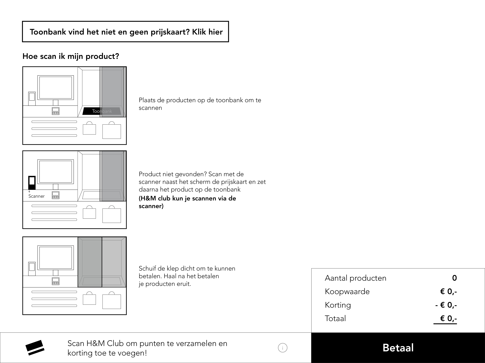
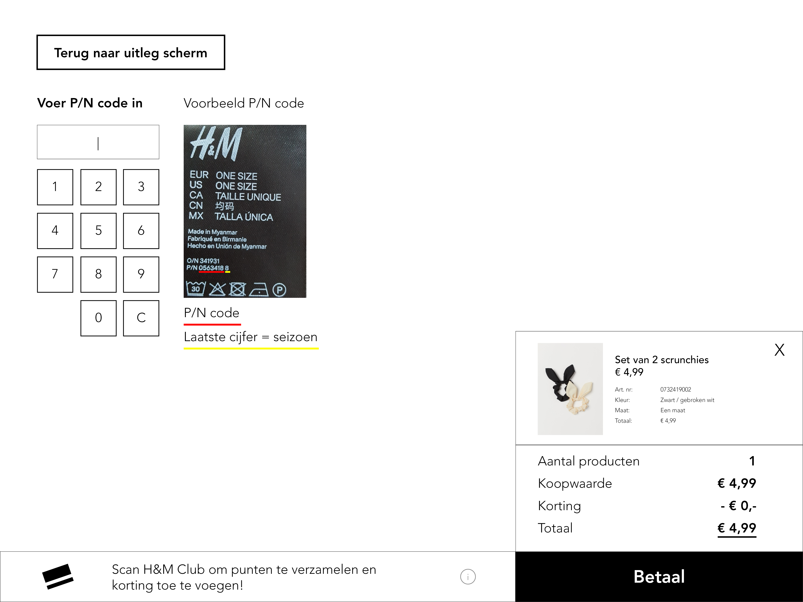
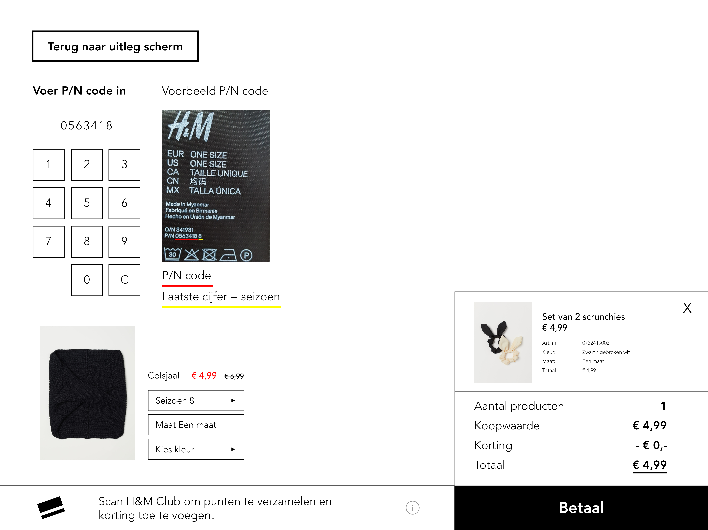
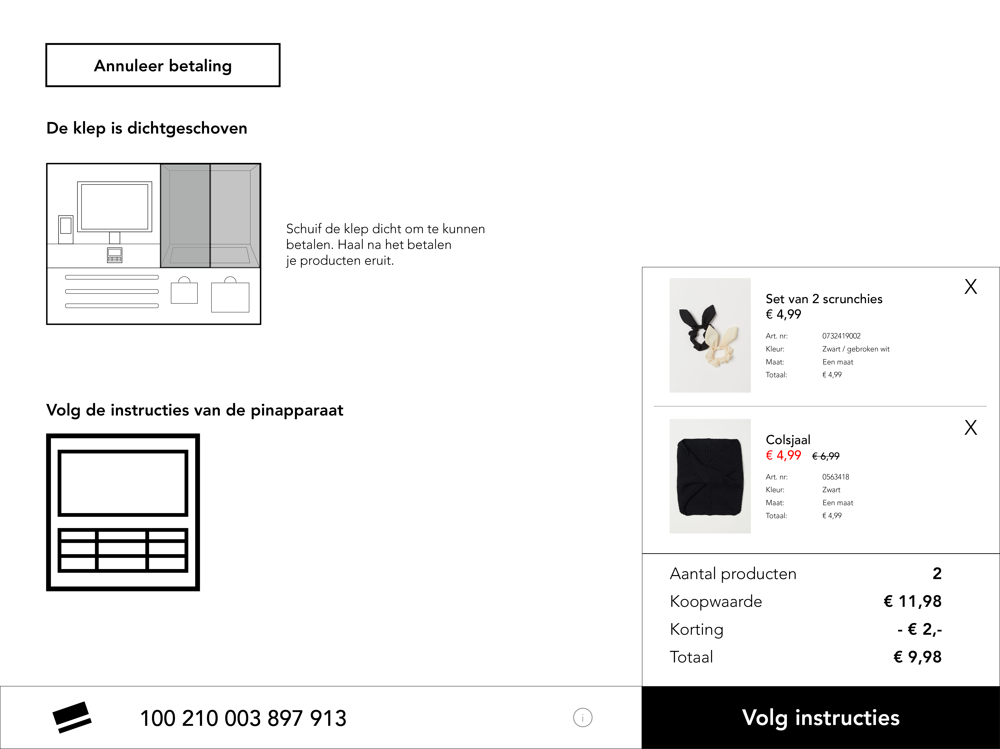
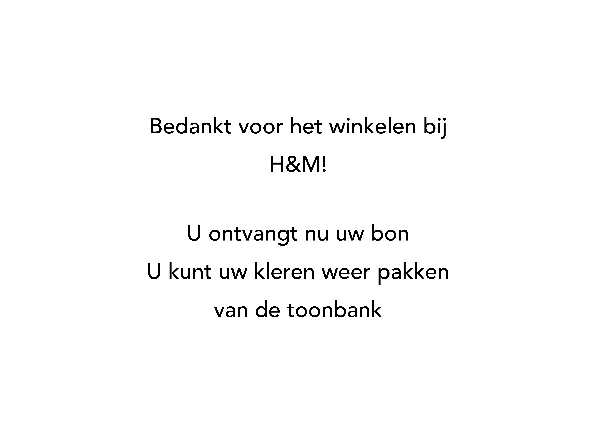

# Iteratie V 0.1

### Deelnemers: User testers

* Hasan
* Beyza
* Meral
* Elif
* Esma
* Harcai
* Fikriye

### Het prototype






Het prototype is als een wireframe ontworpen. Er waren namelijk nog drie andere concepten die getest moesten worden. Om het op tijd af te maken voor de test zijn ze alle vier in wireframes ontworpen.

Deze wireframe is in Invision klikbaar zelf te testen.





In de pdf staan alle schermen



### De schermen waar feedback op zijn gegeven




* Teveel informatie op 1 scherm
* De stappen hebben geen logische volgorde
* De knop: Toonbank vind het niet en geen prijskaart? Klik hier Valt helemaal niet op
* De H&M club valt weg omdat het zo laag is
* Je moet telkens opnieuw lezen omdat je kan vergeten waar je de taak net las
* Het overzicht met de kosten is duidelijk
* Afbeeldingen geven geen toegevoegde waarde
  * Ze zijn namelijk niet duidelijk in wat er gedaan moet worden




* De scrunchies zijn duidelijk
* Fijn om een afbeelding van het product te zien
* Afbeelding van de P/N code kan duidelijker
  * Dit is bijna niet te lezen




* Testers dachten dat ze klaar waren na het invoeren van de P/N code
* Ze begrijpen niet waar het seizoensnummer staat
  * Ze vergeten dat het bij het voorbeeld P/N code staat
  * Maar dit was ook niet duidelijk voor ze
* Ze dachten dat ze op de maat knop moesten klikken maar er is maar één maat
* Dit vonden ze lastig om een product toe te voegen




* De afbeelding van klep dichtgeschoven staat er nog steeds na het dichtschuiven
* Het icoon van de pinapparaat is niet duidelijk
* H&M club is toegevoegd maar viel helemaal niet op
* De instructie hoe je de H&M club toe moest voegen was niet duidelijk
* Dit hele scherm vonden de testers niet goed uitgewerkt




* De volgordes bij het eindscherm kloppen niet
* Door bedankt als eerste te zeggen lijkt het of je al klaar bent
* Beter dat er eerst staat: Je ontvangt uw bon 
* Daarna: U kunt uw kleren weer pakken van de toonbank
* Als laatste: Bedankt voor het winkelen
* Tot slot is alles grijzig en saai ontworpen



