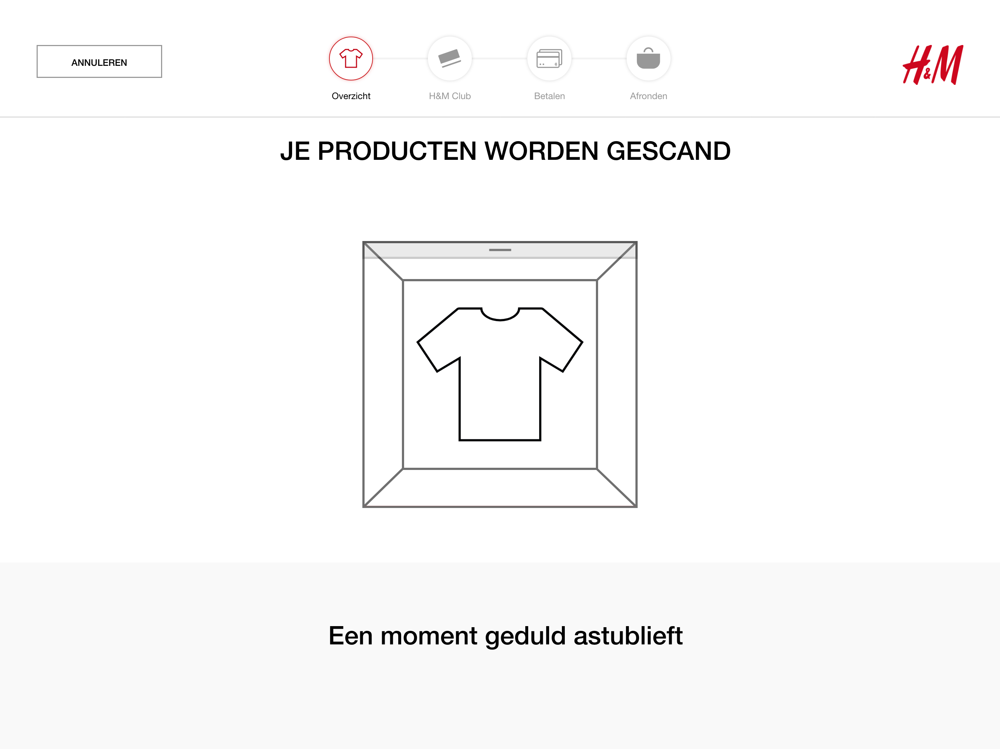

# Iteratie V 0.2

### Deelnemers: User testers

* Hasan
* Esma
* Fikriye

### Expert review

Aranea Felëus over service design

### Het prototype





Het prototype is in versie 0.2 visueler en uitgebreider gemaakt. Dit bestand kan ik alleen delen via Adobe XD. Helaas is het bij Adobe XD niet mogelijk om meer dan 1 soort deelbare prototype link te delen. 

**Wanneer je de Adobe XD file download kan je er wel door heen klikken in het programma zelf. Je klikt op de playbutton rechtsboven.**

**Er is geen PDF versie geüpload omdat de afbeeldingen in het bestand niet goed konden worden overgedragen.**



### De schermen waar feedback op zijn gegeven




* Mooie introductie scherm
* Nederlandse vlag lijkt op een Limburgse vlag
* Choose a language boven de vlaggen zetten, want nu staat de opdracht onderaan na de opties




* De animatie is niet duidelijk
* Je weet niet hoe lang het duurt




* Knop annuleren werd niet begrepen als: terug naar start scherm
* Belangrijk viel niet op dat werd genegeerd
* Testers waren tevreden over het product tegel
* Ze vonden het mooi dat de bon aan de zijkant stond met alle nodige informatie




* De vraag staat te ver van de button opties
  * Ze hadden hier geen link bij gezet
* Te veel tekst op het scherm
* Consumenten die al weten wat H&M club is hoeven dit niet te lezen
  * Ze zouden het eerst lezen omdat ze zouden denken dat er belangrijke andere informatie bij staat
* De testers begrepen niet waarom: Let op: Alleen H&M club members gevestigd in Nederland bij de knoppen nee en ja staan




* Er werd niet begrepen dat de tester zelf de toonbank moest sluiten
* Ze dachten dat de animatie dit deed




* Consumenten willen zelf bepalen of ze een bon willen ontvangen of niet






* Alweer is de volgorde niet goed
* Beter dat er eerst staat: Pak je spullen van de toonbank
* En als laatst bedankt en een fijne dag
  * Want met bedankt en een fijne dag geef je aan dat het nu echt helemaal klaar is




* De video is onduidelijk
* Liever een afbeelding van de P/N code
  * Met een duidelijke kader om de P/N code heen
* Buttons aan de onderkant verwarrend
  * Liever een back button
  * Laat de knop verder niet zien als het niet gebruikt kan worden




* Seizoen was niet duidelijk
* Waarom moeten ze een kleur kiezen als de afbeelding al laat zien dat de kleur klopt?
* Het toevoegen van een product was niet makkelijk




* Te veel tekst op het scherm
* Toon alleen informatie als de consument dat zelf wil
* Ze dachten dat de voorbeeld afbeelding hun voucher was
* Ze verwachtte daarom dat ze al 10% korting gingen krijgen




* Je moest veel doen op 1 scherm
* Maak er meerdere schermen van zodat het stap voor stap gaat
* Het toevoegen van de voucher was lastig
* De pop up was niet duidelijk
* Je kunt op verder klikken zin was verwarrend voor de tester
  * Ze wilden pas verder als ze een voucher hadden toegevoegd



