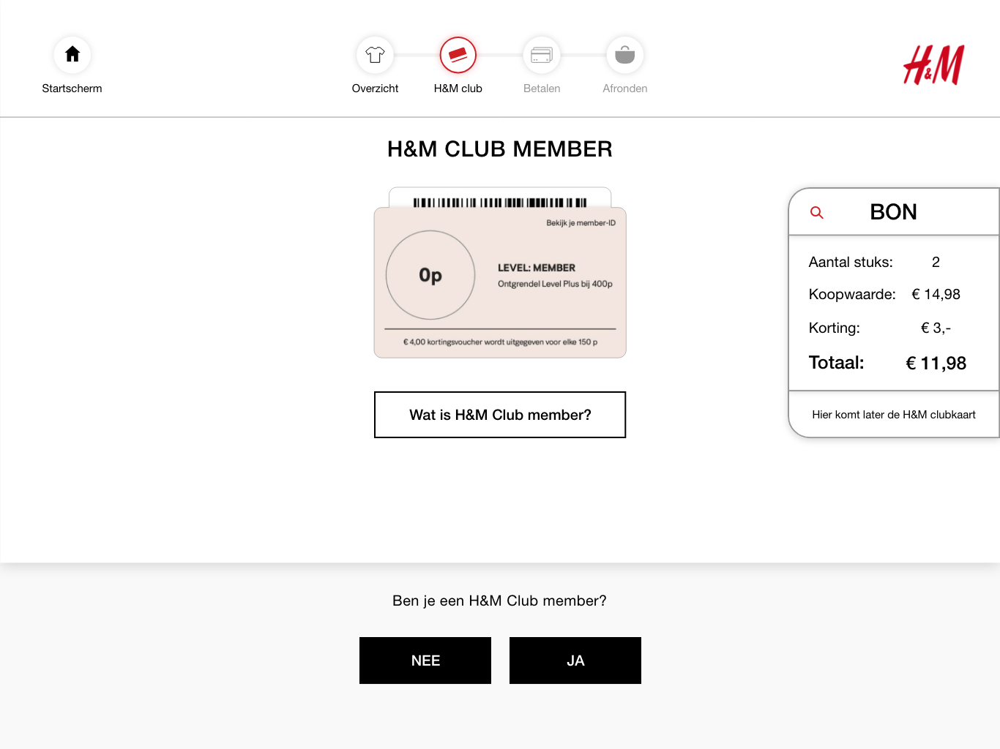
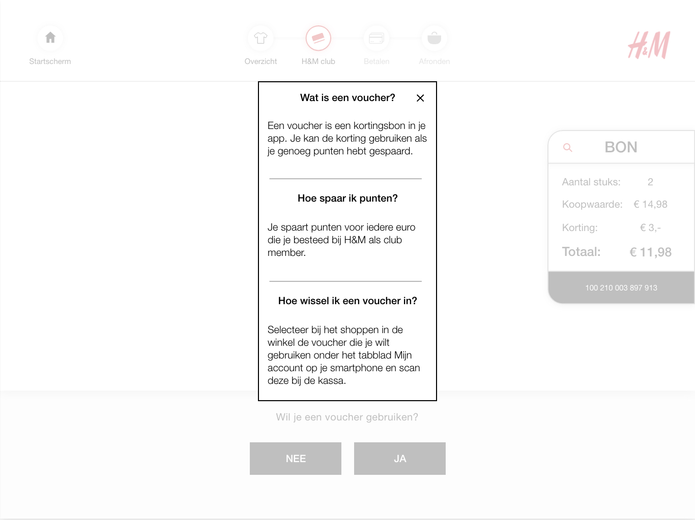
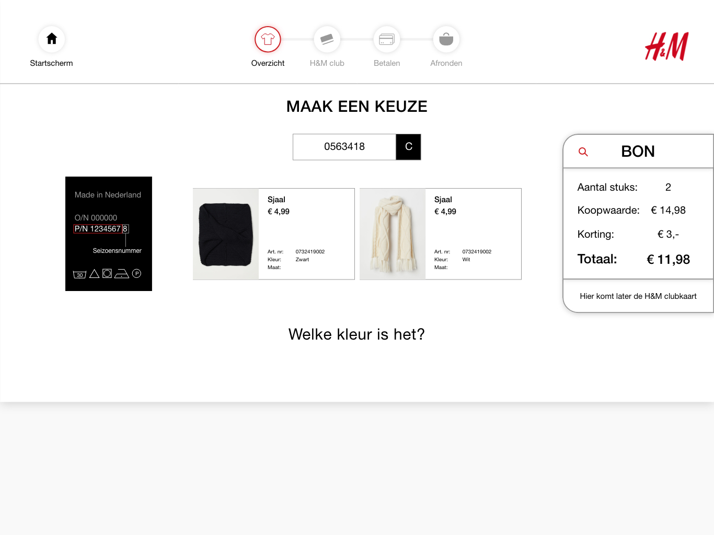

# Iteratie V 0.3

### Peer review

Met Monika Rutten hebben we het over design principes gehad.  
Ze keek ook met een CMD perspectief naar het prototype.

### Het prototype





Het prototype is in versie 0.3 is aangepast aan het feedback van versie 0.2. Dit bestand kan ik alleen delen via Adobe XD. Helaas is het bij Adobe XD niet mogelijk om meer dan 1 soort deelbare prototype link te delen. 

**Wanneer je de Adobe XD file download kan je er wel door heen klikken in het programma zelf. Je klikt op de playbutton rechtsboven.**

**Er is geen PDF versie geüpload omdat de afbeeldingen in het bestand niet goed konden worden overgedragen.**



### De schermen waar feedback op zijn gegeven




* Schrijf er microcopy bij de vlaggen
* Voor kleuren blinde mensen
* Veel vlaggen lijken een beetje op elkaar




* De iconen in het progres bar zijn verschillend
  * De een is ingekleurd
  * De andere heeft alleen outlines
* Maak de tekst korter: Liggen je producten op de toonbank? Klik dan op verder.




* Test of de pop up button \(de witte button met zwarte rand\) ook anders kan werken
  * Haal de zwarte rand weg en zet een rode lijn onder: Wat is H&M club member?
  * Want nu kunnen mensen verwachten dat ze naar een andere pagina gaan
    * Dit komt door dat ze dit gewend zijn geraakt van de buttons in het grijze veld
* Maak 1 button helemaal zwart - Dit is de prominente keuze
* Maak 1 button alleen een outline - Dit is een optie voor als het niet lukt
* Hierdoor is het verschil sneller te zien




* Is de overlay echt nodig?
* Als mensen hun overzicht willen zien klikken ze vast op het icoon van Overzicht
* Je kan dit testen om te zien of mensen het echt gaan gebruiken




* Helemaal geen fan van pop ups! 
* Monika zou het eerder zo veel mogelijk oplossen door geen pop ups te gebruiken
* Uit mijn vorige test wilde de testers niet te veel tekst zien op het scherm
  * Dit was mijn reden om de extra informatie alleen weer te geven als de testers het willen zien
  * Na de test van versie 0.4 weet ik zeker of ze de pop up vervelend vinden of juist handig




* Maak het rode kader dikker
* Ze boven de waslabel voorbeeld
* Plaats de zin van: P/N code is te vinden... staat voorbeeld onder aan de titel
* Want nu leest dit te ver weg voor de consument




* De C button is niet duidelijk
  * Maak er: Opnieuw van - Zo duidelijk mogelijk
* Stel de vraag van kleur boven als titel of zet het dichterbij de titel
* Hoeveel stappen zijn er eigenlijk om een product toe te voegen?
  * Maak hier een extra progres bar voor



