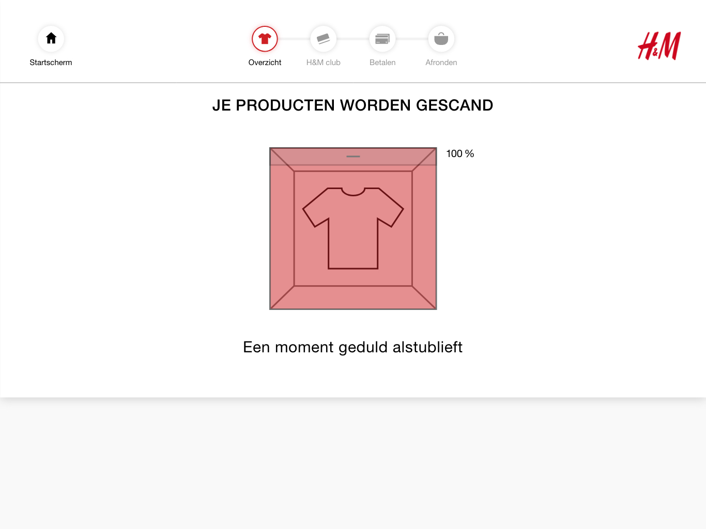
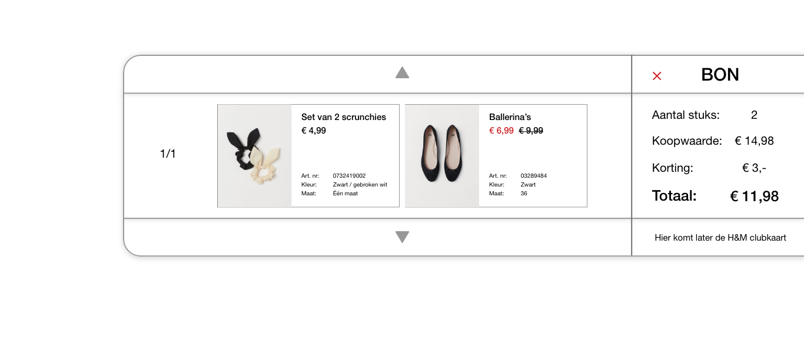
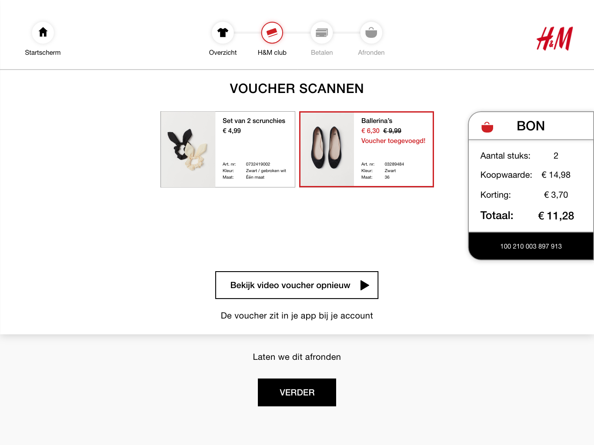
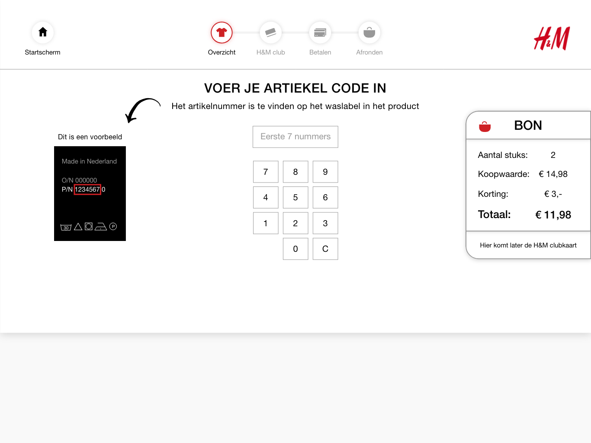

# Iteratie V 0.4

### Deelnemers: User testers

* Hasan
* Esma
* Fikriye

### Het prototype





Het prototype is in versie 0.4 is aangepast aan het feedback van versie 0.3. Dit bestand kan ik alleen delen via Adobe XD. Helaas is het bij Adobe XD niet mogelijk om meer dan 1 soort deelbare prototype link te delen. 

**Wanneer je de Adobe XD file download kan je er wel door heen klikken in het programma zelf. Je klikt op de playbutton rechtsboven.**

**Er is geen PDF versie geüpload omdat de afbeeldingen in het bestand niet goed konden worden overgedragen.**



### De schermen waar feedback op zijn gegeven




* Voor de testers was het percentage zien een: Aha! moment
* Ze begrepen dat er iets aan het laden werd hierdoor




* De overlay van de bon overzicht werd helemaal niet gebruikt
* De testers hadden hier toch geen behoefte aan
* Ze vonden het wel een handige optie dat er is
* Ik heb besloten om het weg te halen omdat de overzicht in de bon niet werd gebruikt




* De rode lijn was afleidend
* Leek wel op een waarschuwing
* Werd niet gezien als pop up knop
* Om deze reden ga ik de button weer terug veranderen naar een zwarte omrande button.




* Ze vonden het fijn dat ze zelf kunnen beslissen of ze een bon willen of niet
* Doordat er een kill code wordt gestuurd naar de RFID tag is het in de RFID al bevestigd dat het product is betaald
  * Zelfs zonder bon zou na 1 scan al duidelijk zijn of het product is betaald of gestolen




* Betere volgordes met de teksten
* Het hele proces ging veel sneller dan versie 0.2
* Haal overal ! tekens weg dit is niet nodig




* De video is duidelijk 
* Je ziet na het scannen dat bij de bon je H&M club is toegevoegd




* Er mist nog steeds een tussen scherm om de voucher duidelijk toe te voegen
* Het is wel gelijk te zien waar de voucher is toegevoegd
* Handig dat je de video opnieuw kan bekijken
* De microcopy tekst over waar de voucher is is ook handig
* Laten **we** dit afronden - Vonden ze geen fijne tekst
  * Liever: Ben je klaar? Klik dan op verder




* De pijl paste niet bij het scherm
* Duidelijker waar de P/N code te vinden is



