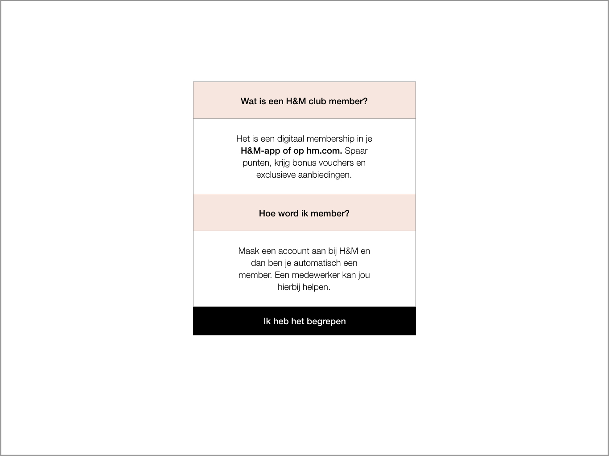

# Iteratie V 1.0 \(V 0.5\)

### Expert review

Aranea Felëus over service design. Haar feedback is verwerkt als aanbeveling. Ze had verder bijna niks meer op aan te iets op de schermen aan te merken.

### Het prototype





Het prototype is in versie 1.0 is aangepast aan het feedback van versie 0.4. Dit bestand kan ik alleen delen via Adobe XD. Helaas is het bij Adobe XD niet mogelijk om meer dan 1 soort deelbare prototype link te delen. 

**Wanneer je de Adobe XD file download kan je er wel door heen klikken in het programma zelf. Je klikt op de playbutton rechtsboven.**

**Er is geen PDF versie geüpload omdat de afbeeldingen in het bestand niet goed konden worden overgedragen.**



### De laatste feedback op de schermen

Ik laat hieronder in het kort het proces zien van de zelfscan kassa. Met een paar feedback resultaten van Aranea.




* De vlag klopt dit keer! Vorige keer was het een Limburgse vlag




* De rode tekst dat eerst belangrijk was wordt nu wel gelezen
* De vraag en de buttons zijn dichtbij wat goed is




* Volgordes van teksten zitten op de juiste plek
  * Zoals de vraag staat bij de button
  * Titel in het kort boven
* Button voor meer informatie was duidelijk





* De happy flow zonder H&M club was heel makkelijk te volgen




* Voucher icoon zorgt voor minder verwarring





* Afbeelding is duidelijker dan de video
* Het is beter dat de tip waar de P/N code te vinden is bovenaan staat
* Handig de uitleg wat P/N betekent

* Ik weet wat mij te wachten staat door het progres bar onderaan

* Door de lijn kijk je opnieuw naar het waslabel
* Want de waslabel blijft continue aan de zijkant staan waardoor ik er niet weer naar toe zou gekeken hebben




* Heel fijn dat je na het toevoegen van het product het overzichtsscherm weer ziet
* Duidelijk welk product is toegevoegd
* Goed dat er weer staat dat je producten weer op de toonbank moet leggen



### Feedback over error schermen

Aranea bekeek ook mijn error schermen. Haar feedback was over alle schermen ongeveer het zelfde. Ik zal er twee uitlichten met feedback erbij. Om alle error schermen te bekijken klik op de page link hieronder:






* Waarom zou iemand die iets heeft gestolen het op de toonbank leggen?
* Misschien zou het kunnen dat iemand per ongeluk iets heeft meegenomen
* Ze zou terug kunnen komen om het weer terug te zetten of te kopen
* Wordt zij dan nog steeds aangezien als dief?

Dit waren goede vragen waar ik geen antwoord op kon geven. Voor error schermen bedacht ik zoveel mogelijk error momenten. Dit zou een scherm zijn dat kan komen te vervallen.




* De teksten bij de error schermen kunnen vriendelijker
* Misschien is het kruisje te hard \(Hiervoor was het kruisje een grote X die ik heb verkleind nu\)



