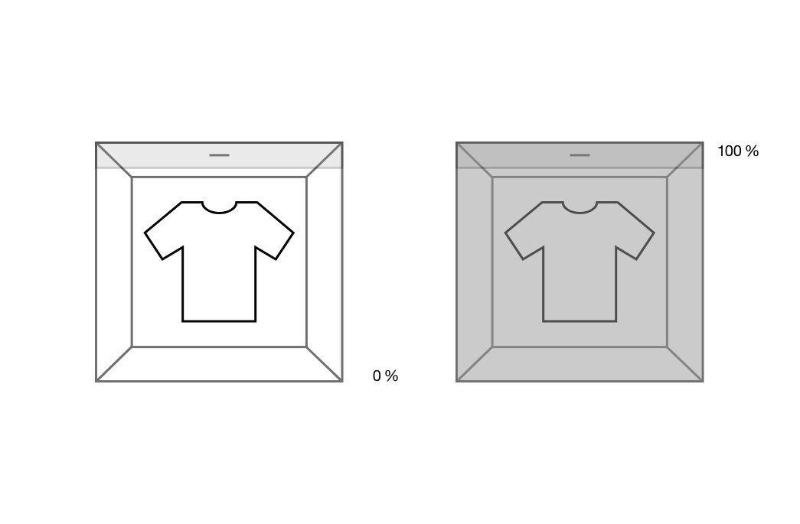
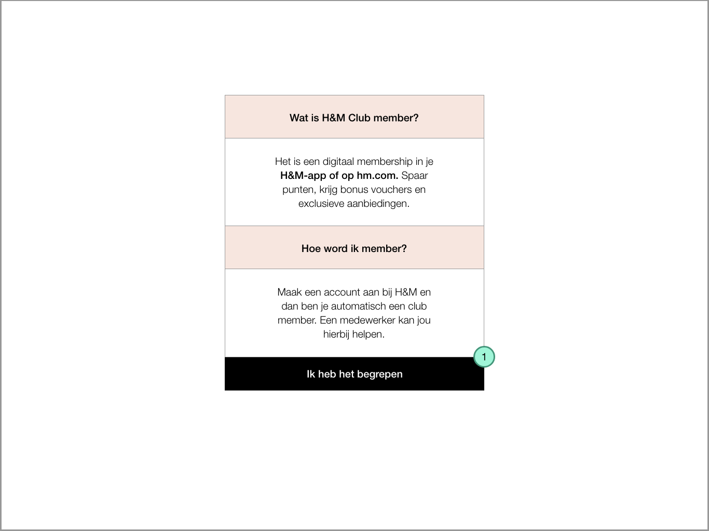

# Design principes

### Waarom leg ik design principes uit?

Om beter te begrijpen waarom ik bepaalde keuzes heb gemaakt leg ik hier de design principes uit. 

### **Progres bar**




**Grijs icoon:** Daar is de consument nog niet gekomen en dit is nog niet klikbaar  
**Zwart icoon:** Daar is de consument langs geweest. De vragen daar zijn allemaal beantwoord. Als de consument wil kan die er op klikken en haar antwoorden opnieuw bekijken.  
**Rood icoon:** Dit geeft aan waar de consument op het moment is.

Deze progres bar verschijnt wanneer het de producten scant en het alarm van de producten af haalt.

**Kleur grijs of rood:** Laat zien hoe de toonbank aan het laden is.  
**Percentage:** Laat zien hoe ver de toonbank is met het laden.




#### Waarom schrijf ik Microcopy?

Door het schrijven van microcopy vertel ik in één woord waar het icoon over gaat. De consument hoeft dan niet te raden wat het t-shirt betekent of welke van de twee passen eigenlijk betaalpassen zijn. Hierdoor wordt de consument minder onzeker van en weet gelijk wat haar te wachten staat. De cognitieve lading \(de hoeveelheid informatie die de consument te zien krijgt\) wordt dan niet onder belast maar geeft ook niet te veel informatie.

#### Waarom gebruik ik iconen?

Door de iconen weet de consument wat de microcopy betekent. Bijvoorbeeld als er alleen overzicht stond zou de consument misschien niet weten dat ze haar producten zou zien. Misschien dacht de consument alleen een overzicht van de totale kosten te zien? Door een t-shirt te plaatsen bij het woord Overzicht weet de consument dat ze haar kleren zal zien. Iconen maken de cognitieve lading snel overzichtelijker.

#### Waarom heb ik gekozen voor een progres bar?

Hierbij gebruik ik de Goal Gradient effect. Met de Goal Gradient effect laat ik zien dat er maar 4 stappen zijn om het proces van de aankoop af te ronden. Als ik dit niet liet zien wist de consument niet hoeveel stappen er waren en kon de consument in het midden van het proces afkappen. Door het proces te laten zien weet de consument wat haar te wachten staat en hoe ver de consument op het moment is.

#### Waarom gebruik ik percentage?

Hiervoor gebruikte ik alleen het kleur verschil om te laten zien dat de toonbank aan het laden is. Dit was voor velen niet duidelijk. Ze begrepen niet waarom de animatie van kleur veranderde. Daarom heb ik ernaast een percentage bij gezet. De reden hiervoor is omdat veel mensen begrijpen wat een percentage proces is. Ze begrijpen dat als er 0% staat en daarna 20% wordt dat ze nog 80% hoeven te wachten. Dit maakt de cognitieve lading duidelijker voor de consument. 



* Monika Rutten
* [https://www.doyoucopy.nl/microcopy-copywriting/](https://www.doyoucopy.nl/microcopy-copywriting/) \(Hendriks, 2019\)
  * _" Microcopy is een korte zin of zelfs één enkel woord dat gebruikers op een website of app helpt het doel te bereiken. Deze ‘microteksten’ nemen onzekerheden bij de gebruiker weg en mensen bij de hand, op weg naar een succesvolle conversie."_
* [http://theelearningcoach.com/learning/what-is-cognitive-load/](http://theelearningcoach.com/learning/what-is-cognitive-load/) \(Malamed, 2019\)
  * _" As learning experience designers, we have to watch out for cognitive load, which refers to the total amount of mental activity imposed on working memory in any one instant."_ 
* \_\_[_https://www.conversion-uplift.co.uk/glossary-of-conversion-marketing/goal-gradient-effect/_](https://www.conversion-uplift.co.uk/glossary-of-conversion-marketing/goal-gradient-effect/) __\(Conversion-uplift, 2018\)
  * _" The goal gradient effect means that as people or animals get closer to achieving a reward they accelerate their behaviour to progress towards the goal."_ 



### Tone of voice




#### Waarom zijn titels in all caps?

H&M schrijft al haar titles in all caps. Ik wilde me houden aan de huisstijl van H&M en heb de titels op dezelfde manier ontworpen.




#### Wat voor tone of voice wilde ik gebruiken?

H&M gebruikt meestal directe berichten op hun website en applicatie. Ze hebben niet echt een 'gezellig' gesprek met de consument. Met gezellig gesprek bedoel ik dat de tone of voice van de teksten vriendelijk en menselijk zijn. Ik hield me daarom vooral aan directe berichten zoals de H&M.

Van mijn testresultaten kreeg ik de feedback dat ze de teksten te hard vinden. Ze vonden dat het wel vriendelijker gevraagd kan worden of ze hun spullen op de toonbank willen leggen. 

De teksten had ik daarna aangepast en geprobeerd wat vriendelijker te maken. Ik hield de teksten wel kort zodat het niet te druk werd op het scherm. Op deze manier hield ik de teksten nog steeds in de stijl van H&M.

**De tone of voice is daarom:** Kort en krachtig op een vriendelijke manier.



* Monika Rutten
* Mijn testers
* [https://www.marketingtermen.nl/begrip/tone-of-voice](https://www.marketingtermen.nl/begrip/tone-of-voice) \(Marketingtermen, z.d.\)
  * De tone of voice is de stijl waarin een bedrijf of merk communiceert met de doelgroep.



### Video's, animatie en afbeeldingen




Video's hebben allemaal een zachte schaduw: \#000000 \(16%\) X=0 Y=3 B=10

De animaties gaan over de toonbank. Wanneer producten op de toonbank worden gelegd zal de animatie laten zien dat het de producten scant. Wanneer de producten zijn betaald zal de animatie laten zien dat het alarm van de producten wordt verwijderd.

Soms is een afbeelding genoeg om uit te leggen wat er nodig is om te doen.




#### Waarom heb ik video's gebruikt?

Ik kan tekstueel uitleggen dat je eerst de kledinghanger van het product moet pakken. Daarna moet je de hanger ophangen aan het rek onder het scherm. Tot slot leg je het product op de toonbank en ben je klaar met deze stap. Maar als ik dit op het scherm had geplaatst moet de consument veel tekst lezen. Hierdoor kan de consument stoppen en naar de standaard kassa gaan voor de betaling. 

Één beeld zegt meer dan duizend woorden. Hetzelfde geld voor video's. Ze leggen visueel beter uit wat je moet doen dan dat het volledig word opgeschreven. Het is ook sneller en overzichtelijker voor de consument. Ze begrijpen wat ze moeten doen om de opdracht uit te voeren en voelen zich niet onzeker over wat ze moeten doen. 

In de video heb ik ook maar 1 persoon gebruikt. Ik wil laten zien dat je de zelfscan kassa alleen kan gebruiken zonder hulp van iemand anders. Het is daarom beter dat maar 1 persoon in de video te zien is anders kan de consument denken dat ze meerder mensen nodig hebben.

#### Waarom heb ik animaties gebruikt?

Hetzelfde geldt voor animaties. Je kan zelf niet zien hoe de RFID reader de producten scant. Door een animatie te laten zien hoe de RFID reader scant weet de consument dat de toonbank bezig is met het scannen van producten. 

#### Waarom heb ik afbeeldingen gebruikt?

Ook hier geldt het spreekwoord: Één beeld zegt meer dan duizend woorden. Een afbeelding maakt snel duidelijk wat er wordt bedoeld op het scherm. 



* Monika Rutten
* [https://public-cinema.com/blog-een-beeld-zegt-dan-meer-duizend-woorden/](https://public-cinema.com/blog-een-beeld-zegt-dan-meer-duizend-woorden/) \(van Diggelen, 2019\)
  * _"Beeld roept emoties op - Beeld blijft beter in het geheugen gegrift - Beeld brengt een complexe situatie effectiever over dan tekst. "_



### Buttons




De buttons zijn altijd geplaatst in het grijze deel van het scherm. Daar zijn de vragen met de buttons dichtbij elkaar gezet. De buttons lijken op de buttons van de H&M website.

Soms heeft de consument meer informatie nodig. Dan is er op het midden van het scherm een button. Door op deze button te klikken komt er een pop up op het scherm.




#### Waarom gebruik ik buttons?

Door een Call To Action button te gebruiken vraag ik de consument om een keuze te maken. Nadat zij een keuze hebben gemaakt weet de zelfscan kassa welk scherm het erna moet laten zien. De zelfscan kassa weet dan ook dat de consument er zeker van is om verder te gaan met het proces.

#### Waarom is de vraag dichtbij de button?

Als eerst had ik de vraag in de titels gezet. Maar de vraag was te ver weg van de button. Hierdoor konden de testers geen connectie maken dat de vraag bij de button hoorde. Door de vraag dichtbij de button te plaatsen begrepen de testers dat ze samen horen. Dit principe heet Principle of Proximity. Hoe dichterbij de elementen zijn, hoe beter wordt begrepen dat het bij elkaar hoort. Hoe verder de elementen van elkaar zijn betekent dat de elementen niet bij elkaar horen.

#### Waarom is 1 button donker ingekleurd?

Door de buttons verschillende ontwerpen te geven zie je het verschil sneller dan dat ze allebei donker waren ingekleurd. Wat donker is ingekleurd valt meer op en is een prominentere keuze. 

**Wat gebeurd er als ik op de button klik met alleen een omranding?**

Het proces gaat verder of als iets mis gaat zoals: Het heeft niet alle producten gevonden, verschijnt er een nieuw scherm. Dit nieuwe scherm helpt de consument verder met wat er niet was gelukt. 



* Monika Rutten
* [https://uxplanet.org/gestalt-theory-for-ux-design-principle-of-proximity-e56b136d52d1](https://uxplanet.org/gestalt-theory-for-ux-design-principle-of-proximity-e56b136d52d1) \(Ux planet & Studio, 2018\)
  * _" This principle \(Principle of Proximity\) is based on the cognitive tendency to perceive the objects close to each other as related, especially in comparison with those which are placed farther."_ 
* [https://www.onlinemarketing.triplepro.nl/conversie-artikelen/wat-is-een-call-to-action](https://www.onlinemarketing.triplepro.nl/conversie-artikelen/wat-is-een-call-to-action) \(Triplepro, z.d.\)
  * _"Een call-to-action, ook wel afgekort tot CTA, is een oproep aan de bezoeker die overeenkomt met het doel van de website of van de desbetreffende pagina."_



### Pop ups




Pop ups verschijnen wanneer de consument op een button klikt voor meer informatie. Als er een error gebeurd verschijnt ook een pop up.




#### Waarom gebruik ik pop ups?

Een zelfscan kassa moet overzichtelijk en kalm ontworpen worden. Maar soms is het belangrijk om informatie te geven als iets niet duidelijk is. Tijdens het testen liet ik de informatie gelijk zien op het scherm, maar dat was te druk voor de testers. Ze wilden zelf kiezen wanneer ze de informatie zien. 

Daarom koos ik er voor om informatie in een pop up / overlay te zetten. Door power te geven aan de consument kan ze zelf kiezen of ze informatie wil zien of niet. 

Pop ups zijn meestal irritant en het liefst worden ze vermeden. Maar uit mijn testen bleken ze goed te werken.




* [https://usabilla.com/blog/paradox-choice-less-ux-design/](https://usabilla.com/blog/paradox-choice-less-ux-design/) \(Patel, 2017\)
  * Avoid content overload and don’t give away too much information at once.
  * Save your customers from anxiety by being crystal clear about the options that you give. If you beat around the bush, customers will leave.
* [https://www.activecampaign.com/blog/do-pop-ups-work](https://www.activecampaign.com/blog/do-pop-ups-work) \(Minning, 2018\)
  * Pop ups are:
    * They’re rude
    * They’re insulting
  * But they can also: 
    * They can promote content
    * They can fuel lead generation
* [http://bokardo.com/principles-of-user-interface-design/](http://bokardo.com/principles-of-user-interface-design/) \(Bokardo, z.d.\)
  * **Progressive disclosure**
    * Avoid the tendency to over-explain or show everything all at once. When possible, defer decisions to subsequent screens by progressively disclosing information as necessary. This will keep your interactions more clear.



### F-shaped pattern




Hoe de schermen worden gelezen.





#### Waarom maak ik gebruik van de F-shaped pattern?

De eerste en tweede versie van de zelfscan kassa waren druk ontworpen. Bij de eerste versie zat alles aan de zijkant waardoor de ogen van de testers veel moesten zoeken. Bij de tweede versie was het hele scherm gebruikt waardoor de testers zich alleen focust op het midden van het scherm. 

Ik zocht op welke lay-out het overzichtelijks wordt gelezen. Hierdoor kwam ik bij de F-Shaped pattern uit. De ogen volgen de hiërarchie van het scherm in het midden op. Wat aan de zijkant stond werd meestal genegeerd. 

Ik paste de schermen aan en maakte een duidelijk hiërarchie. Alles werd in het midden gezet want de ogen kijken meestal naar het midden van het scherm. De bon staat aan de rechterkant en valt voor iedereen de eerste keer op. Daarna vinden ze het niet erg dat de bon aan de zijkant staat. Het staat niet in de weg van de content in het midden. 



* [https://uxplanet.org/f-shaped-pattern-for-reading-content-80af79cd3394](https://uxplanet.org/f-shaped-pattern-for-reading-content-80af79cd3394) \(Ux planet & Babich, 2018\)
  * The F-Pattern describes the most common user eye-scanning patterns when it comes to blocks of content. _F for fast._
  * Users first read in a horizontal movement, usually across the upper part of the content area. This initial element forms the F’s top bar.
  * F-shaped pattern will help you create a design with good _visual hierarchy,_ adesign that people can _scan_ easily.



### Bon




De bon is een overzicht wat het volgende laat zien:

* Hoeveel producten zijn gescand
* Wat de koopwaarde is
* Hoeveel korting er is
* Wat het totale bedrag is met de korting
* Of er een H&M club kaart is gescand of niet




#### Waarom staat de bon aan de rechterzijkant?

Ik wilde niet dat de bon te veel zou opvallen. De bon moet alleen een overzicht laten zien wat de consument in totaal koopt. De eerste keer dat de bon op het scherm verschijnt valt het op voor de consument. Daar kan de consument snel controleren of alles klopt. Na het controleren negeert de consument de bon, maar vind het wel fijn om er af en toe terug naar te kijken. Doordat het niet zo erg opvalt staat het ook niet in de weg van de schermen. 



* [http://bokardo.com/principles-of-user-interface-design/](http://bokardo.com/principles-of-user-interface-design/) 
  * \(Bokardo, z.d.\)
  * Strong visual hierarchies work best
    * A strong visual hierarchy is achieved when there is a clear viewing order to the visual elements on a screen.
  * Smart organization reduces cognitive load
    * By smartly organizing your content you make it less of a cognitive load on the user



