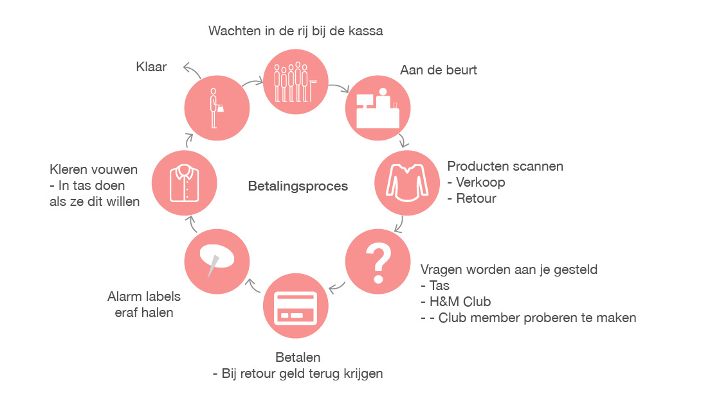
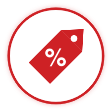
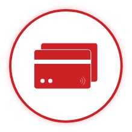

# Functies van de zelfscan kassa

### Wat zijn de functies van de zelfscan kassa?

Hiervoor heb ik onderzoek gedaan naar het betalingsproces. Van het betalingsproces keek ik alleen naar het aankoop proces. Dit zijn:

* Producten scannen
* H&M club member
  * Mogelijk een voucher toevoegen
* Betalen
* Alarm verwijderen
* In een tas doen

### 4 Functies

Van het aankoop proces heb ik 4 functies gekozen dat van belang zijn voor de consument. De consument zou haar H&M club member willen scannen voor punten. Wanneer de consument haar club member heeft gescand zou ze haar voucher ook willen toevoegen. Om deze reden heb ik vier hoofdfuncties.




**RFID scannen - Dit moet altijd lukken**

De zelfscan kassa kan alleen weten hoeveel het product kost als het kan scannen. Om deze reden gebruikt de zelfscan kassa een RFID reader. De RFID reader zit onder de toonbank en scant de producten met een RFID tag. 

**2D scannen - Voor als het toch mislukt**

Het scannen van de RFID tag moet altijd lukken. Het kan gebeuren dat de RFID tag beschadigd is. Om het product alsnog te kunnen scannen is er een 2D scanner. De 2D scanner kan de barcodes van de prijskaarten scannen. Zo is het product alsnog toegevoegd.

**P/N code - Laatste optie**

Als de RFID tag mislukt en er is ook geen prijskaart kan de consument het product toevoegen via de P/N code. De P/N code is te vinden in het waslabel van het product. De code wordt ingevoerd in de zelfscan kassa. De consument moet dan de kleur, maat en seizoensnummer kiezen. Hierna is het product toegevoegd. 

De P/N code wordt gebruikt door caissières voor als ze geen prijskaarten kunnen vinden. Hiermee kunnen ze het product toevoegen en daarna het alarm verwijderen.

**Overzicht**

De producten worden na het scannen toegevoegd aan het overzicht. Dit overzicht laat de data zien van de producten en totale kosten. 




**H&M club - Verplicht inbegrepen**

H&M wil dat consumenten vaker hun H&M club member scannen. Hierdoor weet H&M dat de club member wordt gebruikt. Uit het interview met Sonny Kommen heeft hij verteld dat de consumenten met H&M club member meer producten kopen. Zij willen namelijk punten sparen om korting te krijgen.

De H&M club member is makkelijk toe te voegen door dat het een barcode heeft. Door een 2D scanner toe te voegen aan de zelfscan kassa is de H&M club member toegevoegd.

**Kan je de zelfscan kassa zonder H&M club gebruiken?**

Ja, de zelfscan kassa is verplicht te vragen of de consument een H&M club member is. Maar de consument hoeft geen member te zijn om producten van de H&M te kopen. Dit geldt ook zo voor de caissières die bij de kassa verkopen. 

Als de consument geen club member is kan ze door naar de betaling van haar aankopen. 




**Voucher**

De voucher wordt alleen gevraagd wanneer de H&M club member is gescand. Met een voucher kan de consument korting krijgen op haar aankopen. Wanneer de consument de voucher wil toevoegen activeert ze de voucher eerst op haar mobiel. De voucher toont op dat moment een barcode dat gescand moet worden. Via de 2D scanner wordt de voucher toegevoegd en automatisch toegepast aan de eisen van de voucher.

**Hoe wordt het automatisch toegepast?**

De vouchers hebben allemaal hun eigen vereisten. Wanneer je online shopt kan je ook vouchers toevoegen. Als je een voucher online toevoegt wordt je aankopen gecontroleerd of je aan de eisen voldoet. Als je eraan voldoet wordt de voucher automatisch aan je aankopen toegevoegd. Hetzelfde geldt ook voor de zelfscan kassa. 

**Hoe krijg je een voucher?**

Wanneer je producten van de H&M koopt en je H&M club member scant spaar je punten. Als je genoeg punten hebt gespaard krijg je korting via de voucher. De korting kan specifiek zijn zoals alleen voor broeken. Het kan ook korting geven aan ieder product waar je bijvoorbeeld 10 procent korting wilt toepassen. Er kunnen ook vouchers zijn die korting geven aan het totaal bedrag. 

**Moet je een voucher gebruiken?**

Nee, dat moet niet als de consument het niet wilt. De consument kan sparen voor meer punten of kan op dat moment geen voucher toepassen. De consument kan de vraag van de voucher overslaan door op nee te klikken en door te gaan naar het betalen van de producten. 




**Betalen**

Bij de zelfscan kassa kan er alleen gepind worden. Op dit moment is er nog geen onderzoek gedaan naar hoe een zelf service apparaat geld wisselt. Het werk van de zelfscan kassa zal door contant geld ook alleen meer worden. Iedere dag zou namelijk de zelfscan kassa gevuld moeten worden met geld. Dit moeten de werknemers doen en zij moeten ook kunnen bijhouden of de zelfscan kassa geld genoeg heeft.

**Alarm verwijderen**

De standaard alarm labels van de H&M zijn vervangen door de RFID tags. De RFID tags hebben allemaal een unieke code met data over het product. Met de unieke code kunnen ze niet dubbel gescand worden. Door de RFID tag is het tegelijk ook een alarm. Wanneer de producten zijn betaald stuurt de RFID reader een kill code. De kill code wordt specifiek gestuurd naar de producten met de RFID tag. Hierdoor gaat het alarm af van de producten.

**Afronden**

Nadat het alarm is verwijderd komt de consument bij het eindscherm. De consument kan haar producten pakken en gratis een tas meenemen. Papieren tassen zijn namelijk gratis om mee te nemen. 



