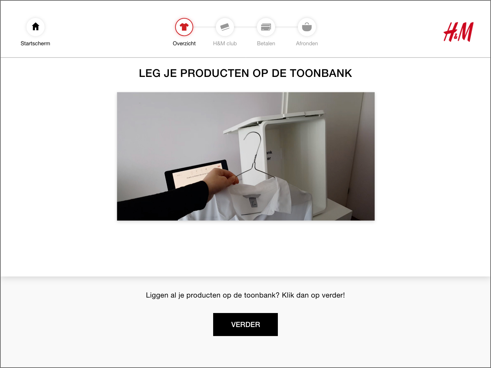
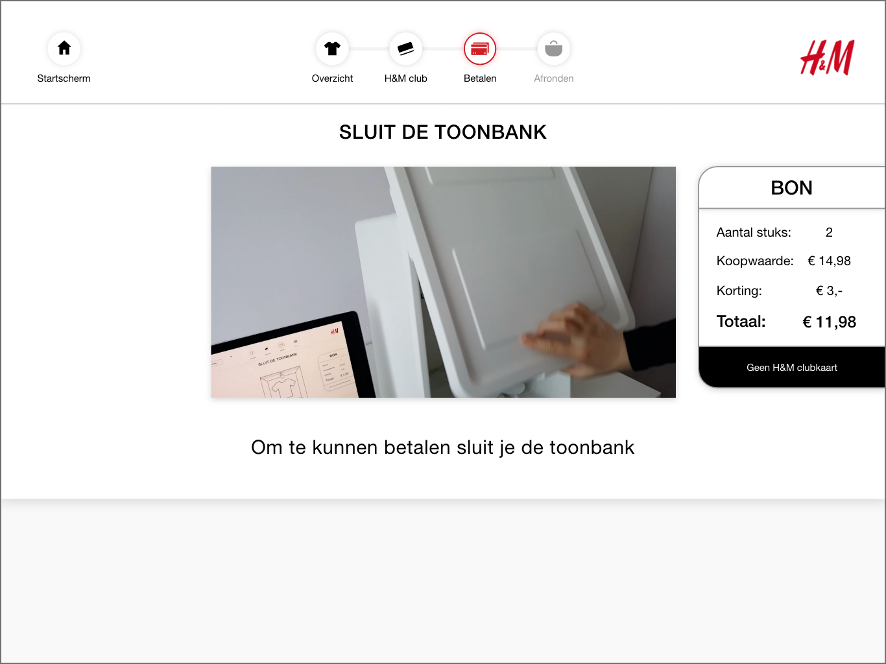
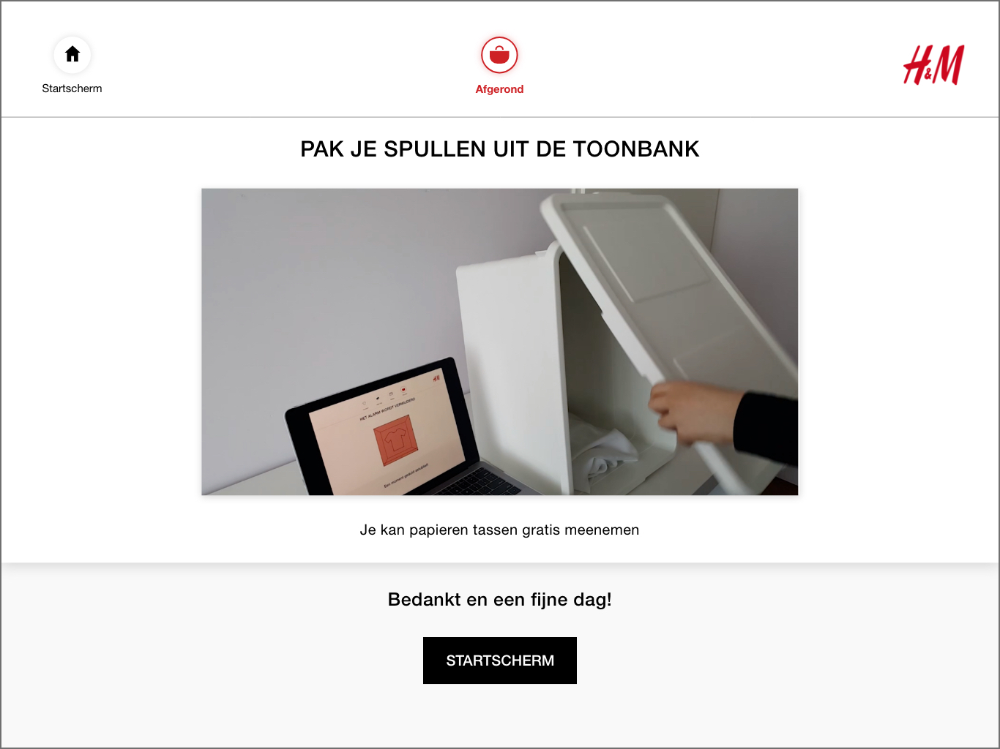
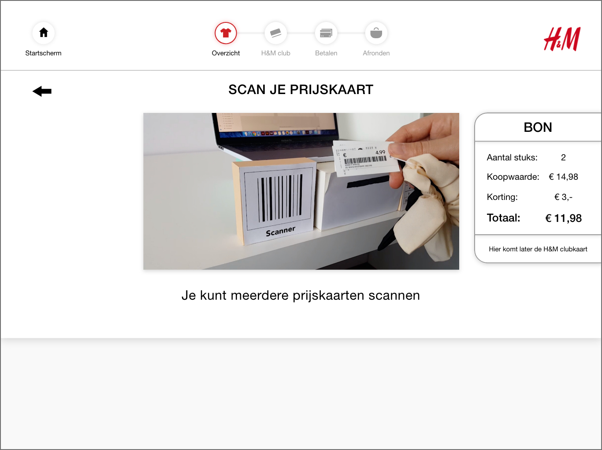
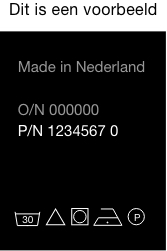
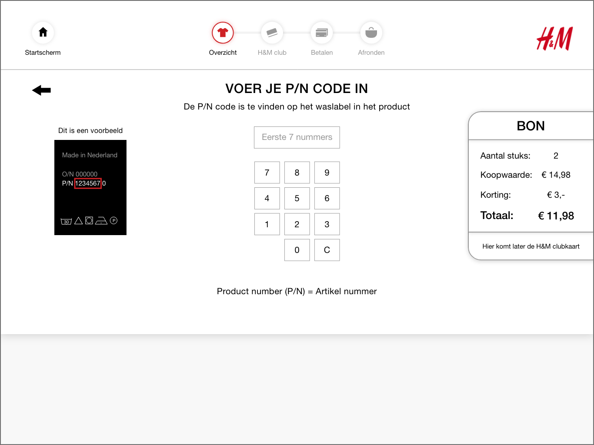
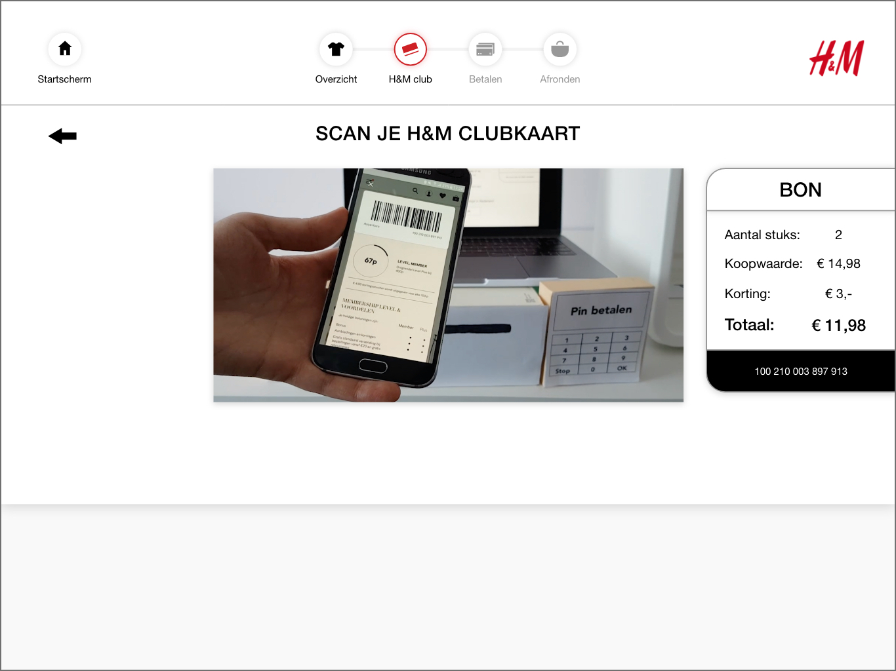
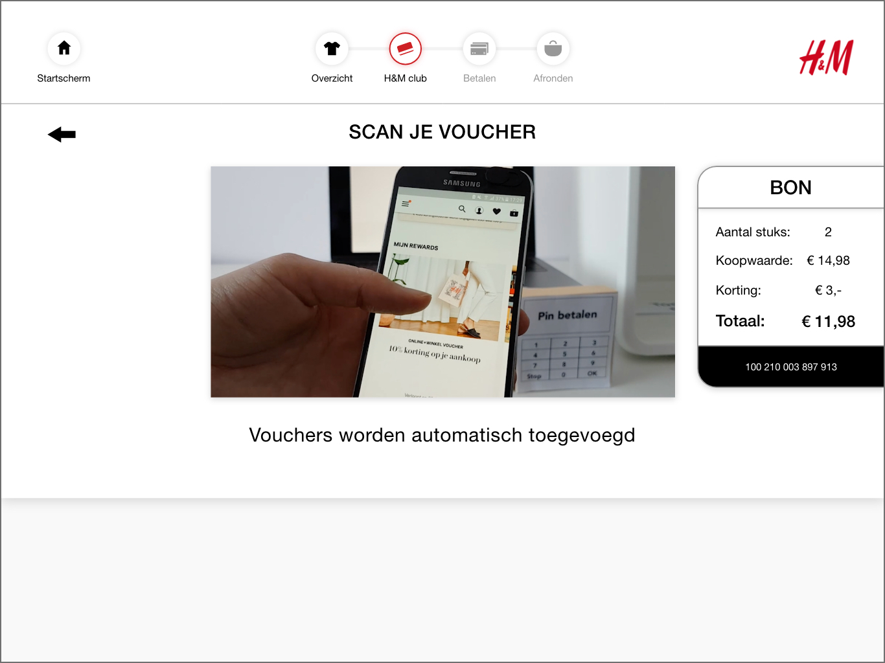
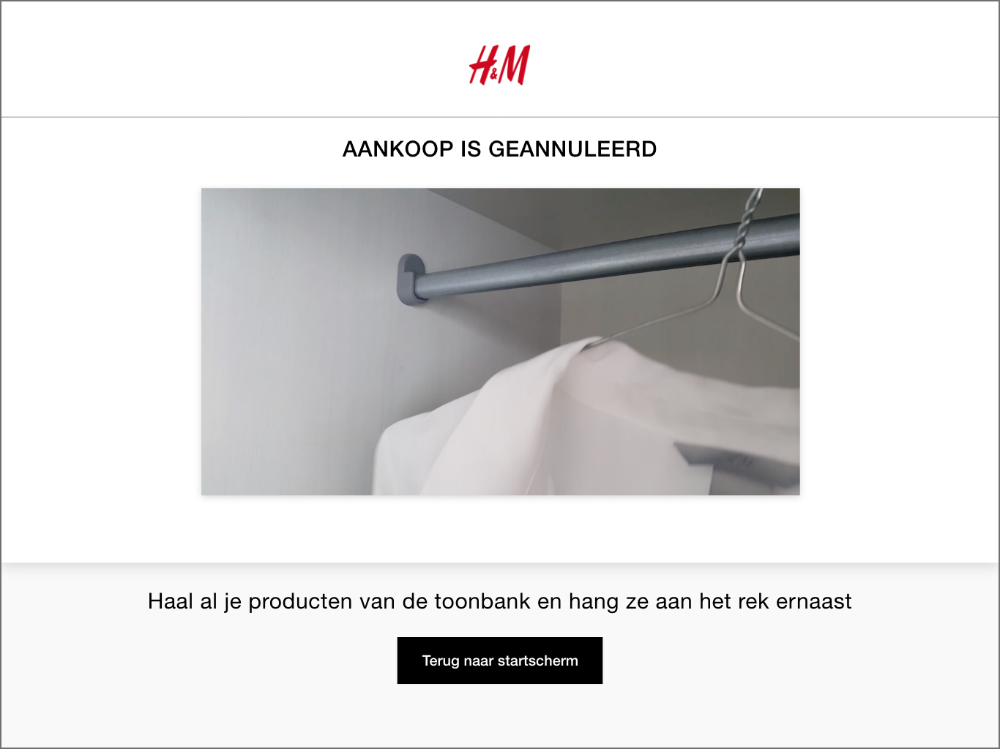

# Videos voor schermen

### Waarom heb ik video's gemaakt?

Uit mijn onderzoek en tests bleken video's goed te werken. Dit komt door dat de gebruiker een visueel voorbeeld heeft hoe ze de zelfscan kassa moet gebruiken. De video's zijn kort en duidelijk voor de testers geweest.

Alle video's blijven loopen / herhalen

### 1- Introductie video om producten op de toonbank te leggen





In de video laat 1 persoon zien wat je moet doen. Als het product een kledinghanger heeft haal je dit ervan af. De kledinghanger plaats je onder de zelfscan kassa. Het product leg je neer op de toonbank.

**Waarom kan het niet met de kledinghanger in de toonbank?**

De kledinghangers van H&M zijn niet gratis en deze worden ook niet verkocht. H&M wilt de kledinghangers hergebruiken zodat ze duurzamer omgaan met hun spullen. 

**Waarom moet het product in de toonbank?**

Elk product heeft een RFID tag en deze wordt gescand door de RFID reader dat onder de toonbank plaats vind. Door de RFID reader word de data van de RFID tag door gestuurd naar het scherm.




Dit is het tweede scherm nadat je een taal keuze hebt gemaakt.



### **2- Toonbank dicht doen**





Door de video begrepen de testers beter dat zij de toonbank moesten sluiten. Er was voorheen een animatie maar dat was niet duidelijk genoeg. 

**Waarom moet de toonbank gesloten worden?**

Om te kunnen betalen moet de toonbank gesloten worden. De reden hiervoor is zodat de gebruiker niet stiekem na het betalen een product bij toevoegt. Want na het betalen gaat er een Kill Code gestuurd worden naar de producten. Het alarm van deze producten gaat er dan van af. Als de gebruiker na het betalen een product snel bijvoegt dan heeft het een gratis product mee gekregen.




Voordat de gebruiker kan betalen moet de toonbank gesloten worden. Pas na het sluiten van de toonbank gaat het scherm automatisch door naar het pinnen.



### **3- Toonbank openen en tas pakken**





Wanneer alles is afgerond kan de gebruiker de toonbank openen. In de video pakt 1 persoon haar product en een tas onder de toonbank. 

**Moet je een tas meenemen?**

Nee dat moet niet. Het wordt in de video getoond zodat de gebruiker weet dat ze gratis de tas kunnen meenemen als ze dat willen. 

Hiervoor wisten mijn testers niet of ze een tas mochten meenemen. Ze wilden hier eerst voor betalen. Dat hoefde niet want papieren tassen zijn gratis. 




Dit is het laatste scherm als een aankoop is voltooid.



### **4- Prijskaart scannen**





Wanneer je product niet is gevonden door de toonbank moet je het zelf toevoegen. Je kan de prijskaart scannen. De video laat zien waar dit moet en hoe je dit moet doen.

**Waarom heeft de toonbank mijn product niet gevonden?**

De toonbank moet altijd alle RFID tags kunnen vinden. De optie om zelf te scannen hoort het liefst zo min mogelijk / nooit gebruikt te worden. Maar het kan gebeuren dat de RFID tag beschadigd is of het is niet gevonden door de RFID reader.




Wanneer het product niet is gevonden door de toonbank en een prijskaart heeft. Dan kan de gebruiker de prijskaart scannen. Deze wordt automatisch toegevoegd na het scannen aan het overzicht. 



### **5- P/N Code vinden - Vervangen door een afbeelding**





De video was niet duidelijk genoeg en zat eerst vervelend aan de linkerkant ****op het scherm.




De afbeelding werd beter begrepen. Op het scherm werd ook verwezen naar het waslabel waar het voorbeeld label bij zit.




Het voorbeeld van de waslabel staat continue aan de linkerkant. Totdat het product is toegevoegd aan het overzicht.



### **6- H&M club scannen**





De video laat zien hoe de gebruiker haar H&M club member kan scannen.

**Waarom zou de gebruiker haar H&M club member scannen?**

Als je een H&M club member bent dan kan je punten sparen. Met de punten kan je kortingen krijgen op H&M producten. Je spaart punten voor iedere euro die je in H&M besteed. Bij de standaard kassa kan je je app scannen. Dit wil de gebruiker ook kunnen bij de zelfscan kassa.




Na het scannen van de H&M club komt onderaan de bon de club code. Daarna gaat het scherm automatisch door naar de voucher vraag.



### **7- H&M voucher toevoegen**





In de video laat 1 persoon zien hoe je een voucher toevoegt.

**Waarom zou de gebruiker een voucher willen toevoegen?**

Door een voucher te gebruiken kan je korting krijgen op je aankopen. Iedere voucher heeft zijn eigen vereisten waar het aan kan voldoen. Door de voucher te scannen krijgt de gebruiker korting op haar aankopen.




Nadat de gebruiker op ja heeft geklikt bij: Wil je een voucher gebruiken? Krijgt de gebruiker dit scherm te zien. Een video speelt als een loop af en laat zien hoe je de voucher kan toevoegen. Na het scannen van de voucher gaat de zelfscan kassa automatisch de voucher toevoegen waar het aan de eisen voldoet.



### 8- Producten weghalen en aan het rek ernaast ophangen





Wanneer de gebruiker de aankoop wil annuleren verschijnt dit scherm. De gebruiker moet alle producten van de toonbank halen. Vervolgens aan het rek ophangen dat naast de zelfscan kassa zit.

**Waarom is deze video nodig?**

Wanneer de gebruiker de producten niet meer wil moet de gebruiker wel weten hoe ze het moet annuleren. Door de producten op de toonbank achter te laten denkt de zelfscan kassa dat de gebruiker terug komt om de aankoop af te maken.




Dit is een scherm voor wanneer de aankoop word geannuleerd. 



\*\*\*\*

