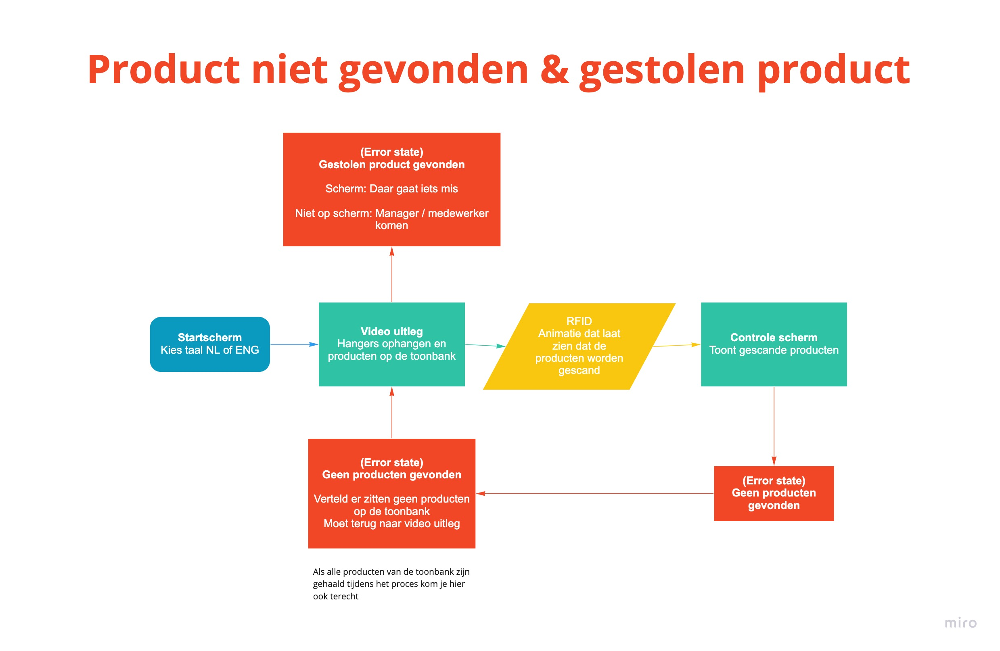
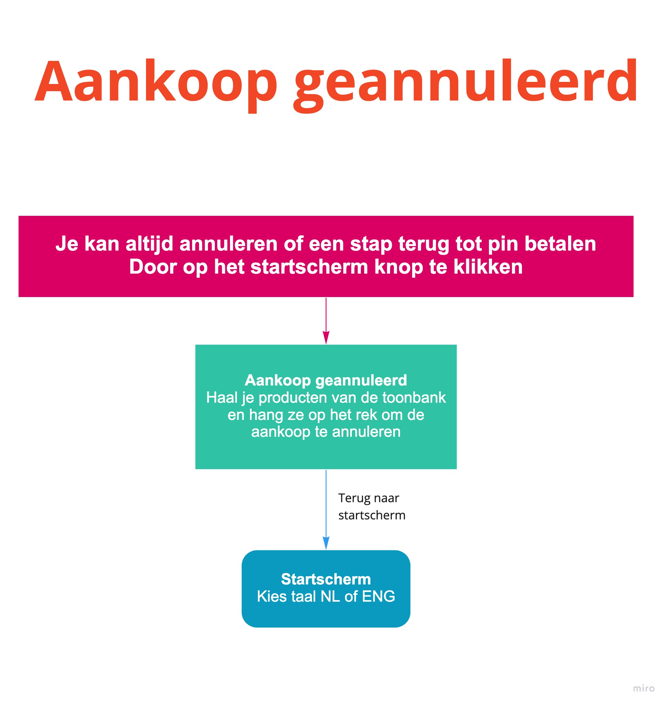
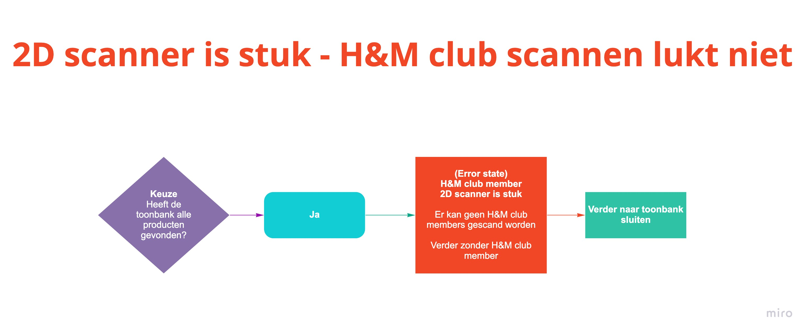
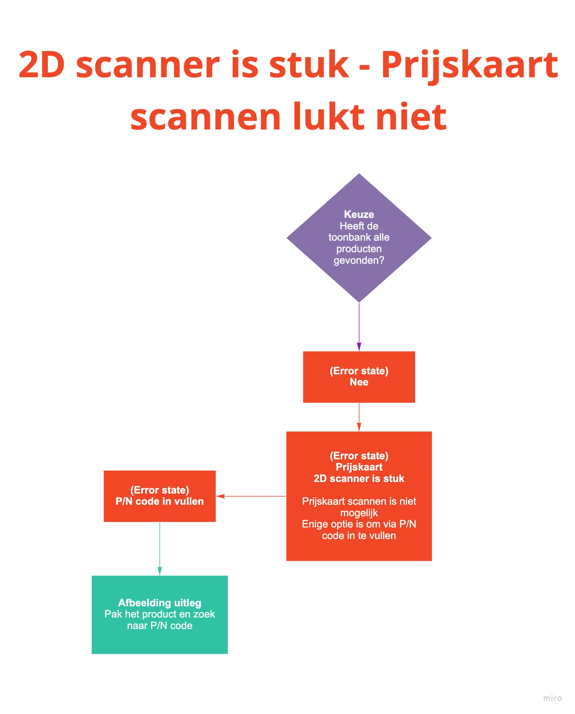
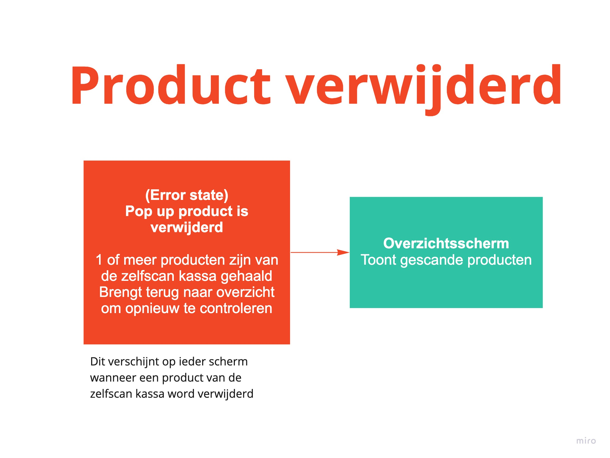
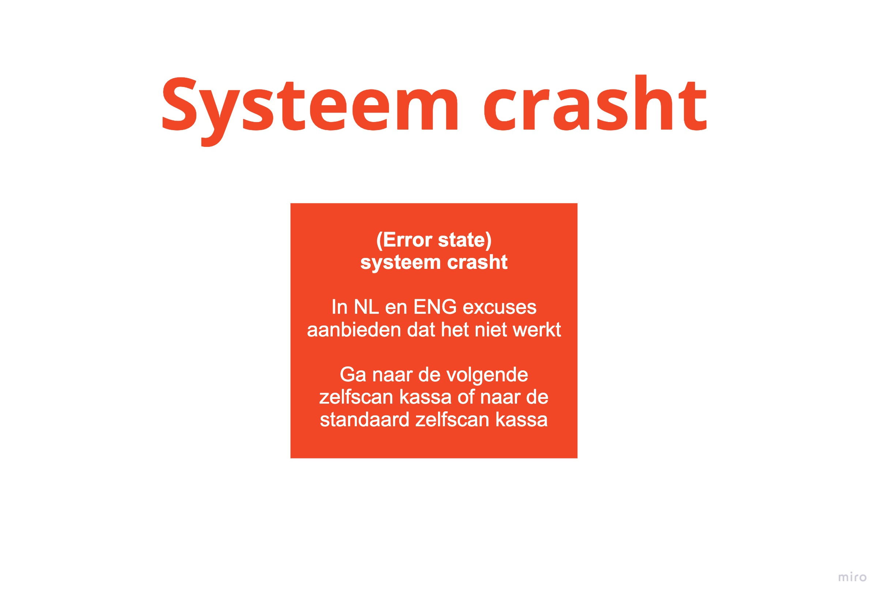
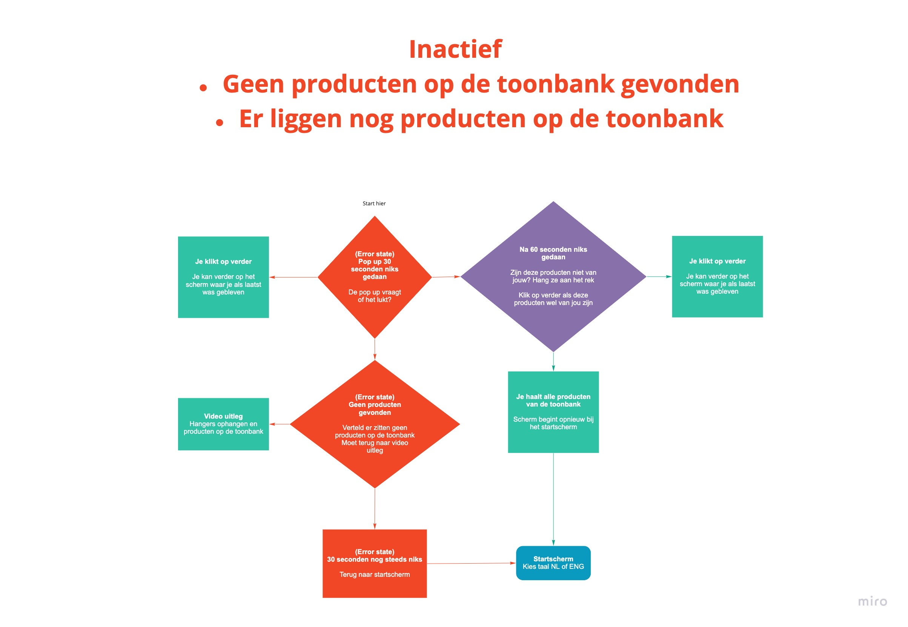

# User flow zelfscan kassa

### Waarom heb ik een user flow gemaakt?

Door het ontwerpen van een user flow heb ik een beter beeld gekregen door welke stappen een zelfscan kassa heen moet gaan. Vervolgens keek ik wat er mis zou kunnen gaan en bedacht ik er oplossingen voor. 

Dankzij het ontwerpen van een user flow heb ik kritisch kunnen kijken wat er allemaal nodig is bij de zelfscan kassa. Het gaf ook een overzicht welke schermen ik moet uitwerken.

### Compleet user flow



### Legenda

### **User flow zelfscan kassa + aantal error states**




**Bekijk het overzicht beter via compleet user flow van Miro**



Dit is een uitgewerkte user flow van de zelfscan kassa. Het laat alle mogelijke keuzes zien die je bij de zelfscan kassa kan maken. 

**Het proces volgen:**

1. Bij het startscherm kies je je taal
2. Daarna speelt een video af hoe je de producten op de toonbank moet leggen
3. De producten worden hierna gescand
4. Je ziet een overzicht van al je producten
   1. Als de zelfscan kassa niet je product heeft gevonden kan je zoeken naar een prijskaart
   2. Als het product geen prijskaart heeft kan je de P/N code invoeren
5. Wanneer de zelfscan kassa alle producten heeft gevonden kan je doorgaan
6. Als je H&M club member bent kan je dit scannen
7. Als je een voucher wil gebruiken kan je dit scannen
8. Je kan hier alleen pinnen
9. Als je een bon wilt kan je dit aangeven
10. Het alarm word verwijderd van de producten
11. Je kan je kleren pakken en een gratis tas meenemen

**Aantal Error states:**

1. Als het een gekocht product heeft gevonden geeft de zelfscan kassa dit aan
   1. Je moet dan de gekochte product eruit halen
2. Je kan alleen met een Nederlandse H&M club member scannen
   1. Het accepteert geen buitenlandse club members
3. Als je aankopen niet voldoen aan de voucher eisen dan wordt de voucher niet geaccepteerd
4. Als het pinnen niet lukt kan je opnieuw beginnen of de aankoop annuleren
5. Wanneer de toonbank word geopend terwijl het alarm er niet is afgehaald komt er een error
   1. Het proces bij het pinnen word dan geannuleerd en gaat terug naar de video. De video laat zien dat de toonbank gesloten moet worden
   2. Bij de bon komt er een pop up dat pas weggaat wanneer de toonbank weer is gesloten
6. Als de bon op is kan er geen bon worden geprint.
   1. De zelfscan kassa kan wel het proces afronden
7. Roze: Aankoop annuleren tijdens het proces
   1. Er komt dan een video die uitlegt dat je de producten moet ophangen aan een rek



### **User flow over het snelste proces om bij de zelfscan kassa te betalen**




**Bekijk het overzicht beter via compleet user flow van Miro**



**Wat is het snelste proces om bij de zelfscan kassa te betalen?**

1. Je hebt al je producten op de toonbank gezet
2. Je hebt de toonbank al gesloten
3. Wanneer de toonbank is gesloten scant de zelfscan kassa de producten gelijk
4. Je hebt je H&M club kaart gescand
5. Je hebt een voucher gescand

**Welke schermen en stappen zijn verdwenen?**

1. De video van leg al je producten op de toonbank is weg
   1. Want je hebt alles al gezet en de deur dicht gedaan
2. De video van sluit de toonbank is weg
3. De animatie van producten scannen is weg
   1. Want de zelfscan kassa scant gelijk wanneer de toonbank is gesloten
4. H&M club member pagina is weg
   1. Want je hebt al je H&M club gescand
5. H&M voucher pagina is weg
   1. Want je hebt al een voucher gescand
   2. Als je geen voucher hebt gescand dan komt de voucher pagina wel

**Waarom zijn de volgende schermen gebleven?**

1. Het startscherm en taal keuze
   1. Omdat de zelfscan kassa anders niet weet hoe die moet communiceren met de consument
2. Het overzicht pagina is gebleven
   1. De consument moet wel controleren of de producten zijn gevonden
   2. In dit voorbeeld klopt alles en gaat de consument gelijk door
3. Pin vraag is gebleven
   1. Want er moet eerst betaald worden
4. Bon vraag is gebleven
   1. Want wie weet wil de consument een fysieke bon
5. Animatie van het alarm verwijderen is gebleven
   1. Want het alarm wordt pas verwijderd na het betalen van de producten
6. Eindscherm met video dat je je producten mag pakken en een tas mag meenemen
   1. Want dan weet de consument dat het proces is voltooid



### Andere error states




**Bekijk het overzicht beter via compleet user flow van Miro**

**Product niet gevonden**

Als de zelfscan kassa geen producten heeft kunnen scannen dan geeft dit een error aan. Er komt een nieuw pagina dat vertelt dat het geen producten heeft gevonden. De consument moet dan terug naar de video pagina en het opnieuw proberen. Anders kan er een medewerker bij gehaald worden.

**Gestolen product gevonden**

Het scherm laat niet zien dat een product is gestolen. Het vertelt dat er iets mis is gegaan en dat een medewerker komt helpen. De manager krijgt een melding dat er een gestolen product op de toonbank ligt. De manager voert dan de nodige stappen uit wat er gedaan moet worden met een gestolen product.




**Bekijk het overzicht beter via compleet user flow van Miro**

**Een aankoop is geannuleerd**

Wanneer de consument af ziet van een aankoop kan die dit annuleren. Door op de startscherm icoon te klikken krijgt het de vraag om opnieuw te beginnen of om te annuleren. 

Als de consument wil annuleren komt die terecht bij een nieuw scherm. Er speelt een video af dat de producten opgehangen moeten worden aan het rek ernaast. Wanneer alles is terug gehangen gaat de zelfscan kassa automatisch naar het startscherm.




**Bekijk het overzicht beter via compleet user flow van Miro**

**2D scanner is stuk**

Dit betekent dat er geen barcodes gescand kunnen worden. En daarom ook geen H&M club member. De pagina van de vraag: Ben je H&M club member veranderd naar: Er kan geen H&M club member gescand worden. De consument moet helaas verder zonder club member. Via een pop up word er wel uitgelegd hoe je alsnog je punten kan sparen

_Geen H&M club dan ook geen voucher vraag_




**Bekijk het overzicht beter via compleet user flow van Miro**

**2D scanner is stuk**

Dit betekent dat er geen barcodes gescand kunnen worden. ****Hierdoor kunnen er geen prijskaarten gescand worden. Wanneer de zelfscan kassa niet alle producten heeft gevonden en de 2D scanner werkt niet, dan kan de consument via het p/n code alsnog het product toevoegen.




**Bekijk het overzicht beter via compleet user flow van Miro**

**Je pakt een product uit de toonbank**

Als je een product niet meer wil kan je het verwijderen door uit de toonbank te pakken. Er verschijnt dan een pop up die verteld dat een product is verwijderd. Het brengt je even terug naar het overzichtsscherm om te controleren of alles nog klopt. Wanneer je verder wilt van het overzichtsscherm kom je terug op het scherm waar je als laatst was gebleven.




**Bekijk het overzicht beter via compleet user flow van Miro**

**Het systeem crasht**

Er valt voor de consument niks anders te doen. Ze kunnen naar de zelfscan kassa ernaast of naar de standaard kassa om te betalen.




**Bekijk het overzicht beter via compleet user flow van Miro**

**Inactief voor 30 seconden**

Als er voor 30 seconden niks gebeurd verschijnt er een pop up. De pop up vraagt of het allemaal wel lukt. Als je verder wil gaan met het proces klik je op verder.

**Inactief voor 1 minuut**

Als er na 30 seconden \(totaal 1 minuut \) nog steeds niks gebeurd komt er een nieuwe scherm. Het vraagt of deze producten wel van jouw zijn of niet. Een video speelt af wat je moet doen met de producten die niet van jouw zijn. Je hangt ze op aan een rek ernaast

Als de producten wel van jou zijn klik je op verder en ga je verder op het scherm waar je als laatst was gebleven

**Geen producten op de toonbank**

Als het geen producten op de toonbank vind kom je terecht op een error scherm. Het verteld dat het geen product heeft kunnen vinden. Je kan dan terug naar de uitleg scherm hoe je producten op de toonbank moet leggen. 

Als er na 30 seconden niks gebeurd gaat de zelfscan kassa terug naar het startscherm.




**Bekijk het overzicht beter via compleet user flow van Miro**

**Toonbank wordt geopend bij de bon pagina**

Het alarm van de producten word door de Kill Code af gehaald. De Kill Code werkt pas na het bevestigen of je een bon wil of niet. Als je de toonbank open bij de bon vraag krijg je een pop up. De pop up vertelt dat de toonbank nog even gesloten moet blijven. De pop up verdwijnt pas wanneer de toonbank weer is gesloten

**Bon kan niet worden geprint**

Wanneer de bon op is kan het geen papieren bon printen. Als de consument een H&M club member heeft gescand ontvangt ze wel een digitale bon. Anders heeft de RFID tag van het product als bewijs de Kill Code van betaling. De zelfscan kassa meld dat het geen bon kan printen en kan wel door met het proces om het alarm van de producten te verwijderen.



