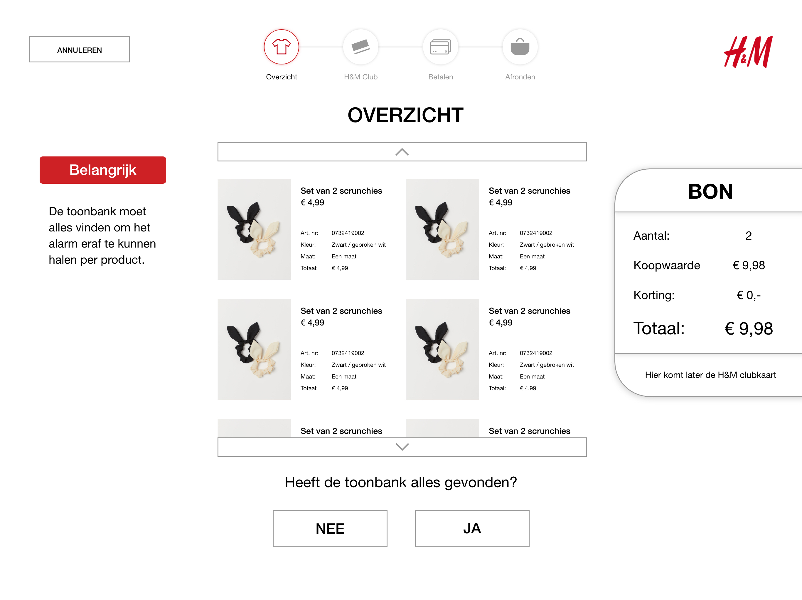
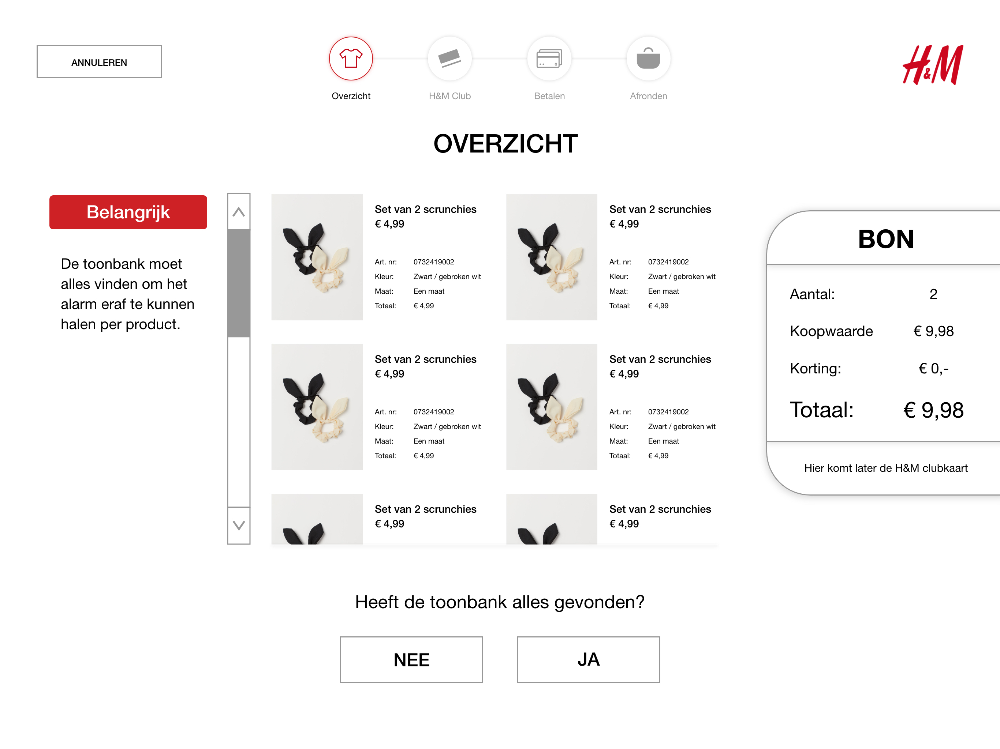
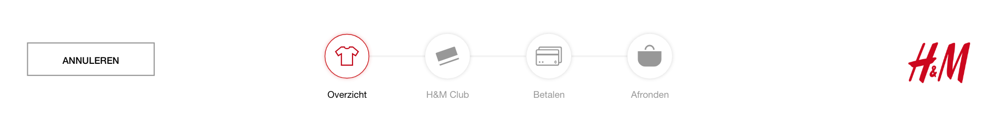
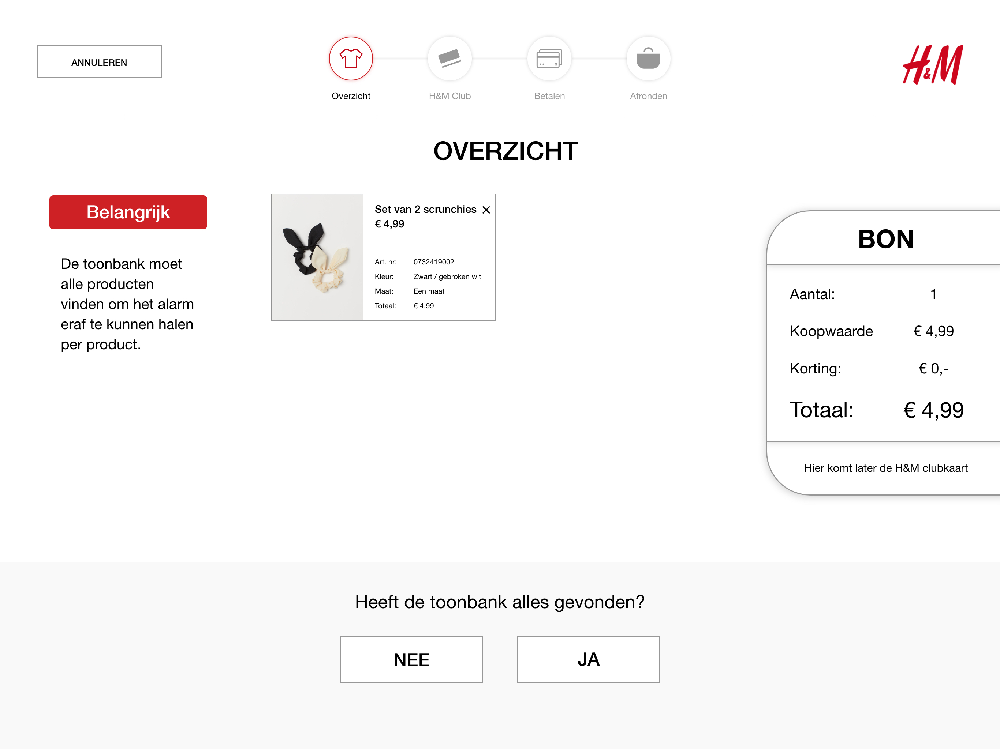

# User test zelfscan kassa 0.2

### Korte samenvatting



* De testsessies waren uitgevoerd tussen 13 mei en 19 mei 2019
* 2 vrouwen 1 man hebben het getest
* Deze testers hadden zelfscan kassa v1.0 al getest en zijn bekend met het afstudeerproject
  * Zelfscan kassa v1.0 zit in hoofdstuk: 
    * Concept fase
      * 4 concepten
        * Zelfscan kassa



* H&M club + voucher pagina's moeten veel beter worden uitgewerkt
  * Voucher korting gelijk toepassen 
  * Bijvoorbeeld: 10 procent korting - toepassen aan duurste product
  * Consument hoeft niet zelf te klikken
* Product toevoegen moet simpeler
* Niet te veel op 1 scherm plaatsen
* Snelle oplossing bedenken voor als iemand producten wil verwijderen
  * Wanneer je het van de toonbank af haalt wordt het automatisch verwijderd
* Door op de bon te klikken het overzicht snel zien
  * En niet terug naar de overzicht pagina gaan
* Bon mislukt
  * Digitale bon als je H&M club member bent
  * RFID houdt ook bij wanneer iets is betaald en wanneer iets wordt gestolen
* Wat aan de linkerkant staat word bijna niet bekeken



* Handig verbeterpunten in te zien
* Weet waar het misgaat
* Weet waar het goed gaat
* Weet wat ik nu mis



### Download test van Adobe XD



Klik op de playbutton rechtsboven. Je begint dan bij het startscherm met de vlaggen.

Je kan meedoen met de tests hieronder om zelf de schermen te zien.

### Test 1 Snelle koop

**Belangrijk:**

* Je hebt **geen** H&M club kaart
* Je wilt alleen een haarbandje kopen

**Jouw taak:**

Ga bij de zelfscan kassa een haarbandje kopen

**Volledige vragen:**

1. Hoe vond je de ervaring van deze zelfscan kassa in vergelijking met de vorige?
2. Wat was voor jouw niet overzichtelijk?
3. Wat vond je ervan dat de bon voor een lange tijd aan de rechterkant staat?

<table>
  <thead>
    <tr>
      <th style="text-align:left"><b>Tester</b>
      </th>
      <th style="text-align:left"><b>1- Vergelijking zelfscan kassa 1 vs zelfscan kassa 2</b>
      </th>
      <th style="text-align:left"><b>2- Wat was niet overzichtelijk?</b>
      </th>
      <th style="text-align:left"><b>3- Bon aan de zijkant?</b>
      </th>
    </tr>
  </thead>
  <tbody>
    <tr>
      <td style="text-align:left">Esma</td>
      <td style="text-align:left">
        <ul>
          <li>Duidelijker</li>
          <li>Dankzij de video&#x2019;s die uitleggen</li>
          <li>Stappen beter te volgen</li>
        </ul>
      </td>
      <td style="text-align:left">
        <ul>
          <li>Een moment geduld puntjes toevoegen</li>
          <li>Niet duidelijk dat ik de deur van de toonbank moest sluiten</li>
          <li>Keuze om bon te ontvangen ja of nee</li>
          <li>Bij alarm verwijderen - hou de klep/deur dicht tekst</li>
          <li>Bedankt en fijne dag onderaan zetten en bovenaan zeggen - je kan je producten
            pakken</li>
        </ul>
      </td>
      <td style="text-align:left">
        <ul>
          <li>Overzichtelijk</li>
          <li>Aantal producten is te zien</li>
          <li>Moet op 1 plek blijven</li>
        </ul>
      </td>
    </tr>
    <tr>
      <td style="text-align:left">Fikriye</td>
      <td style="text-align:left">
        <ul>
          <li>Duidelijker!</li>
          <li>Niet te veel informatie op 1 scherm</li>
          <li>Fijner om te gebruiken</li>
        </ul>
      </td>
      <td style="text-align:left">
        <ul>
          <li>Buttons vallen niet op</li>
          <li>Teksten in button zijn lang</li>
          <li>Geef kleur</li>
          <li>Belangrijk tekst bij overzicht - Daar las ik overheen</li>
          <li>Het zit heel random aan de linkerkant</li>
          <li>Belangrijk tekst / waarschuwing eerder toont bij producten op toonbank</li>
          <li>Choose a language boven de vlaggen</li>
        </ul>
      </td>
      <td style="text-align:left">
        <ul>
          <li>Wel nice</li>
          <li>Handig om te zien de bedragen</li>
          <li>Het pakt niet veel de aandacht</li>
          <li>Misschien dat de bon kan dichtklappen?</li>
          <li>Zodat de klant kan bepalen om het hele tijd te zien</li>
          <li>Koopwaarde nodig?</li>
          <li>Artikelen in de bon zetten - dat je misschien kan scrollen in de bon</li>
          <li>Bij de bon al producten verwijderen</li>
        </ul>
      </td>
    </tr>
    <tr>
      <td style="text-align:left">Hasan</td>
      <td style="text-align:left">
        <ul>
          <li>Duidelijker</li>
          <li>Plaatjes groter</li>
          <li>Alles in het midden - leest fijner</li>
        </ul>
      </td>
      <td style="text-align:left">
        <ul>
          <li>H&amp;M club member pagina moet verbeterd worden</li>
          <li>De zin: Alleen Nederlandse club members loopt niet lekker</li>
        </ul>
      </td>
      <td style="text-align:left">
        <ul>
          <li>Fijn</li>
          <li>Het houdt overzicht</li>
          <li>Je ziet je kosten</li>
        </ul>
      </td>
    </tr>
  </tbody>
</table>### Test 2 H&M club

**Belangrijk:**

* Je hebt **wel** een H&M club kaart
* Je wilt alleen een haarbandje kopen

**Jouw taak:**

Ga bij de zelfscan kassa een haarbandje kopen en voeg een voucher voor korting toe.

**Volledige vragen:**

1. Hoe vond je de uitleg over H&M club? Het toevoegen ervan?
2. Hoe vond je de uitleg om een voucher toe te voegen?
3. Hoe vond je het om zelf een voucher toe te voegen?
4. Wat begreep je dat je moest doen toen er een error kwam bij de bon?

<table>
  <thead>
    <tr>
      <th style="text-align:left"><b>Tester</b>
      </th>
      <th style="text-align:left"><b>1- uitleg H&amp;M club</b>
      </th>
      <th style="text-align:left"><b>2- Uitleg voucher</b>
      </th>
    </tr>
  </thead>
  <tbody>
    <tr>
      <td style="text-align:left">Esma</td>
      <td style="text-align:left">
        <ul>
          <li>Duidelijke pagina</li>
          <li>De titel / vraag bij de knop</li>
          <li>Let op onderaan de uitleg</li>
          <li>Duidelijk hoe je H&amp;M club moet scannen</li>
        </ul>
      </td>
      <td style="text-align:left">
        <ul>
          <li>De vraag bij de button zetten</li>
          <li>Durfde niet op verder te klikken na het toevoegen van de korting</li>
          <li>Dacht dat de korting dan weggaat door de tekst boven de knop verder</li>
          <li>Selecteer product pop up groter</li>
          <li>Selecteer product: eerst taak geven en daarna korting tonen</li>
        </ul>
      </td>
    </tr>
    <tr>
      <td style="text-align:left">Fikriye</td>
      <td style="text-align:left">
        <ul>
          <li>Vaag, de uitleg H&amp;M club</li>
          <li>Tekst in een read more button plaatsen</li>
          <li>Pijl pakt te veel aandacht - bij H&amp;M kaart toevoegen</li>
        </ul>
      </td>
      <td style="text-align:left">
        <ul>
          <li>Dacht dat ze moest klikken op de afbeelding voucher pagina</li>
          <li>Liever video dan plaatje</li>
          <li>Raakte in de war met de knoppen tijdens de voucher en H&amp;M club kaart
            toevoegen</li>
          <li>Tekst: wat is voucher uitklapbaar maken</li>
        </ul>
      </td>
    </tr>
    <tr>
      <td style="text-align:left">Hasan</td>
      <td style="text-align:left">
        <ul>
          <li>H&amp;M club kaart scannen is makkelijk</li>
          <li>Video legt het goed uit</li>
          <li>Teksten moeten beter worden geschreven</li>
        </ul>
      </td>
      <td style="text-align:left">
        <ul>
          <li>Hij dacht dat hij het voorbeeld kon gebruiken als korting</li>
          <li>Verder klikken zonder voucher toe te voegen? Waarom zou ik daar op klikken?</li>
          <li>Hij dacht H&amp;M club kaart is tegelijk voucher</li>
          <li>Video die beter uitlegt</li>
        </ul>
      </td>
    </tr>
  </tbody>
</table><table>
  <thead>
    <tr>
      <th style="text-align:left"><b>Tester</b>
      </th>
      <th style="text-align:left"><b>3- Voucher toevoegen</b>
      </th>
      <th style="text-align:left">4- Error bon</th>
    </tr>
  </thead>
  <tbody>
    <tr>
      <td style="text-align:left">Esma</td>
      <td style="text-align:left">
        <ul>
          <li>Simpel zelf toevoegen - al bekend om te gebruiken in de app en winkel</li>
          <li>Duidelijk dat je de korting gelijk ziet na toevoegen voucher</li>
          <li>Niet duidelijk hoe je verder moet gaan na voucher toevoegen</li>
          <li>Ze wil een feedback / bevestiging dat het is toegevoegd</li>
          <li>Op voucher toevoegen pagina
            <ul>
              <li>Knop verder met de tekst boven: Verder gaan zonder voucher kan ook</li>
              <li>Is verwarrend</li>
            </ul>
          </li>
        </ul>
      </td>
      <td style="text-align:left">
        <ul>
          <li>Bon printen lukt niet - viel niet op</li>
          <li>Ze zocht een caissi&#xE8;re op voor hulp</li>
          <li>Maar dacht dat het was om te controleren</li>
        </ul>
      </td>
    </tr>
    <tr>
      <td style="text-align:left">Fikriye</td>
      <td style="text-align:left">
        <ul>
          <li>Te veel uitleg!</li>
          <li>Maak het overzichtelijker</li>
          <li>Simpeler maken</li>
          <li>Misschien nog een scherm ertussen maken
            <ul>
              <li>Ook bij H&amp;M club</li>
            </ul>
          </li>
        </ul>
      </td>
      <td style="text-align:left">
        <ul>
          <li>Begreep dat bon niet was gelukt</li>
          <li>Als het druk is bij de caissi&#xE8;re dan ga ik niet vragen</li>
        </ul>
      </td>
    </tr>
    <tr>
      <td style="text-align:left">Hasan</td>
      <td style="text-align:left">
        <ul>
          <li>De pop up is verwarrend</li>
          <li>Leest er overheen</li>
          <li>Na het scannen verwacht hij het gelijk toegepast aan product</li>
        </ul>
      </td>
      <td style="text-align:left">
        <ul>
          <li>Producten achter laten?</li>
          <li>Bon probleem zorgt voor lange rij</li>
          <li>Geen handige oplossing</li>
          <li>Hulp knop is nodig!</li>
        </ul>
      </td>
    </tr>
  </tbody>
</table>### Test 3 Product toevoegen

**Belangrijk:**

* Je hebt **geen** H&M club kaart
* Je wilt een haarbandje en sjaal kopen

**Jouw taak:**

Ga bij de zelfscan kassa een haarbandje en sjaal kopen.

**Volledige vragen:**

1. Was de uitleg om een product toe te voegen duidelijk?
2. Wat vond je moeilijk om een product toe te voegen?
3. Waar kon je aan zien dat het product was toegevoegd?

<table>
  <thead>
    <tr>
      <th style="text-align:left"><b>Tester</b>
      </th>
      <th style="text-align:left"><b>1- Uitleg duidelijk?</b>
      </th>
      <th style="text-align:left"><b>2- Moeilijk toevoegen?</b>
      </th>
      <th style="text-align:left"><b>3- Is product toegevoegd?</b>
      </th>
    </tr>
  </thead>
  <tbody>
    <tr>
      <td style="text-align:left">Esma</td>
      <td style="text-align:left">
        <ul>
          <li>Ze dacht dat ze vooraf al deur / klep moest sluiten</li>
          <li>De uitleg was voor mij wel duidelijk</li>
          <li>Duidelijk dat het product terug moet op toonbank</li>
          <li>Handig als het filmpje over product op toonbank wordt getoond</li>
          <li>Na toevoegen liever overzicht zien van al mijn producten</li>
        </ul>
      </td>
      <td style="text-align:left">
        <ul>
          <li>Seizoen vinden was lastig</li>
          <li>Misschien een plaatje van de label en geen video</li>
          <li>De info knop voor seizoen aan de rechterkant zetten</li>
          <li>Voer je alle cijfers in van de P/N code?</li>
          <li>Waarom moet ik een kleur aangeven?</li>
        </ul>
      </td>
      <td style="text-align:left">
        <ul>
          <li>Prijs veranderd</li>
          <li>Bevestiging dat product is toegevoegd</li>
          <li>Liever dat ik weer overzicht zie + mijn toegevoegde product</li>
        </ul>
      </td>
    </tr>
    <tr>
      <td style="text-align:left">Fikriye</td>
      <td style="text-align:left">
        <ul>
          <li>Ja maar te veel informatie in 1 scherm</li>
          <li>Prijskaart vraag duidelijk</li>
          <li>Video zit random aan de linkerkant</li>
          <li>Meer iconen gebruiken voor meer informatie</li>
        </ul>
      </td>
      <td style="text-align:left">
        <ul>
          <li>Nee was niet lastig</li>
          <li>Moet duidelijker</li>
          <li>Misschien meer stappen</li>
        </ul>
      </td>
      <td style="text-align:left">
        <ul>
          <li>Aan de bon</li>
          <li>Prijs veranderde</li>
          <li>Aantal veranderde</li>
          <li>Voeg toe aan bon was voor mij duidelijk
            <ul>
              <li>Dat het aan bon werd toegevoegd</li>
            </ul>
          </li>
        </ul>
      </td>
    </tr>
    <tr>
      <td style="text-align:left">Hasan</td>
      <td style="text-align:left">
        <ul>
          <li>Het was duidelijk door de video</li>
          <li>Video kan wel groter en niet in een hoek</li>
        </ul>
      </td>
      <td style="text-align:left">
        <ul>
          <li>Hij wilde artikelnummer controleren
            <ul>
              <li>Omdat het op het scherm te zien was</li>
            </ul>
          </li>
          <li>Wat is seizoen?
            <ul>
              <li>Dit zal vaak opgezocht worden</li>
            </ul>
          </li>
        </ul>
      </td>
      <td style="text-align:left">
        <ul>
          <li>Prijs ging omhoog</li>
          <li>Door de knop voeg toe aan bon</li>
          <li>De producten in de bon zien</li>
        </ul>
      </td>
    </tr>
  </tbody>
</table>### Vragen schermen

#### 1 Scroll voorkeur voor veel producten

<table>
  <thead>
    <tr>
      <th style="text-align:left">Tester</th>
      <th style="text-align:left"><b>Welke van de twee schermen spreekt jouw meer aan om te scrollen?</b>
      </th>
    </tr>
  </thead>
  <tbody>
    <tr>
      <td style="text-align:left">Esma</td>
      <td style="text-align:left">
        <ul>
          <li>Klikken is leuker en handiger optie 1</li>
          <li>Duidelijk dat je erop moet drukken</li>
          <li>Standaard is klassiek en duidelijk optie 2</li>
          <li>Scrollen zou kunnen vastlopen / niet goed gaan</li>
          <li>Kan je vanzelf al scrollen zoals op mobiel?</li>
        </ul>
      </td>
    </tr>
    <tr>
      <td style="text-align:left">Fikriye</td>
      <td style="text-align:left">
        <ul>
          <li>Scrollen optie 2!</li>
          <li>Zoals bij MC Donalds werkt het fijn</li>
          <li>Klikken optie 1 voelt zo robotachtig</li>
        </ul>
      </td>
    </tr>
    <tr>
      <td style="text-align:left">Hasan</td>
      <td style="text-align:left">
        <ul>
          <li>Klikken versie 1 is handiger</li>
          <li>Fijner want de andere gaat sliden op scherm lastiger</li>
          <li>Klikken is makkelijker</li>
          <li>Standaard scrollen zit normaal gesproken rechts</li>
        </ul>
      </td>
    </tr>
  </tbody>
</table>#### 2 Procesbar duidelijk?

<table>
  <thead>
    <tr>
      <th style="text-align:left">Tester</th>
      <th style="text-align:left">Begrijp je de procesbar?</th>
    </tr>
  </thead>
  <tbody>
    <tr>
      <td style="text-align:left">Esma</td>
      <td style="text-align:left">
        <ul>
          <li>Duidelijk de iconen</li>
          <li>Bekend mee online / hebben ook procesbarren</li>
          <li>Je weet waar je bent</li>
          <li>En wat je nog moet doen</li>
          <li>Het viel op</li>
        </ul>
      </td>
    </tr>
    <tr>
      <td style="text-align:left">Fikriye</td>
      <td style="text-align:left">
        <ul>
          <li>Ja ze waren gewoon duidelijk</li>
        </ul>
      </td>
    </tr>
    <tr>
      <td style="text-align:left">Hasan</td>
      <td style="text-align:left">
        <ul>
          <li>Ja ze waren duidelijk met de teksten erbij</li>
          <li>Viel voor hem niet op</li>
        </ul>
      </td>
    </tr>
  </tbody>
</table>#### 3 Terug naar startscherm

<table>
  <thead>
    <tr>
      <th style="text-align:left">Tester</th>
      <th style="text-align:left"><b>Weet je hoe je terug moet naar het startscherm?</b>
      </th>
    </tr>
  </thead>
  <tbody>
    <tr>
      <td style="text-align:left">Esma</td>
      <td style="text-align:left">
        <ul>
          <li>Ik zou het niet weten</li>
          <li>Ik zie geen optie om naar startscherm te gaan</li>
        </ul>
      </td>
    </tr>
    <tr>
      <td style="text-align:left">Fikriye</td>
      <td style="text-align:left">
        <ul>
          <li>Annuleren knop klikken</li>
          <li>Het viel voor haar op</li>
          <li>Maar als diegene voor bij weg is met spullen? Gaat het niet automatisch
            naar het startscherm?</li>
          <li>Melding geven: Alle producten zijn weg! Wil je opnieuw beginnen?</li>
        </ul>
      </td>
    </tr>
    <tr>
      <td style="text-align:left">Hasan</td>
      <td style="text-align:left">
        <ul>
          <li>Door op annuleren te klikken</li>
        </ul>
      </td>
    </tr>
  </tbody>
</table>#### 4 Overzichtsscherm

<table>
  <thead>
    <tr>
      <th style="text-align:left">Tester</th>
      <th style="text-align:left"><b>Wat vind je van het overzichtsscherm?</b>
      </th>
    </tr>
  </thead>
  <tbody>
    <tr>
      <td style="text-align:left">Esma</td>
      <td style="text-align:left">
        <ul>
          <li>Duidelijk</li>
          <li>Midden al je producten</li>
          <li>Met afbeeldingen en data</li>
          <li>Bon is duidelijk en alle bedragen</li>
          <li>Belangrijk viel voor mij niet op</li>
        </ul>
      </td>
    </tr>
    <tr>
      <td style="text-align:left">Fikriye</td>
      <td style="text-align:left">
        <ul>
          <li>Goed</li>
          <li>Belangrijk viel niet op</li>
        </ul>
      </td>
    </tr>
    <tr>
      <td style="text-align:left">Hasan</td>
      <td style="text-align:left">
        <ul>
          <li>Overzichtelijk</li>
          <li>Je ziet je producten</li>
          <li>Je ziet bon</li>
        </ul>
      </td>
    </tr>
  </tbody>
</table>### Overige vragen

<table>
  <thead>
    <tr>
      <th style="text-align:left">Tester</th>
      <th style="text-align:left">1 Wat kan beter aan zelfscan kassa?</th>
      <th style="text-align:left">2 Wat kan er mis gaan?</th>
    </tr>
  </thead>
  <tbody>
    <tr>
      <td style="text-align:left">Esma</td>
      <td style="text-align:left">
        <ul>
          <li>De zelfscan kassa is wel duidelijk</li>
          <li>Wat gebeurd er met de hangers als het vol zit?
            <ul>
              <li>Die kunnen losgemaakt worden door de medewerkers</li>
              <li>Zoals ze het nu ook doen achter de kassa</li>
            </ul>
          </li>
          <li>Het is overzichtelijk</li>
        </ul>
      </td>
      <td style="text-align:left">
        <ul>
          <li>Systeemfouten? Voor als het systeem</li>
          <li>Maar verder zie ik niet in wat er mis kan gaan</li>
        </ul>
      </td>
    </tr>
    <tr>
      <td style="text-align:left">Fikriye</td>
      <td style="text-align:left">
        <ul>
          <li>Voorbeeld filmpjes zijn fijn</li>
          <li>Heb wel alles verteld wat ik wilde vertellen</li>
        </ul>
      </td>
      <td style="text-align:left">
        <ul>
          <li>Is stelen mogelijk?</li>
          <li>Nee door RFID alarm in de tag niet!</li>
        </ul>
      </td>
    </tr>
    <tr>
      <td style="text-align:left">Hasan</td>
      <td style="text-align:left">
        <ul>
          <li>Hulp knop om medewerkers te roepen</li>
        </ul>
      </td>
      <td style="text-align:left">
        <ul>
          <li>Omdat het nieuw is word lastig</li>
          <li>P/N code is lastig</li>
        </ul>
      </td>
    </tr>
  </tbody>
</table>