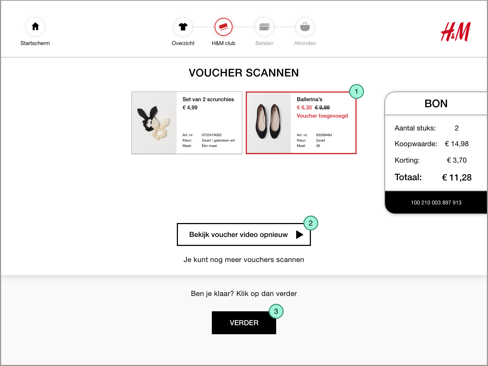
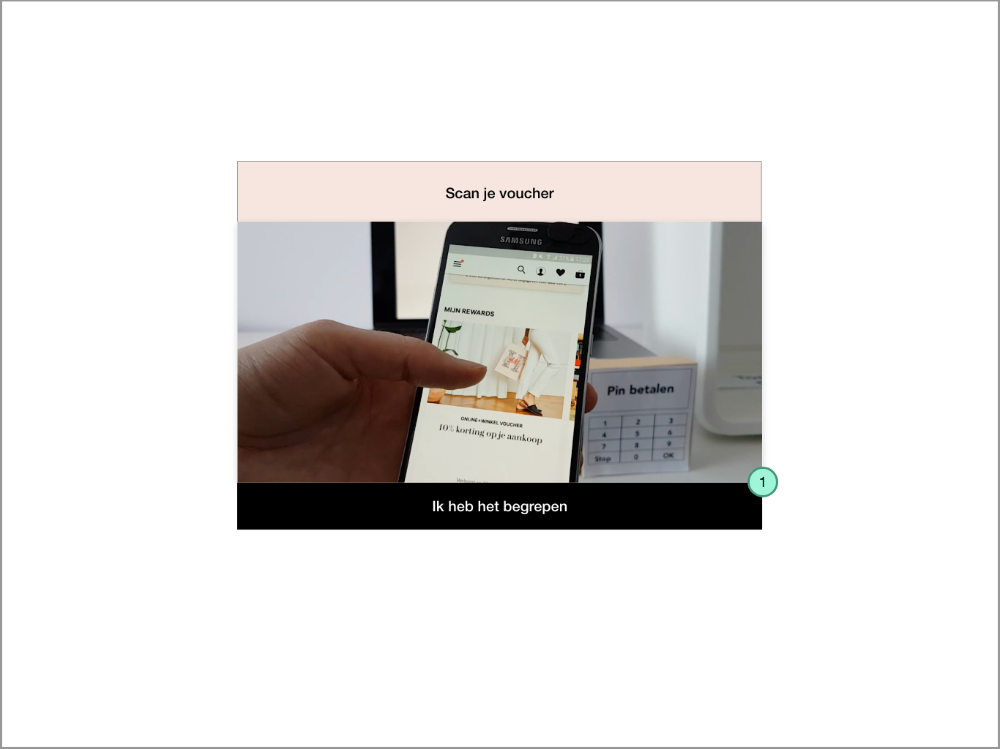

# H&M club member

### De opdracht

Je wilt scrunchies en ballerina's kopen en je hebt **wel een H&M club member**.

### H&M club member scannen




**Scan je H&M club member**  
Je scant de H&M club member met je mobiel bij de 2D scanner 

1. Een video legt uit hoe je de H&M club member kan scannen
   1. [https://vimeo.com/335608455](https://vimeo.com/335608455)
   2. Na het scannen van de H&M club member gaat het scherm automatisch verder

**Hoe kom ik bij dit scherm?**

Door op de vraag: Ben je H&M club member Ja te antwoorden.




**H&M club member is toegevoegd**

1. Onderaan de bon verschijnt een zwarte balk met je H&M club member
   1. Het scherm gaat automatisch door naar de voucher vraag



### Voucher toevoegen




**Voucher scherm**  
Als je H&M club member bent kan je korting krijgen. De korting krijg je alleen als je genoeg punten hebt en als je aankoop aan de eisen van de voucher voldoen.

1. Er verschijnt een pop up over wat een voucher is
2. Als je geen voucher wil gebruiken klik je op nee
   1. Je komt daarna weer terecht bij het scherm waar je de toonbank met sluiten
3. Als je een voucher wil gebruiken klik je op ja

**Pop up**

1. Deze pop up verschijnt over het scherm van de voucher pagina. Door op: Ik heb het begrepen te klikken gaat de consument terug naar de voucher scherm.




**Voucher laten scannen**  
Je scant met je mobiel de geactiveerde voucher

1. Een video legt uit hoe je de voucher kan scannen
   1. [https://vimeo.com/338534174](https://vimeo.com/338534174)
   2. Na het scannen van de voucher gaat het scherm automatisch verder




**Voucher is toegevoegd**  
Wanneer je de voucher hebt gescand wordt het automatisch toegevoegd. 

1. Het product of bon krijgt een rode kader en er staat op: Voucher toegevoegd.
2. Er verschijnt een pop up om de video van de voucher opnieuw te bekijken
3. Wanneer je klaar bent kan je op verder klikken en kom je terecht bij het scherm: Sluit de toonbank

**Pop up**

1. De video pop up komt over het scherm en speelt loopend / herhalend af
   1. Door op: Ik heb het begrepen te klikken gaat de pop up weg



