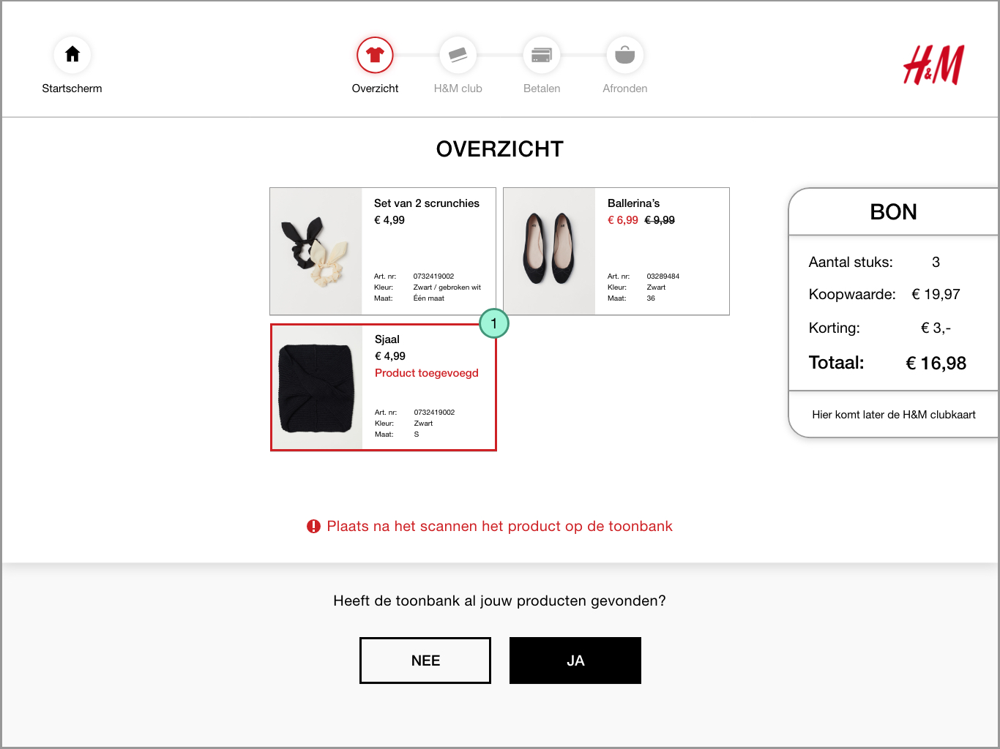

# Product niet gevonden

### De opdracht

Je wilt scrunchies, ballerina's **en een sjaal/top** kopen en je hebt geen H&M club member.

### Prijskaart




**Prijskaart scherm**  
Wanneer een product niet is gevonden door de toonbank vraagt het of het product een prijskaart heeft.

1. Terug knop naar het overzicht
2. Afbeelding voorbeeld prijskaart
3. Nee als het geen prijskaart heeft ga je een P/N code invullen
4. Ja als het een prijskaart heeft dan ga je de prijskaart scannen.

**Hoe kom ik bij de prijskaart scherm?**

Door op Nee te klikken op de vraag: Heeft de toonbank al jouw producten gevonden?




**Prijskaart scannen**

1. Een video legt uit hoe je de prijskaart kan scannen
   1. [https://vimeo.com/338534167](https://vimeo.com/338534167)
   2. Na het scannen van een prijskaart gaat het scherm automatisch verder




**Product is toegevoegd**  
Wanneer een product is toegevoegd kom je terug op het overzichtsscherm.

1. Een toegevoegd product krijgt een rode kader en de tekst: Product toegevoegd aan het product tegel.



### P/N code




**P/N code invoeren**  
Als het product geen prijskaart heeft kan je het product alsnog toevoegen via de P/N code.

1. Voorbeeld van een waslabel. Op de waslabel is de P/N code te vinden.
   1. Er staat een rode kader naast het P/N code om aan te geven welke cijfers je moet invoeren
2. Via de toetsen vul je de P/N code in de input field.




**Kleur selectie**  
Na het invoeren van je P/N code krijg je de vraag om de kleur van je product te kiezen

1. De product tegels
   1. Als er meerdere kleuren zijn kan je door de producten scrollen
2. Progres bar van de P/N schermen
   1. Consument weet dan welke vragen er allemaal komen en kan hier op voorbereid zijn




**Maat selectie**  
Na het kiezen van de kleur van het product, ga je de maat kiezen.

1. Buttons om een maat te kiezen van het product




**Seizoens selectie**  
De producten en de prijzen van H&M kunnen verschillen aan de hand van het seizoen. 

1. Buttons voor de seizoens opties van het product




**Product is toegevoegd**  
Wanneer een product is toegevoegd kom je terug op het overzichtsscherm.

1. Een toegevoegd product krijgt een rode kader en de tekst: Product toegevoegd aan het product tegel.



