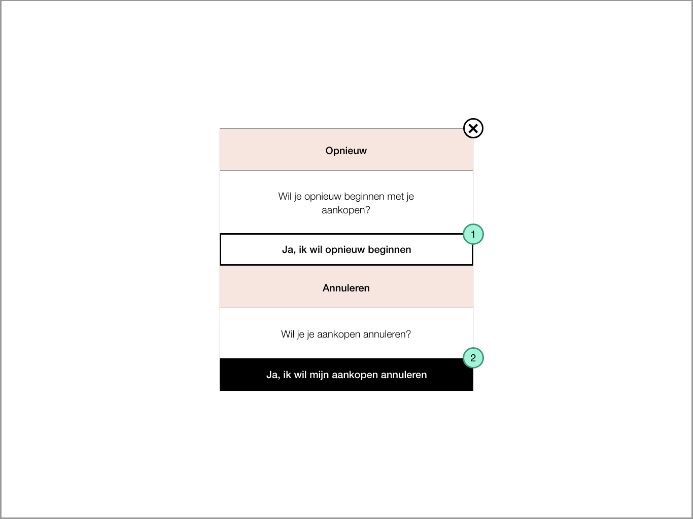
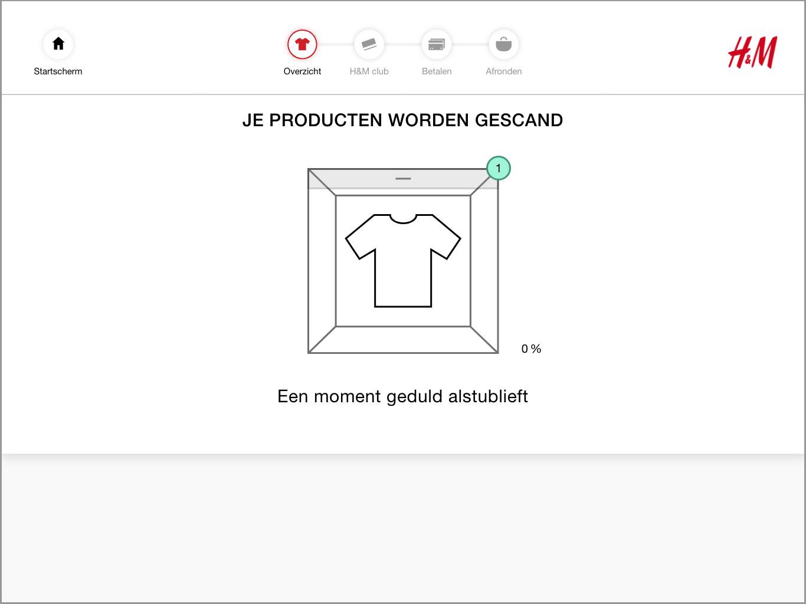
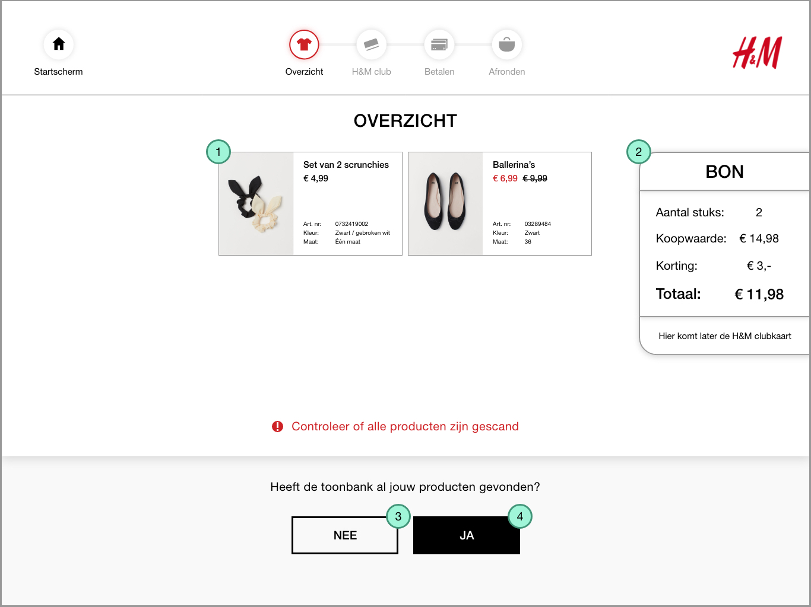
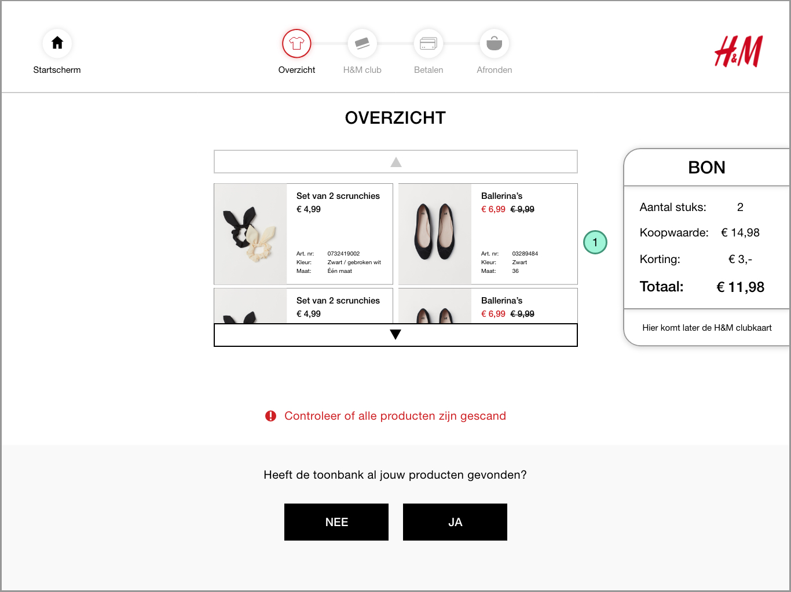
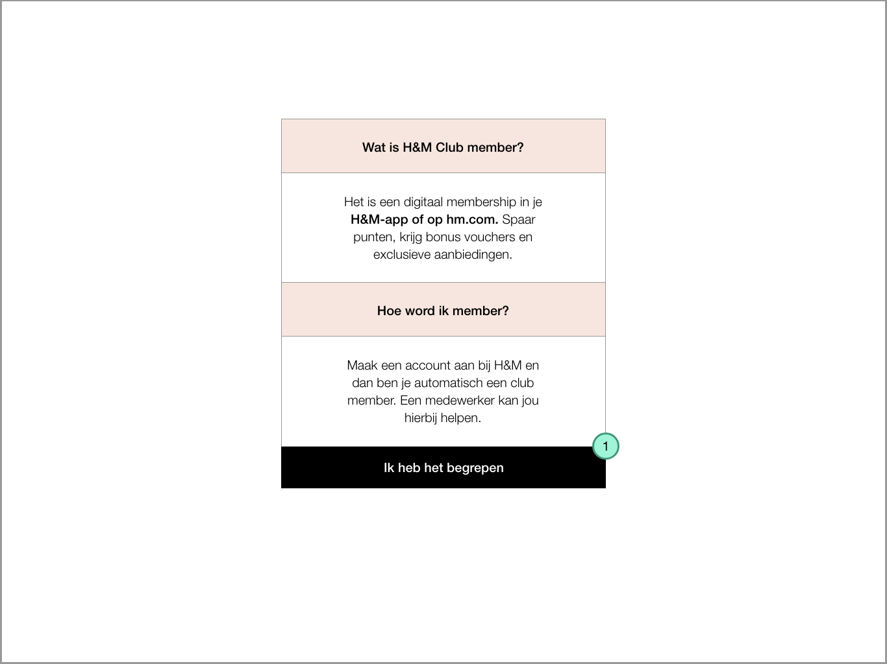
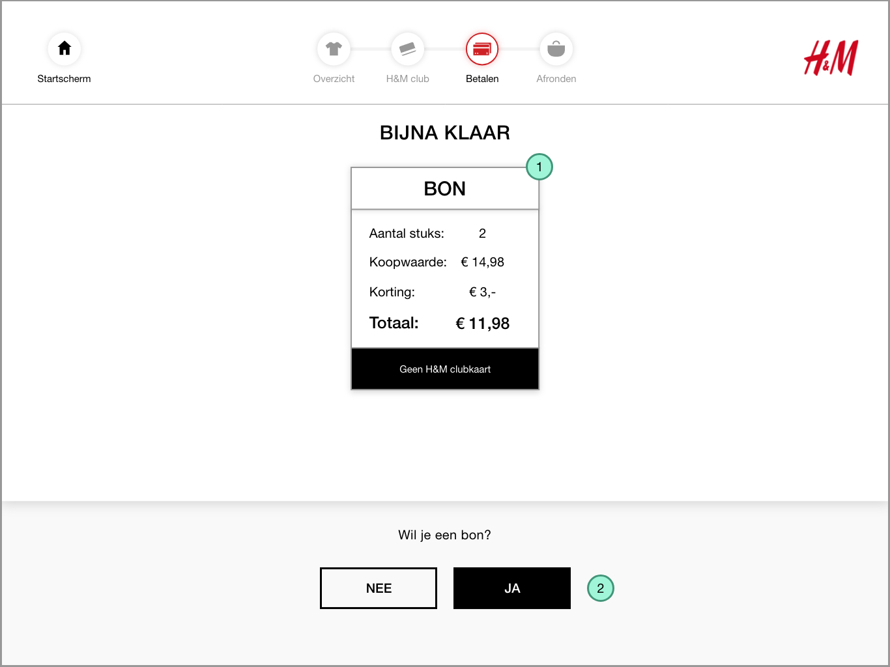

# Producten kopen

### De opdracht

Je wilt scrunchies en ballerina's kopen en je hebt geen H&M club member.

### Deel 1




**Introscherm**  
Begin scherm waar de consument een taal moet kiezen.

1. Kies een taal 
   1. In dit voorbeeld kiezen we Nederlands




**Leg je producten op de toonbank**

1. Startscherm knop
   1. Je kan dan terug naar het introscherm
   2. Of je kan het aankoopproces annuleren
2. Progres bar
   1. Rood icoon is waar de consument nu is
   2. Grijs icoon is waar de consument nog niet is
3. Video
   1. Legt uit dat alle producten op de toonbank gelegd moeten worden
   2. [https://vimeo.com/338534161](https://vimeo.com/338534161)
4. Nadat al je producten op de toonbank liggen klikt de consument op verder

**Pop up als je op startscherm knop klikt**

1. Je wil opnieuw beginnen met je aankopen. Je komt dan terecht op producten op de toonbank scherm \(De eerste afbeelding van deze tabblad\)
2. Je wil je aankopen annuleren dan kom je terecht bij een ander scherm
   1. Verder uitgelegd bij: 




**Animatie scant de producten**

1. De animatie wordt donkergrijs en de percentage laat zien hoe ver het is





**Overzichtsscherm**  
Toont alle producten die op de toonbank zitten op het scherm

1. Product tegel
2. Bon overzicht
3. Heeft het niet alle producten gevonden? Kies nee
4. Heeft het alle producten gevonden? Kies ja

**Scroll overzicht**  
Wanneer er meer dan 4 producten zijn gescand kan je in het overzicht scrollen

1. Je kan op de pijlen klikken of scrollen om de producten te bekijken.




**H&M club member**

1. Pop up verschijnt met meer uitleg over H&M club
2. Ben je geen member? klik nee
3. Ben je member? klik ja

1. Wanneer je alles hebt gelezen en het begrijpt klik op: Ik heb het begrepen




**Toonbank sluiten**  
De toonbank moet gesloten worden zodat de consument kan betalen.

1. Video speelt af hoe je de toonbank moet sluiten
   1. [https://vimeo.com/335608422](https://vimeo.com/335608422)



### Deel 2




**Pin scherm**

1. Het pinapparaat start onderaan het scherm
   1. Na het betalen gaat het scherm automatisch door naar de bon




**Bon scherm**

1. De bon aan de linkerkant komt nu in het midden
   1. Zodat het centraal de aandacht krijgt
2. Als je een bon wilt wordt dan wordt de bon onderaan het scherm geprint
   1. Het scherm gaat daarna verder
   2. Als je geen bon wilt gaat het scherm verder




**Alarm verwijderen**  
Na het betalen wordt het alarm van de RFID tag verwijderd. Dit doet de RFID reader in de toonbank. De reader stuurt een Kill Code naar de RFID tags waardoor het alarm is verwijderd. 

1. De animatie wordt rood en de percentage laat zien hoe ver het is





**Eindscherm**  
Je bent klaar met je aankopen.

1. Legt uit dat de consument haar producten kan pakken en een tas mag meenemen
   1. [https://vimeo.com/335608429](https://vimeo.com/335608429)
2. Door op het startscherm te klikken kom je terug bij het introscherm met de taal keuzes
   1. Als er na 20 seconden niet wordt geklikt gaat de zelfscan kassa automatisch terug naar het startscherm



