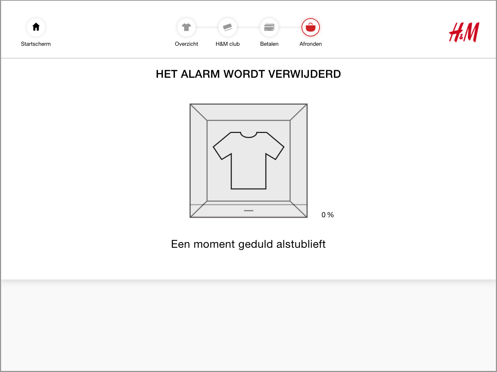
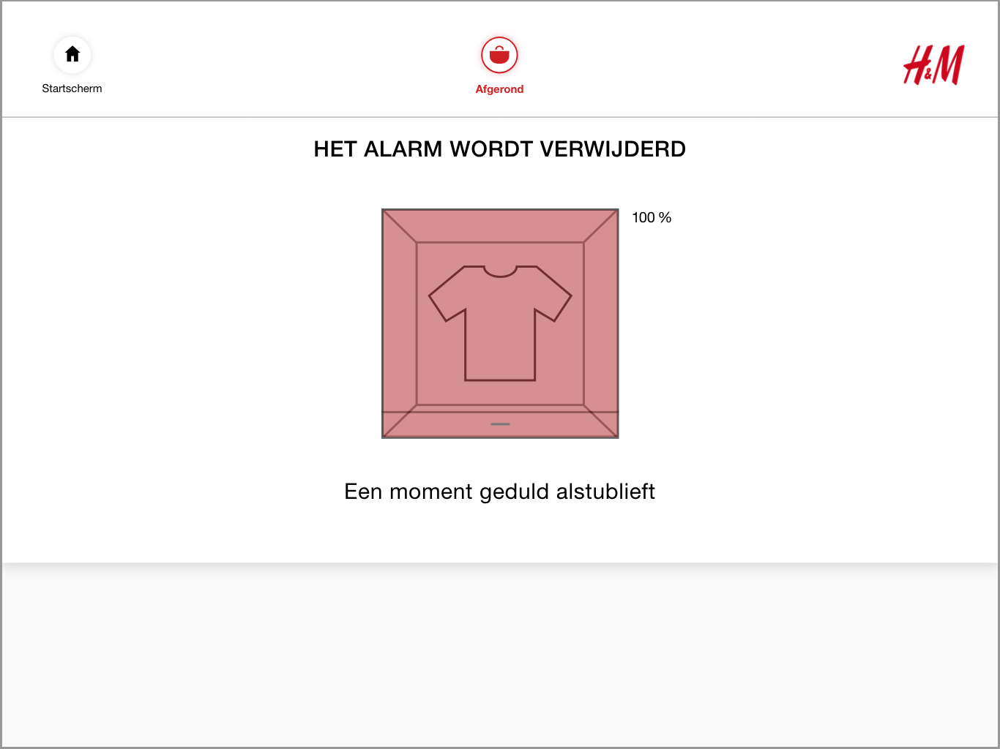

# Snelste proces

### Waarom is er een sneller proces?

Voor de terugkerende consument zou het handig zijn als ze sneller kunnen betalen. Om deze reden is er een pad uitgewerkt wat het snelste proces dat de zelfscan kassa kan aanbieden. Dit maakt het betalingsproces nog sneller.

Bekijk de user flow terug bij:



### Snelste proces voor de zelfscan kassa



1. Je hebt al je producten op de toonbank gezet
2. Je hebt de toonbank al gesloten
3. Wanneer de toonbank is gesloten scant de zelfscan kassa de producten gelijk
4. Je hebt je H&M membership gescand
5. Je hebt een voucher gescand



Er blijven maar 6 schermen over. De animatie tel ik als 1 scherm en als alle producten zijn gevonden blijven het 6 schermen.




1. De video van leg al je producten op de toonbank is weg
   1. Want je hebt alles al gezet en de deur dicht gedaan
2. De video van sluit de toonbank is weg
3. De animatie van producten scannen is weg
   1. Want de zelfscan kassa scant gelijk wanneer de toonbank is gesloten
4. H&M club member pagina is weg
   1. Want je hebt al je H&M club gescand
5. H&M voucher pagina is weg
   1. Want je hebt al een voucher gescand
   2. Als je geen voucher hebt gescand dan komt de voucher pagina wel



