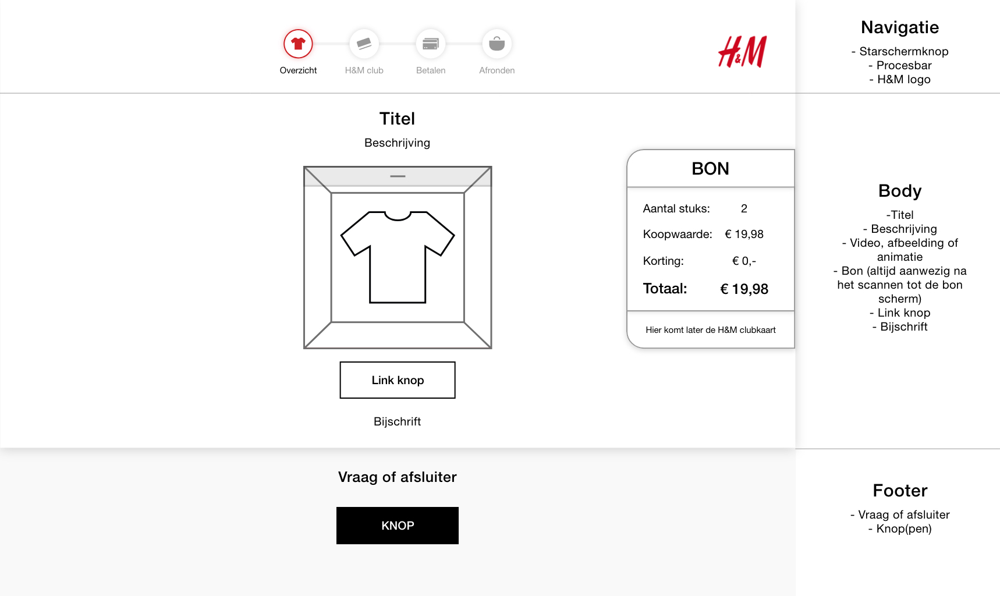
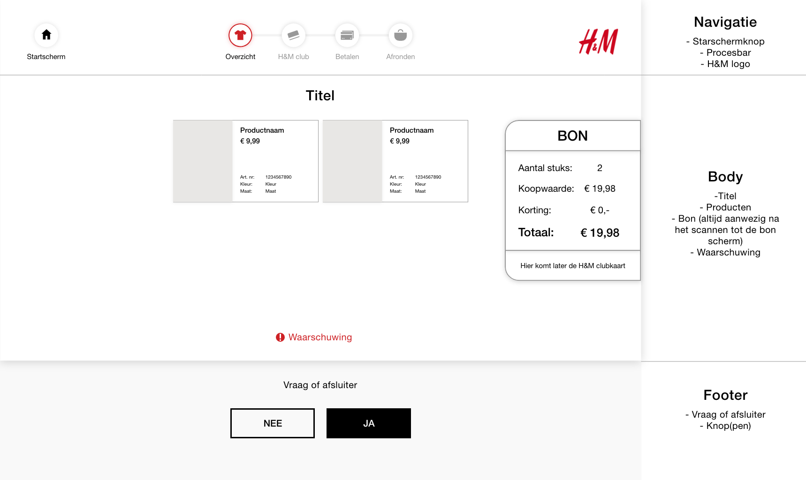

# Structuur schermen

### Waarom maak ik een structuur voor de schermen?

Door het opbreken van mijn schermen kan ik structuur creëren. Hiermee heb ik een houvast  voor de schermen. Het blijft hierdoor consistent en herkenbaar voor de consument. De schermen moeten niet te vol raken en alleen het nodige laten zien dat op het moment bij hoort.

### Standaard schermen

Bijna al mijn schermen zijn op deze manier opgedeeld. Het heeft een navigatie, body en een footer. In de navigatie kan je je proces volgen en het proces annuleren door naar startscherm te gaan. 

In de body veranderd het meest. Het ligt eraan waar je bent in het proces. Je zal een video, afbeelding of animatie kunnen zien. Er zal ook niet altijd een beschrijving, link knop of bijschrift bij staan. 

In de footer zijn de knop keuzes: Verder of ja en nee. Erboven staat een vraag om verder te kunnen gaan. Aan het eind van het proces staat er een afsluiter om terug te gaan naar het startscherm. 

### Overzichtsscherm

Het overzichtsscherm lijkt een beetje op de standaardschermen. Alleen hier zijn de verschillen: de producten en waarschuwing. 

De producten zijn vormgegeven in hun eigen box met:

* Productnaam
* Prijs
* Artikelnummer
* Kleur
* Maat

De waarschuwing staat er om duidelijk te maken dat alle producten gevonden moeten worden. 

