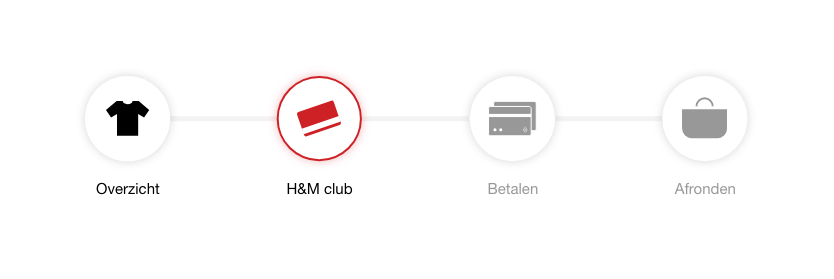

# Moodboards

### Waarom moodboards?

Door een moodboard te maken kreeg ik een beter beeld naar wat ik op zoek ben. Ik wilde vooral simpele maar duidelijke ontwerpen maken. Met simpel bedoel ik dat het niet druk is ontworpen of dat het veel effecten heeft. Met duidelijk bedoel ik dat ik wil dat de consument gelijk begrijpt wat er in een progres bar staat of dat ze de informatie zien die ze op dat moment willen zien.

### Progres bar




Meeste inspiratie van de voorbeelden met groene kader




Van de moodboard kreeg ik het idee om de procesbar op deze manier te ontwerpen. Dit maakte de procesbar duidelijk. Door de labels weet de consument gelijk wat de iconen precies betekenen. Door de iconen herkent de consument wat de labels ermee te maken hebben. Het kleur verschil laat zien welke klikbaar zijn en waar de consument op het moment is.

Er wordt gebruik gemaakt van iconen, kleur verschil en een label.  
Als de consument kleuren blind is weet die door de omranding van de cirkel waar die is.

**Grijs icoon:** Daar is de consument nog niet gekomen en dit is nog niet klikbaar  
**Zwart icoon:** Daar is de consument langs geweest. De vragen daar zijn allemaal beantwoord. Als de consument wil kan die er op klikken en haar antwoorden opnieuw bekijken.  
**Rood icoon:** Dit geeft aan waar de consument op het moment is. 




Tijdens de animatie word gescand naar producten of word het alarm van de producten afgehaald. 

Door de percentage en kleur verschil te laten zien weet de consument dat iets aan het laden is.

Als de consument kleuren blind is kan die alsnog aan de percentage zien hoe ver het laden is.



Op mijn pinterest board heb ik de afbeeldingen verzameld

* [https://nl.pinterest.com/ak610160/progressbar/](https://nl.pinterest.com/ak610160/progressbar/) \(“progressbar”, z.d.\)



### Producten tonen




Meeste inspiratie van de voorbeelden met groene kader




Van de moodboard kreeg ik het idee om het zo simpel mogelijk te houden. In de product tegel moet het volgende te zien zijn:

* Afbeelding van het product
* Product naam
* Het bedrag
* Artikel nummer
* Kleur
* Maat

Dit zijn allemaal eigenschappen van het product die nodig zijn voor de bon \(behalve de afbeelding\). Door al deze data te laten zien kan de consument controleren of het product klopt. 

De product tegels moeten ook herkenbaar zijn als het ontwerp van H&M. Daarom heb ik het zo dicht mogelijk ontworpen als de H&M app versie. 

Op het scherm van de zelfscan kassa zitten er twee product tegels naast elkaar. Als er meer dan 4 producten worden gekocht komt er een slider zoals het voorbeeld hieronder.




De beelden komen van de H&M website en applicatie:

* [https://www2.hm.com/nl\_nl/index.html](https://www2.hm.com/nl_nl/index.html) 

  \(H&M homepage, z.d.\). 

* [https://play.google.com/store/apps/details?id=com.hm.goe&hl=nl](https://play.google.com/store/apps/details?id=com.hm.goe&hl=nl)  

  \(H&M app playstore, z.d.\)



### Pop up




Meeste inspiratie van de voorbeelden met groene kader




De pop up is simpel ontworpen. Het verteld meer informatie als de consument dit wil. De beige/roze kleur gebruikt H&M vooral als banners of achtergrond. Dit leek me gepast voor de pop up. 

Omdat er informatie word verteld heb ik de knop: Ik heb het begrepen gemaakt. Dit komt vriendelijker over dan: Ok of sluiten. 



Op mijn pinterest board heb ik de afbeeldingen verzameld

* [https://nl.pinterest.com/ak610160/popup/](https://nl.pinterest.com/ak610160/popup/) \(“popup”, z.d.\)



### Bon




Meeste inspiratie van de voorbeelden met groene kader




De bon zit aan de rechterkant van het scherm. Deze plek is gekozen omdat de rest van de content alles in het midden heeft staan. Het valt ook eerder op doordat de schermen in de F-shape zijn ontworpen. De oog gaat van nature in het midden de titles langs, afbeeldingen en buttons. De meeste mensen lezen ook van links naar rechts. De bon blijft aan de rechterkant en veranderd niet waardoor dit niet irritant is voor de consument.

De bon is minimalistisch gemaakt en laat alleen de belangrijkste gegevens zien:

* Hoeveel stuks je koopt
* Wat de koopwaarde is zonder korting
* Hoeveel korting je hebt verzameld
* Totaal prijs met korting

Voorbeeld hoe de bon op het scherm eruit ziet. \(Met H&M club member gescand\)

\(Wanneer je bij het betalen bent kan je niet meer terug naar de vorige schermen.\)



Op mijn pinterest board heb ik de afbeeldingen verzameld

* [https://nl.pinterest.com/ak610160/check-out-bon-aan-de-zijkant/](https://nl.pinterest.com/ak610160/check-out-bon-aan-de-zijkant/) \(“check out bon aan de zijkant”, z.d.\)



Look and feel van de schermen




Meeste inspiratie van de voorbeelden met groene kader




De schermen moesten simpel, rustig en duidelijk ontworpen worden. Wat er op dat moment nodig is, zoals je H&M club member scannen, moet op dat moment gevraagd worden. Niet dat alles op 1 scherm word gevraagd en dat het er erg druk uit ziet.

Alles moet in het midden staan, behalve de bon. De structuur is op de volgende pagina beter uitgelegd:





* [http://bokardo.com/principles-of-user-interface-design/](http://bokardo.com/principles-of-user-interface-design/) \(Bokardo, z.d.\)
  * Every screen we design should support a single action of real value to the person using it.
* De beelden zijn van de video's waar ik Best practices ging zoeken:





