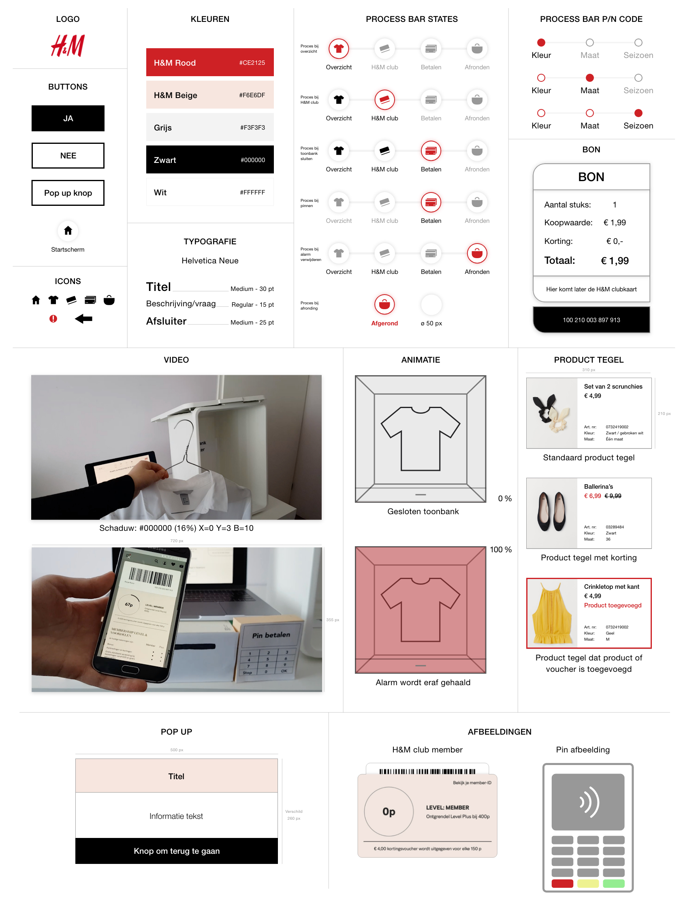

# Styletile

### Waarom een styletile?

Door een styletile te maken heb ik een overzicht over het design van de zelfscan kassa. Ik laat zien welke buttons, kleuren, lettertype en elementen ik gebruik. 

Ik heb het lettertype Helvetica Neue gebruikt, omdat ik het officiële lettertype van H&M niet heb. Helvetica Neue komt wel het dichtste bij het lettertype van H&M. 

### Styletile





De buttons lijken op de buttons van de H&M website.

**Zwart met witte tekst:** Dat is de knop waar het liefst op wordt geklikt. Het valt door de zwarte achtergrond ook meer op.

**Witte button met zwarte lijn en tekst:** Is de knop waar je ook op kan klikken als het niet lukt of als je meer informatie nodig hebt. 



Dit zijn de kleuren van H&M. Ik heb het ontwerp hier aan gehouden. Soms had ik een lichtere kleur nodig en paste ik de opacity aan.



De progres bar heeft verschillende states.  
Wanneer het icoon:

**Rood** is: betekent dit dat de consument in dat proces is.   
**Grijs** is: betekent dit dat de consument nog niet bij het proces is gekomen. Er kan ook niet op geklikt worden  
**Zwart** is: betekent dit dat de consument klaar is met het proces. Er kan wel geklikt worden op dit icoon om de keuzes opnieuw te bekijken. 



Het ontwerp van de bon veranderd niet veel. Wanneer de H&M club member wordt gescand wordt de onderkant zwart met de code. Als er geen H&M club member wordt gescand dan wordt de onderkant ook zwart maar staat er geen H&M club member. 

Wat verder veranderd zijn de bedragen en aantal producten. 



Alle video's hebben een schaduw als achtergrond en zijn even groot. 



De animatie gaat over het scannen van de producten of het alarm verwijderen van de producten. Het laat zien hoe lang de animatie bezig is.



Alle product tegels hebben dezelfde elementen:

* Afbeelding van het product
* Product naam
* Het bedrag
* Artikel nummer
* Kleur
* Maat

**Korting**  
Als het product korting heeft komt het bedrag in het rood te staan en het oude bedrag met een streep doorheen.  

**Product of voucher toegevoegd**  
Wanneer een nieuw product wordt toegevoegd of een voucher krijgt het een rode lijn. Zo valt het op tussen de andere producten. Voor kleurenblinden zien zij het verschil door de lijn dat er donker uit ziet. 



De pop ups zien er bijna allemaal zo uit. Ze hebben een titel, informatie tekst en een knop. Pop ups komen wanneer de consument meer informatie nodig heeft. De pop ups komen ook wanneer er iets mis gaat.



Er zitten niet zo veel afbeeldingen in de zelfscan kassa. Ze zijn er bedoeld als ondersteuning om te begrijpen wat er wordt gevraagd op het moment.



