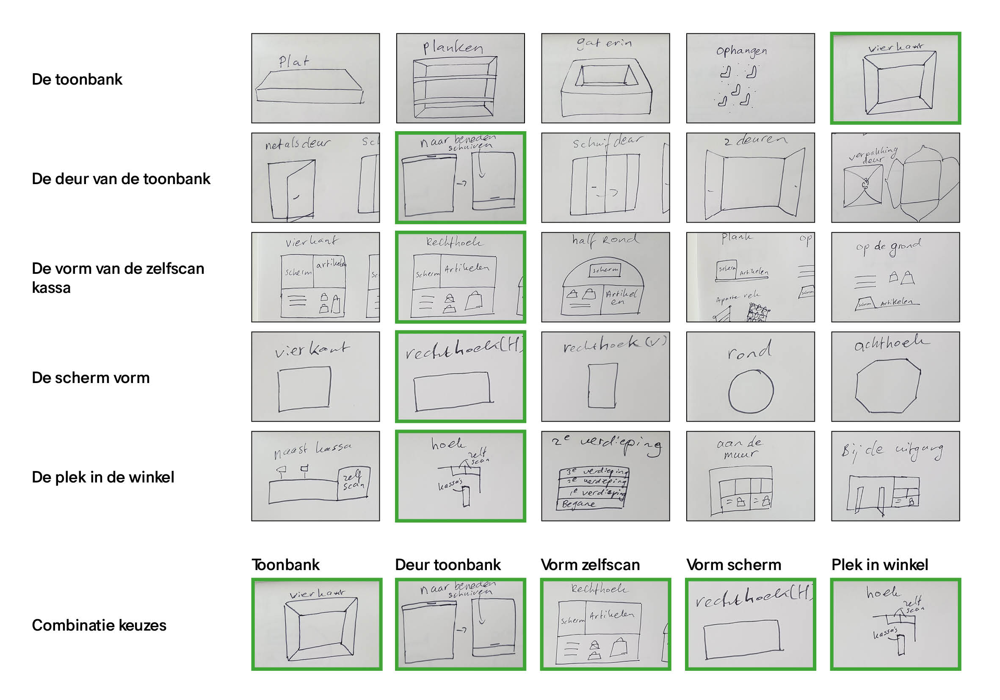
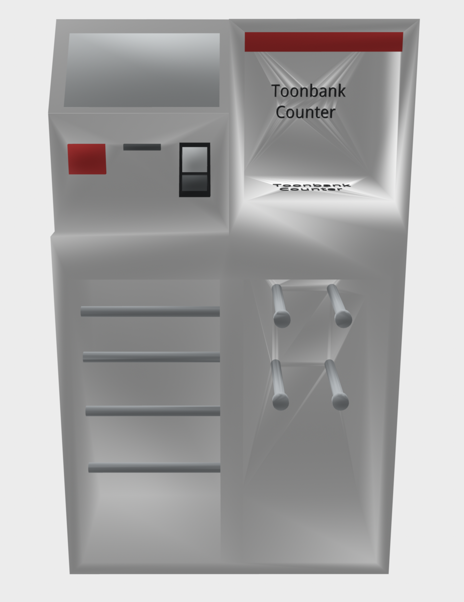

# Morfologische kaart + 3D model

### Waarom een morfologische kaart?

Voor de zelfscan kassa wilde ik kijken naar alternatieve mogelijkheden. Hoe zou de toonbank eruit kunnen zien? Hoe word de deur van de toonbank het beste gebruikt? Welke vorm van de zelfscan kassa kan ik het beste gebruiken?

Door alle opties in een morfologische kaart te zetten heb ik goed kunnen kijken wat het beste werkt. Van de opties heb ik de varianten gekozen die het beste lijken te passen bij de zelfscan kassa.

### Morfologische kaart

### 3D model

Van de morfologische kaart heb ik een 3D model geschetst met Tinkercad. Dit heb ik in het Makerslab geprint. Het 3D model nam ik mee tijdens het testen en kon op deze manier beter uitleggen hoe de zelfscan kassa eruit ziet. 

**De zelfscan kassa heeft:**

* Een scherm om te gebruiken
* 2D scanner om prijskaarten en H&M club members te scannen
* Bon printer
* Pinapparaat
* Toonbank met RFID reader
* Stangen voor de kledinghangers
* Stangen voor de tassen  

