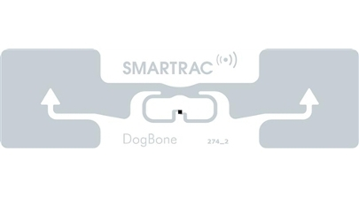
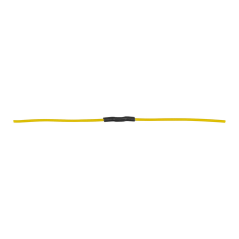
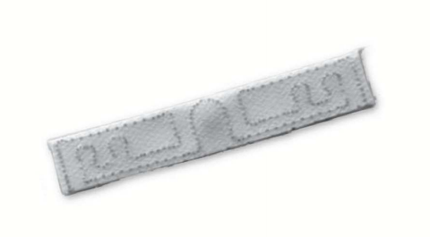
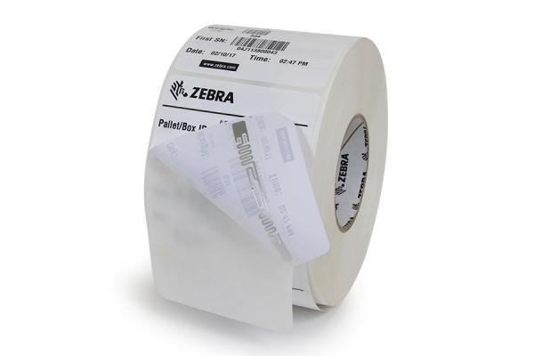
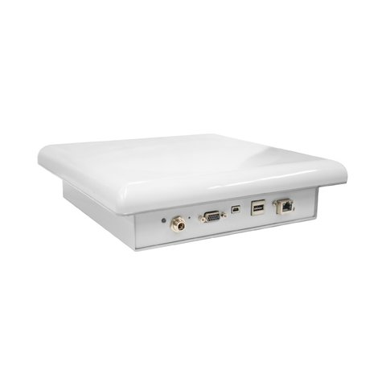
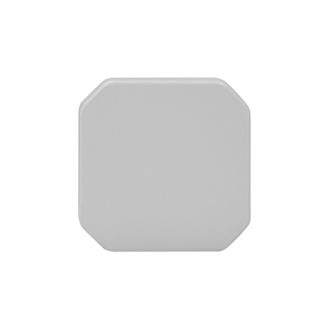

# Zelfscan kassa met RFID

### Waarom heb ik RFID toegepast?

Ik heb onderzoek gedaan naar RFID en zag daar vele voordelen in. Uniqlo maakt alleen gebruik van RFID tags in hun winkel. Zij scannen en verwijderen het alarm in 1 keer door de toonbank.  Dit leek me handig om toe te passen aan de zelfscan kassa. Door de RFID zal de zelfscan kassa het betalingsproces sneller afmaken.

Onderstaande link gaat naar het RFID onderzoek



Onderstaande link gaat naar Uniqlo onderzoek



### Hoe maakt de zelfscan kassa gebruik van RFID?




**Producten**

Alle producten moeten zijn voorzien van een RFID tag. De RFID tag houdt data bij over het product en geeft het een unieke code. De RFID tag kan op verschillende manieren toegevoegd worden aan het product:

Deze RFID wire tag kan flexibel in het product toegevoegd worden. Het kan in de wasmachine en is beter bestemd tegen warmte dan standaard RFID tags. Door dat het zo flexibel is kan het bijna overal toegepast worden.

Deze RFID tag is subtiel toegevoegd aan het waslabel. Net als de RFID wire tag kan deze RFID tag ook in de wasmachine. Ik wil de RFID laundry tag aanraden aan H&M als ze beslissen om met RFID te werken.



Als H&M niet wil dat de producten een RFID tag krijgen is er een andere oplossing. De RFID label kan gebruikt worden op de prijskaart. Het is hierdoor wel makkelijker te verwijderen van het product. 



**Wat is er mis met de huidige alarm labels?**

De huidige alarm labels zijn groot, opvallend en hebben een naald. De naald gaat door het product heen en kan het product beschadigen. Omdat de huidige alarm labels groot zijn kunnen ze niet aan alle producten worden toegepast. Ze kunnen niet toegepast worden aan accessoires, sokken, schoenen en make-up artikelen. Hierdoor zijn deze producten niet beveiligd en kunnen makkelijker gestolen worden. 

Als er geen gebruik van de RFID tag wordt gemaakt zou de zelfscan kassa net als dat van Zara werken. Dan moesten de consumenten zelf de alarm labels handmatig verwijderen. Dit kan een gedoe zijn als de magneet, wat de alarm labels uit elkaar haalt, niet goed werkt. Het kan ook gevaarlijk zijn door de naald van de alarm labels. 




**Waar zit de reader?**

De RFID reader zit onderaan de toonbank van de zelfscan kassa. Het maakt niet uit dat er een stuk materiaal tussen de RFID reader en de RFID tag zit. Een RFID reader kan namelijk radio frequente golven door materialen heen sturen. 

**Wat doet de reader?**

De RFID reader stuurt radio frequente golven uit via de antenne \(zie afbeelding hieronder\). Door de radio frequente golven ontvangen de RFID tags het signaal dat ze worden gescand. De RFID tags sturen een radio frequente golf terug met de data over het product. De antenne stuurt deze data naar de RFID reader. De RFID reader stuurt deze data dan weer door naar de zelfscan kassa.



**Hoe sterk is de reader?**

De toonbank van de zelfscan kassa is 50 cm hoog. Om alle producten hier in te scannen heeft de RFID reader en RFID antenna ongeveer 13.56 MHz nodig. Met dit aantal MHz kan de zelfscan kassa alles scannen op de toonbank.

MHz = De frequentie van radiozenders op de korte golf.

Ik heb een tabel gemaakt met de eigenschappen van de RFID tags, readers, antenna's en kabels. Dit is te vinden door op de page link hieronder te klikken.



**Hoe gaat het alarm eraf?**

Na het betalen stuurt de RFID reader radio frequente golven via de RFID antenna een kill code. De kill code wordt specifiek gestuurd naar de producten met de RFID tags en haalt hiervan het alarm eraf. 

Voor meer informatie klik op de page link hieronder.





* Iedere ochtend voegen werknemers alarm labels toe aan de producten
  * Dit hoeft niet meer door de RFID tags
* Er kan via een aparte RFID reader en RFID antenna in een paar keer het magazijn gescand worden op producten. 
  * Hierdoor weten de werknemers welke producten er allemaal zijn en het aantal
  * De maximale afstand wat de RFID reader en RFID antenna kunnen scannen is 10 meter
* De poorten bij de uitgang maken ook gebruik van RFID reader en antenna's
  * Wanneer iets wordt gestolen weet de RFID reader precies welk product is gestolen door de unieke code in de RFID tag.
  * Het alarm gaat af wanneer het scant dat de RFID tag nog geen kill code heeft ontvangen.



