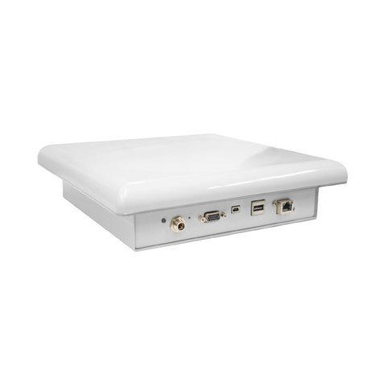

# Specificaties

### Wat gebruikt de zelfscan kassa?

Bij de morfologisch kaart had ik aangegeven wat de zelfscan kassa nodig heeft. Ik wil dit verder uitwerken naar waar de producten precies komen te staan en welke producten er gebruikt kunnen worden.

Ik ben geen product ontwerper en weet niet zeker of mijn keuzes echt zouden werken. Ik zou ook niet weten welke kabels en andere bedradingen nodig zijn om de zelfscan kassa werkend te maken. Dit zal door een expert gemaakt moeten worden.

### Specificaties deel 1




**Waarom een scherm?**

Om met de zelfscan kassa te interacteren is er een scherm nodig. Hierop komen de gescande producten op te staan. Verder legt de zelfscan kassa via het scherm uit wat de consument moet doen om het betalingsproces af te ronden.

* Het scherm is 45 graden gedraaid. Dit zorgt ervoor dat het scherm makkelijker te lezen is en geeft aan dat het klikbaar is. 
* Het scherm is 15 inch. Dit is breed genoeg om mee te interacteren en vanaf te lezen. Het scherm kan ook 13 inch worden als het scherm te veel ruimte inneemt.

Bron 45 graden scherm: [https://www.ics.com/blog/kiosk-how-best-position-your-public-touchscreen-display-use](https://www.ics.com/blog/kiosk-how-best-position-your-public-touchscreen-display-use)  \(Shamonsky, 2014\)

**Waar staat het scherm?**





**Waarom een 2D scanner?**

Voor als de RFID tag beschadigd is kan de consument de prijskaart scannen via de 2D scanner. Via de 2D scanner kan ook de H&M club member gescand worden. Deze data verstuurd de 2D scanner naar de zelfscan kassa. De scanner is in de zelfscan kassa gebouwd zodat het geen ruimte aan de voorkant neemt.

**Waar zit de 2D scanner?**





**Waarom een bonprinter?**

De consument zou na het betalen een bon willen. Daarom is het belangrijk dat de zelfscan kassa dit kan aanbieden. De bonprinter is in de zelfscan kassa gebouwd zodat het geen ruimte aan de voorkant neemt.

**Waar zit de bonprinter?**





**Waarom een pinapparaat?**

Bij de zelfscan kassa kan er alleen via de bankpas betaald worden. De reden hiervoor is  uitgelegd bij: Functies van de zelfscan kassa. Pinnen werkt voor de zelfscan kassa makkelijker dan nog met contant geld te wisselen. 



**Waar zit de pinapparaat?**





**Waarom een schuifdeur?**

Door een schuifdeur te gebruiken bespaart de zelfscan kassa ruimte. Er staat niks voor de toonbank zoals het eerste concept. De schuifdeur gaat verticaal open en dicht. Hierdoor gaat de schuifdeur niet zoals een kast naar voren open. Als dat zo was geweest moest de consument aan de kant wanneer de deur open gemaakt moest worden.

De schuifdeur heeft nog een functie. Wanneer de schuifdeur dicht is gemaakt stuurt dit een bericht naar de zelfscan kassa. De zelfscan kassa weet dan dat er geen andere producten meer bij komen. De volgende stap van de zelfscan kassa gaat dan over naar het betalen. Want na het betalen wordt er een kill code gestuurd naar de producten. Als de toonbank niet gesloten kon worden, kon de consument na het betalen stiekem andere producten toevoegen. Van deze producten zou het alarm verwijderd worden zonder ervoor betaald te zijn.

**Waar staat de schuifdeur?**




### Specificaties deel 2




Waarom een RFID reader?

De RFID reader is ingebouwd onderaan de toonbank. Op deze manier raakt de RFID reader niet beschadigd als er iedere keer producten op worden gegooid. De RFID reader scant de producten via de RFID tag. Dit is uitgebreid uitgelegd bij: Zelfscan kassa met RFID.



Waar zit de RFID reader?





**Waarom stangen voor de kledinghangers?**

De meeste producten hangen aan kledinghangers. Wanneer de consument bij de zelfscan kassa is moet er een mogelijkheid zijn om de kledinghangers te hangen. H&M herbruikt de kledinghangers om duurzaam te zijn.

**Waar staan de stangen voor de kledinghangers?**





**Waarom moeten er stangen zijn voor de tassen?**

De consument zou na het afrekenen een tas willen. Voor een plastic tas moet betaald worden. Voor papieren tassen is dit gratis. Om deze reden geeft de zelfscan kassa gratis papieren tassen. Deze tassen moeten een plek dichtbij de zelfscan kassa hebben.

**Waar staan de stangen voor de tassen?**





**Wat is het formaat van de zelfscan kassa?**

**De zelfscan kassa is:**

* 150 cm hoog
* 90 cm breed
* 45 cm diep

Er is hier rekening gehouden met de toonbank. De toonbank moet op een goede hoogte zijn waar de consument haar producten in kan doen. Om deze reden is de zelfscan kassa een stukje langer gemaakt. Als de zelfscan kassa op schaal nagemaakt kon worden en getest worden met consumenten, dan zou de lengte aangepast worden. Als de toonbank er niet was dan hield ik me ongeveer aan de design patronen van kiosk\_details: [http://www.fortinconsulting.ca/pdf/kiosk\_details.pdf](http://www.fortinconsulting.ca/pdf/kiosk_details.pdf) \(Fortinconsulting, 2012\)

**De ruimte voor de toonbank is:**

* 50 cm hoog
* 45 cm breed
* 45 cm diep



